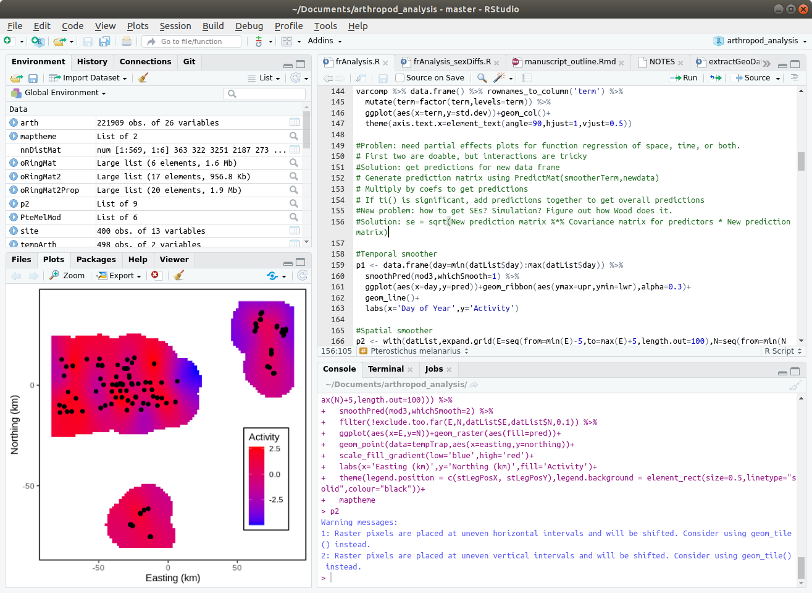

```{r setup, include=FALSE}
# #Trick to get smaller R code size with out resorting to LaTeX text sizes - this doesn't work if you use code chunks in incremental lists
# def.chunk.hook  <- knitr::knit_hooks$get("chunk")
# knitr::knit_hooks$set(chunk = function(x, options) {
#   x <- def.chunk.hook(x, options)
#   ifelse(options$size != "normalsize", paste0("\n \\", options$size,"\n\n", x, "\n\n \\normalsize"), x)
# })
knitr::opts_chunk$set(echo = TRUE, eval = TRUE, message=TRUE, warning=TRUE, tidy=TRUE)
# knitr::opts_chunk$set(echo = TRUE)

```

## Motivation

- "Why do I need to learn R?"
  - Free, powerful, and very common
  - Interfaces with other languages (e.g. C++), and can help you learn other languages
- "What is R good at?"
  - Displaying data, running models, and processing data*
  - Writing presentations and papers
  - _Keeping a record of what you've done_
- "What is R bad at?"
  - No point-and-click interface; simple things can take more time
  - Can be slow if datasets are large*
- I am not here to teach you programming, but some basic techniques are useful

## RStudio GUI

::: columns

:::: {.column width="40%"}

- The __Console__ is the main input into R (where you tell it to do things)
- __Scripts__ are lists of commands that get passed into the console
- If you're using RStudio, 2 of the 4 panes will be dedicated to the console and scripts

::::

:::: {.column width="60%"}

{width=100%}

::::

:::


## Objects and Functions

- Everything in R is either an __Object__ or a __Function__. All must have a unique name, or else the _Steve Problem_* occurs.
- Some common __objects__ (things stored in memory):
  - Characters, Logicals, & Numerics
  - Vectors & Matrices
  - Dataframes & Lists
- Some common __functions__ (things done to objects):
  - _mean_, _sd_, _median_, _quantile_, _c_, _paste_
  - _plot_, _summary_ 
    - these are polymorphic functions: they do different things to different types of objects
  - Control flow - _if_ and _for_
    
## Objects

- Let's make some objects. These are all single objects:

   ```{r}
   myString <- "Hello world" #A string object
   myNumeric <- 12345 #A numeric object
   myLogical <- TRUE #A logical object
   ```
   
- These are objects joined into a _vector_, joined by the function c (concatenate):
   
   ```{r}
   myCharVec <- c("I like pie","I like cake","I like anything you bake")
   myNumVec <- c(1,2,3,4,5)
   myLogVec <- c(TRUE,TRUE,FALSE,TRUE,FALSE,FALSE)
   ```
   
- How long are each of these vectors?

   ```{r}
   howLong <- c(length(myCharVec), length(myNumVec), length(myLogVec))
   howLong #This executes the `print` command on `howLong`
   ```

## Vectors - ``getting"
```{r}
myCharVec #Here's what's inside the whole thing
```

\pause 

- Single number:
  
  ```{r}
  myCharVec[1]
  ```

- Vector of numbers
  
  ```{r}
  myCharVec[c(2,3)] 
  ```
- Logical vector
 
  ```{r}
  myCharVec[c(TRUE,FALSE,TRUE)] 
  ```
  
## Vectors - ``setting"

Vectors are set in the same way, using the assignment operator: <- OR =
  
\pause  
  
- String vector
  ```{r}
  myCharVec[c(2,3)] <- c('Cats','Dogs')
  ```
- Logical vector
  ```{r}
  myCharVec[c(TRUE,FALSE,FALSE)] = 'Parakeets'
  ```
- Results:
  ```{r}
  myCharVec #Here's what's inside the whole thing
  ```

## Class conversions
  
Vectors (or other data) can be converted between __classes__, usually using _as.something_ statements:

\pause

- Logical to numeric
  ```{r}
  as.numeric(myLogVec)
  ```
  
- Numeric to character
  ```{r}
  as.character(myNumVec)
  ```

- Characters to __factors__: these represent _categories_ or experimental levels
  ```{r}
  as.factor(myCharVec) #Default order is alphabetical
  ```
  
<!-- ## Matrices -->

<!-- - Matrices are rectangular structures that hold values inside them: -->

<!--    ```{r} -->
<!--    (myMatrix <- matrix(1:9,ncol=3)) -->
<!--    ``` -->

<!-- - Matrices are indexed by _rows_ and _columns_ (in that order): -->

<!--    ```{r} -->
<!--    myMatrix[1,3] #1st row, 3rd col -->
<!--    myMatrix[,c(FALSE,FALSE,TRUE)] #All rows, 3rd column -->
<!--    ``` -->

## Dataframes

- Dataframes look similar to matrices, but can hold different data types in each column:

  ```{r tidy.opts=list(width.cutoff=50)}
  myDF <- data.frame(stringCol=myCharVec, numCol=myNumVec[c(1:3)], logCol=myLogVec[c(1:3)])
  myDF
  ```
- 
  ```{r}
  summary(myDF) #This function summarizes each column
  ```

## Accessing Dataframes

Dataframes can be accessed numerically, by their name slots (using the $ operator), or with a mixture of the two:

\pause

-
  ```{r}
  myDF[1,2]
  ```
  
-
  ```{r}
  myDF$numCol #This gets all of the column "numCol"
  ```

-
  ```{r}
  myDF[1,"numCol"]
  ```
  
-
  ```{r}
  myDF$numCol[1]
  ```
  
## Reading csv files

- One very common practice is to read in your own data from a csv file. Excel files can be read in directly, but present other problems. 

  ```{r}
  testDat <- read.csv('test_results.csv')
  head(testDat) #head shows only first 6 rows of dataframe
  ```
- R can't handle spaces or other special characters in the column headers (replaces them with periods). It also tries to guess the proper data type for each column, but sometimes gets this wrong.

## Plotting

::: columns

:::: column

- The _plot_ command is useful for quickly looking at sets of data. The following CO2 dataset is built-in to R. To see others, type \texttt{data()}

```{r, co2plot, eval=FALSE, fig.height=5, fig.width=5, tidy=FALSE}
#Makes a plot of the uptake (y) and 
# concentration (x) columns of CO2 
# dataframe, and customizes axis labels
plot(x = CO2$conc, y = CO2$uptake, 
     xlab = 'Concentration (ppm)', 
     ylab = 'Uptake (g)', 
     main = 'Plot of CO2 Concentrations', 
     cex = 2)
```

:::: 

:::: column

```{r, co2plot, echo=FALSE, eval=TRUE}
```

::::

:::

## Plotting (cont.)

::: columns

:::: column

- The boxplot command can summarize _continuous_ and _categorical_ data

```{r, co2plot2, fig.height = 4, fig.width = 5, eval=FALSE, tidy.opts=list(width.cutoff=30)}
#Boxplot uses a formula rather than x,y vectors 

#Formula: uptake depends on (~) Type
boxplot(CO2$uptake ~ CO2$Type, 
        xlab='Type',
        ylab='Uptake (g)') 

```

:::: 

:::: column

```{r, co2plot2, echo = FALSE, eval = TRUE}
```

::::

:::


## First challenge

Your supervisor has just given you a dataset (_test_results.csv_) recorded by two undergrads. However, these undergrads were in a hurry and have made some mistakes:
  
  >- Make a __script__ in R, and use this to record what you do
  
  >- Read the _csv_ file and fix any mistakes. Bonus if you do this without using Excel!
  
  >- Plot the concentration data by treatment group, then plot it for each undergrad. Does there look like much of a difference?
  
  >- Some useful commands: __read.csv__, __boxplot__, __is.na__, __as.factor__, __summary__


## Lists

::: columns

:::: column

>- Lists look similar to vectors, but can hold anything in each slot, including other lists. 

>- LOTS of things in R (e.g. model output) are specially-structured lists at their core

```{r tidy.opts=list(width.cutoff=25)}
myList <- list(charSlot=myCharVec, 
               numSlot=myNumVec, 
               logSlot=myLogVec, 
               dfSlot = myDF)
```

::::

:::: column

```{r eval = TRUE, echo=FALSE}
myList
```

::::

:::
   
## Accessing Lists 

Lists can be accessed numerically or logically, or by their name slots:

```{r}
myList[[2]] #Needs 2 square brackets to isolate object
myList[['numSlot']]
myList$numSlot
myList[[4]][,3] #Same as myList$dfSlot$logCol
```

## Functions

- Functions take objects as __arguments__ (input) and return other __objects__ (output)
  ```{r}
  myNumVec <- c(1,2,3,4,5)
  meanVec <- mean(myNumVec) #Arithmetic mean (average)
  sdVec <- sd(myNumVec) #Standard deviation (sqrt(variance))
  meanSdVec <- c(meanVec,sdVec) #Joins mean and SD into a vector
  meanSdVec
  ```
  
- If you can't remember how a command works, use ? to access the help files
  ```{r, eval=FALSE, echo=TRUE}
  ?median 
  ```

## Homemade Functions

- You can make your own functions! This is useful if you have to do the same thing to many different input objects.

   ```{r}
   myFun <- function(input){ #Takes a vector of numbers
     A <- mean(input) #Take the mean of INPUT
     B <- sd(input) #Take the SD of INPUT
     C <- c(A,B) #Join A and B into a vector C
     return(C) #Return (output) C, then end the function
   }
   myFun(myNumVec) #Same as previous slide
   ```
   
<!-- - If you pass in a logical vector, it will convert it to numeric (0 and 1) -->
<!--   ```{r} -->
<!--   myLogVec <- c(TRUE,TRUE,FALSE,TRUE) -->
<!--   myFun(myLogVec)  -->
<!--   ``` -->

- The objects inside of functions (A, B, C in the one above) disappear after the function runs. However, _functions can see objects in the outer environment_, so beware of the Steve Problem*


## Summary statistics

::: columns

:::: column

Often we want to get the mean of one columns, but split it up by other things in the dataframe. Using the CO2 plant example, how does _uptake_ differ between _Type_?

\pause

```{r}

options(width = 10)

#Split up uptake by Type and Treatment, then take the mean
tapply(CO2$uptake,list(CO2$Type,CO2$Treatment),mean)
```

::::

:::: column

\pause

Typing "CO2" over and over again is annoying. You can use _with_ to avoid this (avoid using _attach_):

\pause

```{r}
#Runs command inside the name space of the CO2 object
with(CO2, 
     tapply(uptake,list(Type,Treatment),sd)
     )
```

::::

:::

## _if_ statements

- R can be told to do things only _if_ certain conditions apply. This is useful inside of functions for error handling:

```{r}
myFun2 <- function(x){
  xClass <- class(x) #What class is x? (Numeric, character, boolean)
  
  if(xClass=='character'){ #== means "are these things equal"?
    return('This is a string') #If x is a character, returns a message
  } else {
    return(mean(x)) #If x isn't a character, returns the mean of x
  }
}
myFun2(myCharVec)
myFun2(myNumVec)

```

## for loops

- R can be told to do things _repeatedly_, using an index:

```{r}
classVec <- rep('',length(myList)) #Storage vector

#i will take on values 1 to 4, each time the loop repeats
for(i in 1:length(myList)){
  
  #ith slot of classVec becomes class from ith slot of myList
  classVec[i] <- class(myList[[i]]) 
}
classVec
```

## Second challenge


Population growth models are common in ecology, and usually often take the form $n_t = n_{t-1} + rn_{t-1}$, where $n$ is the number of critters at some time point $t$, and $r$ is the change in $n$ from one point to the next (r = 0: no change). Using a \texttt{for} loop, write a simple population simulation using the following models:

  >- Exponential growth: $n_t = n_{t-1}(1+r)$
  >- Logistic growth: $n_t = n_{t-1}(1+ r(1-\frac{n_{t-1}}{k}))$
  >- Predator-prey cycles (Lotka-Volterra): 
    >- $\text{prey}_t = \text{prey}_{t-1}(1+ r_1 - a_1\text{pred}_{t-1})$
    >- $\text{pred}_t = \text{pred}_{t-1}(1 + a_2\text{prey}_{t-1}-d)$
  
  