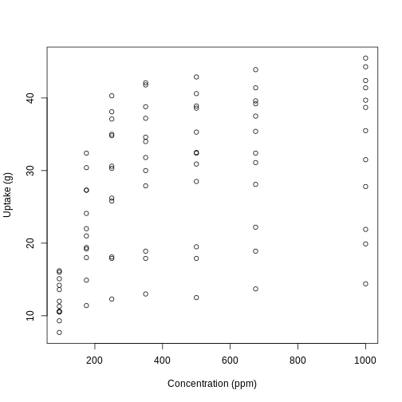
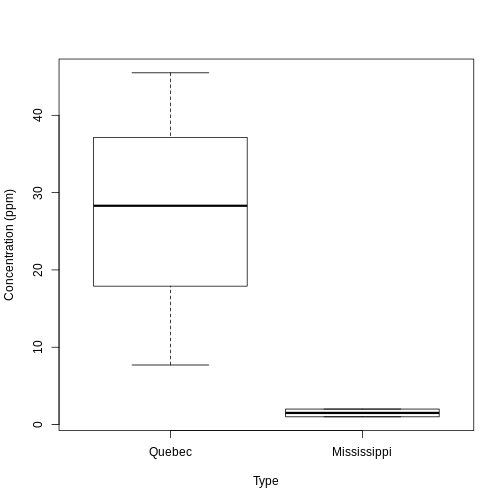

Introduction to R
========================================================
author: Samuel Robinson, Ph.D.
date: Oct 1, 2020
autosize: true

Motivation
========================================================

"Why do I need to learn R?"
- Free, powerful, and very common
- Interfaces with other languages (e.g. C++), and can help you learn other languages

"What is R good at?"
- Displaying data, running models, and processing data*
- Writing presentations and papers
- _Keeping a record of what you've done_

"What is R bad at?"
- No point-and-click interface
- Simple quick-fixes take more time
- Can be slow if datasets are large*

__I am not here to teach you programming, but some basic techniques are useful__

Console and Scripts
========================================================

- The _Console_ is the main input into R (where you tell it to do things)
- _Scripts_ are lists of commands that get passed into the console
- If you're using RStudio, 2 of the 4 panes will be dedicated to the console and scripts

My (personalized) RStudio layout
========================================================


Objects and Functions
========================================================

Everything in R is either an __Object__ or a __Function__. All must have a _unique_ name, or else the Steve Problem* occurs.

Some common objects (things stored in memory):
  - Strings, Logicals, & Numerics
  - Vectors & Matrices
  - Dataframes & Lists*
  
Some common functions (things done to objects):
  - mean, sd, median, quantile, c, paste
  - plot, summary   
    - Polymorphic functions: do different things depending on what object they're given
  - Control flow - _if_ and _for_
    
Objects
========================================================
Let's make some objects. These are all single objects:


```r
myString <- "Hello world" #A string object
myNumeric <- 12345 #A numeric object
myLogical <- TRUE #A logical object
```

These are objects joined into a _vector_, joined by the function c (concatenate):

```r
myStringVec <- c("I like pie","I like cake","I like anything you bake")
myNumericVec <- c(1,2,3,4,5)
myLogicalVec <- c(TRUE,TRUE,FALSE,TRUE,FALSE,FALSE)
```

How long are each of these vectors?

```r
howLong <- c(length(myStringVec), length(myNumericVec), length(myLogicalVec))
howLong #This executes the `print` command on `howLong`
```

```
[1] 3 5 6
```

Vectors
========================================================

How do I get stuff out of the vectors I just made?


```r
myStringVec #Here's what's inside the whole thing
```

```
[1] "I like pie"               "I like cake"             
[3] "I like anything you bake"
```

```r
myStringVec[1] #Uses a single numeric
```

```
[1] "I like pie"
```

```r
myStringVec[c(2,3)] #Uses a vector of numerics
```

```
[1] "I like cake"              "I like anything you bake"
```

```r
myStringVec[c(TRUE,FALSE,TRUE)] #Uses a logical vector of same length
```

```
[1] "I like pie"               "I like anything you bake"
```

Matrices
========================================================

Matrices are rectangular structures that hold values inside them:


```r
(myMatrix <- matrix(1:9,ncol=3))
```

```
     [,1] [,2] [,3]
[1,]    1    4    7
[2,]    2    5    8
[3,]    3    6    9
```

Matrices are indexed by _rows_ and _columns_ (in that order):

```r
myMatrix[1,3] #1st row, 3rd col
```

```
[1] 7
```

```r
myMatrix[,3] #All rows, 3rd column
```

```
[1] 7 8 9
```

Dataframes
========================================================
Dataframes look similar to matrices, but can hold different data types in each column:


```r
#Each column has a unique name, and be the same length
myDF <- data.frame(stringCol=myStringVec, numCol=myNumericVec[c(1:3)], 
                   logCol=myLogicalVec[c(1:3)])
myDF
```

```
                 stringCol numCol logCol
1               I like pie      1   TRUE
2              I like cake      2   TRUE
3 I like anything you bake      3  FALSE
```

```r
summary(myDF) #This function summarizes each column
```

```
                    stringCol     numCol      logCol       
 I like anything you bake:1   Min.   :1.0   Mode :logical  
 I like cake             :1   1st Qu.:1.5   FALSE:1        
 I like pie              :1   Median :2.0   TRUE :2        
                              Mean   :2.0                  
                              3rd Qu.:2.5                  
                              Max.   :3.0                  
```

Lists
========================================================
Lists look similar to vectors, but can hold anything in each slot, including other lists. 

LOTS of things in R (e.g. model output) are specially-structured lists at their core


```r
myList <- list(stringSlot=myStringVec, numSlot=myNumericVec, 
                   logSlot=myLogicalVec, dfSlot = myDF)
myList
```

```
$stringSlot
[1] "I like pie"               "I like cake"             
[3] "I like anything you bake"

$numSlot
[1] 1 2 3 4 5

$logSlot
[1]  TRUE  TRUE FALSE  TRUE FALSE FALSE

$dfSlot
                 stringCol numCol logCol
1               I like pie      1   TRUE
2              I like cake      2   TRUE
3 I like anything you bake      3  FALSE
```

Accessing Dataframes 
========================================================
Dataframes can be accessed numerically, by their name slots, or with a mixture of the two:

```r
myDF[1,2]
```

```
[1] 1
```

```r
myDF$numCol #This gets all of the column "numCol"
```

```
[1] 1 2 3
```

```r
myDF[1,"numCol"]
```

```
[1] 1
```

Accessing Lists 
========================================================
Similarly, lists can be accessed numerically (see below), or by their name slots:

```r
myList[[2]] #Needs 2 square brackets to isolate object
```

```
[1] 1 2 3 4 5
```

```r
myList[['numSlot']]
```

```
[1] 1 2 3 4 5
```

```r
myList$numSlot
```

```
[1] 1 2 3 4 5
```

```r
myList[[4]][,3] #Same as myList$dfSlot$logCol
```

```
[1]  TRUE  TRUE FALSE
```

Functions
========================================================

Functions take objects as __arguments__ (input) and return other __objects__ (output)


```r
myNumericVec
```

```
[1] 1 2 3 4 5
```

```r
meanVec <- mean(myNumericVec) #Arithmetic mean (average)
sdVec <- sd(myNumericVec) #Standard deviation (sqrt(variance))
meanSdVec <- c(meanVec,sdVec) #Joins mean and SD into a vector
meanSdVec
```

```
[1] 3.000000 1.581139
```

```r
?median #If you can remember how a command works, use "?"
```

Homemade Functions
========================================================

You can make your own functions! This is useful if you have to do the same thing to multiple sets of input.

```r
myFun <- function(input){ #Takes a vector
  A <- mean(input) #Take the mean of INPUT
  B <- sd(input) #Take the SD of INPUT
  C <- c(A,B) #Join A and B into a vector C
  return(C) #Return (output) C, and end the function
}
myFun(myNumericVec) #Same as previous slide
```

```
[1] 3.000000 1.581139
```

```r
myFun(myLogicalVec) #Logical vector is converted to 1 (TRUE) and 0 (FALSE)
```

```
[1] 0.5000000 0.5477226
```

The things inside of functions (A,B,C in the one above) disappear after the function executes. However, functions can see objects in the outer environment, so beware of the Steve Problem*

Plotting
========================================================

The _plot_ command is useful for quickly looking at sets of data. The following CO2 dataset is built-in to R. To see others, type data()


```r
#Makes a plot of the uptake and conc columns of CO2, and make the axis labels prettier
plot(CO2$conc, CO2$uptake, xlab='Concentration (ppm)', ylab='Uptake (g)')
```



Plotting (cont.)
========================================================

The boxplot command can summarize _continuous_ and _categorical_ data


```r
boxplot(CO2$uptake, CO2$Type,
        names=unique(CO2$Type),  #Uses unique values of Type for names
        xlab='Type', ylab='Concentration (ppm)')
```



Summary statistics
========================================================

Often we want to get the mean of one columns, but split up by other things in the dataframe. Using the CO2 plant example, how does _uptake_ differ between _Type_?


```r
#Split up uptake by Type and Treatment, then take the mean
tapply(CO2$uptake,list(CO2$Type,CO2$Treatment),mean)
```

```
            nonchilled  chilled
Quebec        35.33333 31.75238
Mississippi   25.95238 15.81429
```

It's annoying and repetitive to type "CO2" over and over again. You can use _with_ to avoid this:

```r
#Runs command inside the name space of the CO2 object
with(CO2, 
     tapply(uptake,list(Type,Treatment),sd)
     )
```

```
            nonchilled  chilled
Quebec        9.596371 9.644823
Mississippi   7.402136 4.058976
```
What functions are being run using _tapply_?

if statements
========================================================
R can be told to do things only _if_ certain conditions apply. This is useful inside of functions for error handling

```r
class(myStringVec)
```

```
[1] "character"
```

```r
myFun2 <- function(x){
  xClass <- class(x) #What class is x? (Numeric, character, boolean)
  
  if(xClass=='character'){ #== means "are these things equal"?
    return('This is a string') #If x is a character, returns a message
  } else {
    return(mean(x)) #If x isn't a character, returns the mean of x
  }
}
myFun2(myStringVec)
```

```
[1] "This is a string"
```

```r
myFun2(myNumericVec)
```

```
[1] 3
```

for loops
========================================================
R can be told to do things _repeatedly_, using an index:

```r
classVec <- rep('',length(myList)) #Storage vector

#i will take on values 1 to 4, each time the loop repeats
for(i in 1:length(myList)){
  
  #ith slot of classVec becomes class from ith slot of myList
  classVec[i] <- class(myList[[i]]) 
}
classVec
```

```
[1] "character"  "numeric"    "logical"    "data.frame"
```

Reading csv files
========================================================
One very common practice is to read in your own data from a csv file. Excel files can be read in directly, but present other problems. 


```r
testDat <- read.csv('test_results.csv')
head(testDat) #head shows only first 6 rows of dataframe
```

```
  Concentration Treatment Lab.Member Time.of.Day
1           2.9   Control       Will     Morning
2           3.2   Control       Will     Morning
3           3.6   Control       Will     Morning
4           5.6         A       Will     Morning
5           6.8         A       Will     Morning
6           7.0         A       Will     Morning
```

R can't handle spaces or other special characters in the column headers (replaces them with periods). It also tries to guess the proper data type for each column, but sometimes gets this wrong.


A challenger approaches!
========================================================
1. Your supervisor has just given you a dataset recorded by two undergrads (_test_results.csv_). However, these poor undergrads were in a big rush, and have made some mistakes (Sam, in particular).
  - Fix any mistakes that have been made. Bonus if you do this without using Excel! 
  - Plot the concentration data by treatment group, then plot it by time of day. Does there look like much of a difference?
  - Some useful commands will be: __boxplot__

2. Make R sing "99 bottles of beer on the wall". Bonus points if you can use a function that you built! 
  - Some useful commands will be: __for__, __if__, __paste__
