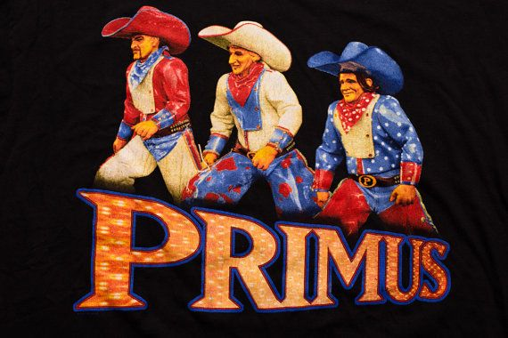

```{r setup, include=FALSE}
knitr::opts_chunk$set(echo = FALSE, cache=TRUE)
library(tidyverse)
library(knitr)
library(ggpubr)
presTheme <- theme(axis.title=element_text(size=30),axis.text=element_text(size=15))
theme_set(presTheme)
# theme_set(theme_classic())
set.seed(123)
```

<!-- # Part 1: `dplyr` and `tidyr` -->

<!-- ## Normal data manipulation in R -->

<!-- <!-- Note: "plants" dataframe is just used for (non-evaluated) examples, and isn't included in repository --> -->

<!-- ```{r, echo=T, eval=F} -->
<!-- #Changes species to factor -->
<!-- plants$Species <- as.factor(plants$Species) -->
<!-- #Changes plant code to factor -->
<!-- plants$Plant.Code <- as.factor(plants$Plant.Code)  -->
<!-- #Changes Seed to factor -->
<!-- seeds$Seed <- as.factor(seeds$Seed)  -->
<!-- #Changes plant code to factor -->
<!-- seeds$Plant.Code <- as.factor(seeds$Plant.Code) -->
<!-- #Selects Flower, Code, Total.Germ columns -->
<!-- germ <- germ[,c('Flower','Code','Total.Germ')]  -->

<!-- #Sets numerics -->
<!-- plants[,c(3:9)] <- as.numeric(unlist(plants[,c(3:9)]))  -->
<!-- #Sets Dates -->
<!-- seeds$Collection.Date <- as.Date(seeds$Collection.Date,origin='2012-01-01') -->
<!-- ``` -->

<!-- \pause -->

<!-- - One line of code per column - lots of typing -->
<!-- - Lots of `$$$`s -->
<!-- - Lots of room for errors -->

<!-- ## Data manipulation using dplyr/tidyr -->

<!-- ```{r, echo=T,eval=F} -->
<!-- library(tidyverse) -->
<!-- #Convert factors in plants df -->
<!-- plants <- plants %>% mutate(across(c(Species,Plant.Code)),factor) -->
<!-- #Convert factors in seeds df -->
<!-- seeds <- seeds %>% mutate(across(c(Seed,Plant.Code)),factor) -->
<!-- #Select Flower, Code, and Total.Germ columns in germ df -->
<!-- germ <- germ %>% select(Flower,Code,Total.Germ) -->

<!-- #Change columns 3:9 to numeric -->
<!-- plants <- plants %>% mutate(across(c(3:9)),as.numeric) -->
<!-- #Convert Collection.Date to Date format -->
<!-- seeds <- seeds %>%  -->
<!--   mutate(Collection.Date=as.Date(Collection.Date,origin='2012-01-01')) -->
<!-- ``` -->

<!-- \pause -->

<!-- - More compact, less typing -->
<!-- - Easier to read -->
<!-- - Faster (matters for large datasets) -->

<!-- ## Why should I do data manipulation in R? -->

<!-- * Much quicker (once you learn how!) -->

<!-- * Can do complex re-arranging and make summary tables very easily -->

<!-- * For very large datasets, Excel starts falling apart fairly quickly -->

<!-- * _You have a record of exactly what you've done_ -->

<!-- \pause -->

<!-- __Start with small, simple tasks, and work your way up to larger, complicated ones__ -->

<!-- ## Things to learn today: -->

<!-- ::: columns -->

<!-- :::: column -->

<!-- * Basic syntax and table verbs -->

<!-- * Piping -->

<!-- * Reshaping -->

<!-- * Grouping -->

<!-- * Exercise! -->

<!-- :::: -->

<!-- :::: column -->

<!-- {width=100%} -->

<!-- :::: -->

<!-- ::: -->

<!-- ## Basic Syntax -->

<!-- Both `dplyr` and `tidyr` work with `data frames` or `tibbles` -->

<!-- - `data frame`: similar to matrix, but with different data types for each column -->

<!-- - `tibble`: "compact" data frame, with some annoying features removed -->
<!--   ```{r,echo=T,eval=T} -->
<!--   head(iris) #Regular data frame -->
<!--   ``` -->

<!-- ## Basic Syntax -->

<!-- ```{r,echo=T,eval=T,message=F} -->
<!-- as_tibble(iris) #This is usually done automatically -->
<!-- ``` -->

<!-- ## Basic verbs - subsetting -->

<!-- - **select**: returns only columns that you want -->
<!--   ```{r, echo=FALSE,eval=TRUE} -->
<!--   head(iris)   -->
<!--   ``` -->
<!-- - Select `Petal.Length`,`Petal.Width`, and `Species` columns -->
<!--   ```{r,echo=T,eval=T,message=F} -->
<!--   irisTemp <- select(iris,Petal.Length,Petal.Width,Species) -->
<!--   ``` -->
<!--   ```{r, echo=FALSE,eval=TRUE} -->
<!--   head(irisTemp)   -->
<!--   ``` -->

<!-- ## Basic verbs - subsetting -->

<!-- - Helper functions for **select**: *colon* operator -->
<!--   ```{r, echo=FALSE,eval=TRUE} -->
<!--   head(iris,3) -->
<!--   ``` -->
<!-- - Get all columns between `Petal.Length` and `Species` -->
<!--   ```{r,echo=T,eval=T,message=F} -->
<!--   irisTemp <- select(iris,Petal.Length:Species) -->
<!--   ``` -->
<!--   ```{r, echo=FALSE,eval=TRUE} -->
<!--   head(irisTemp,3) -->
<!--   ``` -->

<!-- ## Basic verbs - subsetting -->

<!-- - Helper functions for **select**: `-`, and *contains* -->
<!--   ```{r, echo=FALSE,eval=TRUE} -->
<!--   head(iris,3) -->
<!--   ``` -->
<!-- - `-`: selects all columns EXCEPT the one(s) specified -->
<!--   ```{r,echo=T,eval=T,message=F} -->
<!--   irisTemp <- select(iris,-Species) -->
<!--   ``` -->
<!--   ```{r, echo=FALSE,eval=TRUE} -->
<!--   head(irisTemp,3)  -->
<!--   ``` -->

<!-- - Some common selection helpers: -->
<!--   - `contains()` contains a string -->
<!--   - `starts_with()` column name starts with a string -->

<!-- ## Basic verbs - subsetting -->

<!-- - **filter**: returns only rows that you want -->
<!--   ```{r, echo=FALSE,eval=TRUE} -->
<!--   head(iris,5) -->
<!--   ``` -->
<!-- - Chooses rows where `Species` is _versicolor_ -->
<!--   ```{r,echo=T,eval=T,message=F} -->
<!--   irisTemp <- filter(iris,Sepal.Length<5,Species=='versicolor') -->
<!--   ``` -->
<!--   ```{r, echo=FALSE,eval=TRUE} -->
<!--   head(irisTemp,3)  -->
<!--   ``` -->
<!-- - Some common logical operators: -->
<!--   - `==` equal to, `!=` not equal to -->
<!--   - < greater than, > less than -->
<!--   - & AND, | OR -->

<!-- ## Basic verbs - make new variables -->

<!-- - **mutate**: add new columns or alter existing ones -->
<!--   ```{r,echo=FALSE,eval=T,message=F} -->
<!--   irisTemp <- mutate(iris,P.Width2=Petal.Width^2) #Squares Petal.Width -->
<!--   ``` -->
<!--   ```{r, echo=FALSE,eval=TRUE} -->
<!--   head(irisTemp,3)  -->
<!--   ``` -->
<!-- - Squares the `Petal.Width` column -->
<!--   ```{r,echo=T,eval=T,message=F} -->
<!--   irisTemp <- mutate(iris,Petal.Width=Petal.Width^2)  -->
<!--   ``` -->
<!--   ```{r, echo=FALSE,eval=TRUE} -->
<!--   head(irisTemp,3)  -->
<!--   ``` -->

<!-- ## Basic verbs - make new variables -->

<!-- - **across**: uses the function on a number of columns. Must be used _inside_ verbs like _mutate_ -->
<!--   ```{r, echo=FALSE,eval=TRUE} -->
<!--   head(iris,3) -->
<!--   ``` -->
<!-- - Squares the `Sepal.Length` and `Petal.Width` columns -->
<!--   ```{r,echo=T,eval=T,message=F,warning=F} -->
<!--   irisTemp <- mutate(iris, across(c(Sepal.Length,Petal.Width), ~.^2)) -->
<!--   ``` -->
<!--   ```{r, echo=FALSE,eval=TRUE} -->
<!--   head(irisTemp,3) -->
<!--   ``` -->
<!--   - `~` is called a lambda (similar to a function) -->
<!--   - `.` means "input data from column X", so... -->
<!--   - `~.^2` means "square anything in these named column -->

<!-- ## Basic verbs - make new variables -->

<!-- - **rename** & **transmute** -->
<!--   ```{r, echo=FALSE,eval=TRUE} -->
<!--   head(iris,3) -->
<!--   ``` -->
<!-- - Renames `Petal.Length` to `PLength` -->
<!--   ```{r,echo=T,eval=T,message=F,warning=F} -->
<!--   irisTemp <- rename(iris, PWidth=Petal.Width, PLength=Petal.Length) -->
<!--   ``` -->
<!--   ```{r, echo=FALSE,eval=TRUE} -->
<!--   head(irisTemp,3) -->
<!--   ``` -->
<!-- - Same as _mutate_ but drops other columns -->
<!--   ```{r,echo=T,eval=T,message=F,warning=F} -->
<!--   irisTemp2 <- transmute(iris, P.Width2=(Petal.Width^2)) -->
<!--   ``` -->
<!--   ```{r, echo=FALSE,eval=TRUE} -->
<!--   head(irisTemp2,3) -->
<!--   ``` -->

<!-- ## Mini-summary -->

<!-- - **select**: subset columns -->

<!-- - **filter**: subset rows -->

<!-- - **mutate**: add new columns, or alter existing -->

<!-- - **transmute**: same as above, but drops other columns -->

<!-- - **rename**: changes column names -->

<!-- - **across**: applies function across multiple columns -->
<!--   - Used _inside of_ table verbs -->

<!-- ## First challenge -->

<!-- ::: columns -->

<!-- :::: column -->

<!-- Using the `iris` dataset (type `data(iris)`): -->

<!-- - Filter only rows with "virginica" -->
<!-- - Make 2 new "area" columns, which are length $\times$ width of Petals and Sepals -->
<!-- - Get rid of all columns except "Species" + 2 new columns -->

<!-- :::: -->

<!-- :::: column -->

<!-- Goal: -->

<!-- ```{r,echo=F} -->
<!--  iris %>% filter(Species=='virginica') %>% -->
<!--   transmute(Species,P.Area=Petal.Length*Petal.Width,S.Area=Sepal.Length*Sepal.Width) %>% -->
<!--   head(10) -->
<!-- ``` -->

<!-- :::: -->

<!-- ::: -->

<!-- ## Piping - %>% -->

<!-- This is where the tidyverse becomes _very_ useful -->

<!-- - Takes data from one verb and passes it to the next one.  -->

<!-- - Lets you string together complex operations: -->
<!--   ```{r,echo=T,tidy=F,eval=T,message=F,warning=F} -->
<!--   irisTemp <- select(iris,Sepal.Length,Species) %>% #Selects Sepal.Length & Species -->
<!--     filter(Sepal.Length>5,Species=='versicolor') %>% #Filters using dataframe from above -->
<!--     mutate(SLength2=Sepal.Length^2) #Mutates using dataframe from above -->
<!--   ``` -->
<!--   ```{r} -->
<!--   head(irisTemp) -->
<!--   ``` -->

<!-- ## Reshaping - i.e. "data gymnastics" -->

<!-- - This is very tedious to do in base R and Excel -->
<!-- - Reshaping operations in `tidyr` make this much easier -->
<!-- - Main commands: -->

<!-- 1. `pivot_longer` - gather columns into rows ('long format') -->
<!-- 2. `pivot_wider` - spread rows into columns ('wide format') -->

<!-- ## Reshaping - _pivot_longer_: columns to rows -->

<!-- ```{r,echo=F} -->
<!-- #Some data to work with -->
<!-- bats <- data.frame(bat=letters[1:3], weight = seq(1,3,1), -->
<!--                     height=seq(2.5,5.5,length=3), wings=rep(2,3)) -->
<!-- ``` -->

<!-- ::: columns -->

<!-- :::: column -->

<!-- Some data in __wide__ format: data for each "unit" listed in multiple columns -->

<!-- ```{r, echo=FALSE} -->
<!-- bats -->
<!-- ``` -->

<!-- :::: -->

<!-- :::: column -->

<!-- The same data in __long__ format: data listed in single column, plus and ID column -->

<!-- ```{r, echo=FALSE} -->
<!-- pivot_longer(bats,-bat) -->
<!-- ``` -->

<!-- :::: -->

<!-- ::: -->

<!-- ## Reshaping - _pivot_longer_: columns to rows -->

<!-- - Change wide dataframe to long dataframe -->

<!-- ```{r,echo=T,eval=T,message=F,warning=F} -->
<!-- (longBats <- bats %>% pivot_longer(cols=weight:wings, #Columns to be made into 2 -->
<!--                           names_to='trait', #Name of "naming" column -->
<!--                           values_to='meas')) #Name of "value" column -->
<!-- ``` -->

<!-- ## Reshaping - _pivot_wider_: rows to columns -->

<!-- - This is the inverse of _pivot_longer_ -->


<!-- ```{r,echo=T,tidy=F,eval=T,message=F,warning=F} -->
<!-- longBats %>% pivot_wider(names_from=trait, #Names of new columns -->
<!--                          values_from=meas) #Values to go into new columns -->
<!-- #Note: this must have unique row identifiers -->
<!-- ``` -->

<!-- ## Mini-summary -->

<!-- - `%>%`: "pipe" operator; passes data to the next line -->

<!-- - `pivot_longer`: reshapes data into _long_ form -->

<!-- - `pivot_wider`: reshapes data into _wide_ form -->

<!-- ## Exercises! -->

<!-- ::: columns -->

<!-- :::: column -->

<!-- Using the *CO2* dataset: -->

<!-- - Select only _non-chilled_ plants from _Quebec_ -->
<!-- - Pipe data frame to next command -->
<!-- - Change the uptake dataset from long to wide format (each plant should have its own column), with a column at the beginning showing concentration -->
<!-- - Hint: _filter_ rows and _select_ columns you need, then _pivot_wide_ to wide format -->

<!-- :::: -->

<!-- :::: column -->

<!-- Goal: -->

<!-- ```{r,echo=F} -->
<!-- CO2 %>% -->
<!--   filter(Type=='Quebec',Treatment=='nonchilled') %>% -->
<!--   select(-Type,-Treatment) %>% -->
<!--   pivot_wider(names_from=Plant,values_from=uptake) -->
<!-- ``` -->

<!-- :::: -->

<!-- ::: -->

<!-- ## Grouping -->

<!-- - Often, we want to perform operations only on _groups_ within data frames -->
<!-- - For example, what is the average of each species' _Petal.width_? -->
<!-- - This can be done in base `R`: -->

<!-- \pause -->

<!-- ```{r,echo=T,tidy=F,eval=T,message=F,warning=F} -->
<!-- with(iris,tapply(Petal.Width,Species,mean)) #Using tapply -->
<!-- ``` -->

<!-- \pause -->

<!-- ```{r,echo=T,tidy=F,eval=T,message=F,warning=F} -->
<!-- aggregate(Petal.Width~Species,data=iris,mean) #Using aggregate -->
<!-- ``` -->

<!-- ## Grouping -->

<!-- - How can this be done in `dplyr` and `tidyr`? -->

<!-- ```{r,echo=T,tidy=F,eval=T,message=F,warning=F} -->
<!-- iris %>% group_by(Species) %>% #Group by species -->
<!--   summarize(meanPWidth=mean(Petal.Width), #Mean of Petal.Width -->
<!--             sdPWidth=sd(Petal.Width)) #SD of Petal.Width -->
<!-- ``` -->

<!-- \normalsize -->

<!-- - Apply *grouping*, then use `summarize` function -->
<!--   - Breaks dataframe into "mini-dataframes" before applying the function -->
<!-- - Data frame can be fed into other functions after summarizing -->

<!-- ## Grouping - Examples -->

<!-- ```{r,echo=T,tidy=F,eval=T,message=F,warning=F} -->
<!-- iris %>% group_by(Species) %>% #Group by species -->
<!--   summarize(count=n(), #Number of rows -->
<!--             med=median(Petal.Width), #Median -->
<!--             iqr=IQR(Petal.Width)) #Inter-quartile range -->
<!-- ``` -->

<!-- \normalsize -->

<!-- - *n* is empty, because it shows the number of rows of the grouped "mini-dataframe" -->

<!-- ## Grouping - Examples -->

<!-- - Also useful for applying functions to subsets of data, *without* summarizing -->

<!-- ```{r,echo=T,tidy=F,eval=T,message=F,warning=F} -->
<!-- iris %>% group_by(Species) %>% -->
<!--   mutate(ID=1:n()) %>% #Makes ID column, with numbers 1-N -->
<!--   filter(ID<4) #Selects ID 1-3 from each group -->

<!-- ``` -->

<!-- ## Grouping -->

<!-- - Another way of doing the same thing -->

<!-- ```{r,echo=T,tidy=F,eval=T,message=F,warning=F} -->
<!-- iris %>% group_by(Species) %>% -->
<!--   slice(1:3) #Selects rows 1-3 from each group -->
<!-- ``` -->

<!-- \normalsize -->

<!-- - You can use most of the subset and window functions across groups -->

<!-- ## Exercises! -->

<!-- Using the *InsectSprays* dataset: -->

<!-- - Find the mean and SD of `counts` for each type of `spray` -->
<!-- - Reshape dataframe so that each `spray` has its own column, with mean and SD in separate rows -->
<!-- - Hint: get summary stats first, then `pivot_longer` and `pivot_wider` -->

<!-- \pause -->

<!-- ```{r,echo=F} -->
<!-- InsectSprays %>% group_by(spray) %>% -->
<!--   summarize(mean=mean(count),sd=sd(count),.groups='keep') %>% -->
<!--   pivot_longer(cols=mean:sd,names_to='stat',values_to='value') %>% -->
<!--   pivot_wider(names_from=spray,values_from=value) -->
<!-- ``` -->


<!-- ## Happy data wrangling! Yee-haw! -->

<!-- {width=95%} -->

# Part 2: `ggplot2`

## Motivation

What is `ggplot2`?

- `ggplot` philosophy
- Simple plots
- Some useful techniques
- More complicated plots

## What is `ggplot2`?

- Updated version of `ggplot` (older `R` package)
- Implementation of Wilkinson's _grammar of graphics_
- Elements: data, transformations, elements, scale, guide, coordinates
- Describes a [layered approach to building graphics](https://doi.org/10.1198/jcgs.2009.07098) beyond formulaic plots (e.g. "boxplot", "scatterplot")
- Many different extensions available [here](https://exts.ggplot2.tidyverse.org/gallery/)

\pause

Philosophy:

- Data input centered around around `data.frames` or `tibbles`
- Data display centered around `geoms` (geometric objects)
- Columns from data frames are `mapped` into `geoms` using `aesthetics`
- `geoms` are displayed according to `themes`

## Simple example - scatterplot

```{r, echo=TRUE}
data(mtcars) # mtcars dataset (built into R)
```
```{r, echo=FALSE,eval=TRUE}
head(mtcars,5) # Show first 5 rows
```

::: columns

:::: column

Top line of code says:

- data from `mtcars` dataframe
- `aes` = aesthetics from dataframe
- map `disp` to x-axis, `mpg` to y-axis

```{r, scatPlot, eval=FALSE, echo = TRUE}
ggplot(data = mtcars, aes(x = disp, y = mpg))+
  geom_point() # Display data using points
```

::::

:::: column

```{r, scatPlot, echo=FALSE, eval=TRUE}
```

::::

:::

## Simple example - bar plot

```{r, echo=TRUE}
data(mtcars) # mtcars dataset (built into R)
```
```{r, echo=FALSE,eval=TRUE}
head(mtcars,5) # Show first 5 rows
```

::: columns

:::: column

Top line of code says:

- map `gear` to x-axis (first converted to a `factor`)
- Automatically uses `stat='count'` to group data according to factor

```{r, barPlot, eval=FALSE, echo = TRUE}
ggplot(data = mtcars, aes(x = factor(gear)))+
  geom_bar()
# Display number of data points for each 
#   factor level
```

::::

:::: column

```{r, barPlot, echo=FALSE, eval=TRUE}
```

::::

:::

## Simple example - histogram

```{r, echo=TRUE}
data(mtcars) # mtcars dataset (built into R)
```
```{r, echo=FALSE,eval=TRUE}
head(mtcars,5) # Show first 5 rows
```

::: columns

:::: column

Top line of code says:

- map `disp` to x-axis
- `geom_histogram()` 

```{r eval=FALSE, echo=TRUE}
ggplot(data = mtcars, aes(x = disp))+
  # Group disp into bins, and display
  #   count in each bin
  geom_histogram()
```

::::

:::: column

```{r echo=FALSE, message=FALSE, warning=FALSE}
ggplot(data=mtcars,aes(x=disp))+ geom_histogram()
```

::::

:::

## Simple example - histograms and density plots

\tiny

::: columns

:::: column

```{r echo=TRUE, message=FALSE, warning=FALSE}
# Histogram
ggplot(data=mtcars,aes(x=disp))+
  geom_histogram()
```

\normalsize

Histogram

::::

:::: column

```{r echo=TRUE, message=FALSE, warning=FALSE}
# Density plot
ggplot(data=mtcars,aes(x=disp))+
  geom_density()
```

\normalsize

Probability density plot

$a\int_{-\infty}^{\infty} f(x) \,dx=1$

::::

:::

## Colours in plots

- Colours can be _mapped_ (via `aes`) or _set_ (outside of `aes`)

\tiny

::: columns

:::: column

```{r, echo = TRUE}
ggplot(data=mtcars,aes(x=disp,y=mpg))+
  # Maps gear to colour
  geom_point(aes(col=factor(gear)))
```

::::

:::: column

```{r echo=TRUE}
ggplot(data=mtcars,aes(x=disp,y=mpg))+
  geom_point(colour='red') #Sets colour
```

::::

:::

\normalsize

- Notice how `aes` was used twice in Figure 1? If used within the `ggplot` command, the rest of the geoms will remember it. Used within a geom, it will _update_ the aesthetic

## What if I want different colours?

::: columns

:::: column

- Default colour themes are pretty bad. Change them with `scale_colour_manual`
- Use `scale_fill_manual` for area-based colours (e.g. bar plots, polygons)
- Remember, 10% of males are red-green colourblind!

::::

:::: column

```{r echo=FALSE, eval = TRUE, fig.width=5, fig.height=5}
ggplot(data=mtcars,aes(x=disp,y=mpg))+
  geom_point(aes(col=factor(gear)))+
  scale_colour_manual(values=c('blue','purple','red'))
```

::::

:::

\small

```{r, echo = TRUE, eval = FALSE}
ggplot(data=mtcars,aes(x=disp,y=mpg))+
  geom_point(aes(col=factor(gear)))+
  scale_colour_manual(values=c('blue','purple','red'))
```


## Sizes in plots

- Sizes can also be _mapped_ (via `aes`) or _set_ (outside of `aes`)

\tiny

::: columns

:::: column

```{r, echo = TRUE}
ggplot(data=mtcars,aes(x=disp,y=mpg))+
  # Maps gear to size
  geom_point(aes(size=gear))
```

::::

:::: column

```{r echo=TRUE}
ggplot(data=mtcars,aes(x=disp,y=mpg))+
  geom_point(size=10) #Sets size
```

::::

:::

\normalsize

- Similar to colour choices, you can alter mapped sizes using `scale_size`

## Change plot `theme`

::: columns

:::: column

- `theme` controls almost all non-data elements of plots
- Made up of _elements_: `element_line()`, `element_text()`, `element_rect()`
- Let's make some changes:

\tiny

```{r, echo = TRUE, eval=FALSE}
ggplot(data=mtcars,aes(x=disp,y=mpg))+
  # Maps gear to colour
  geom_point(aes(col=factor(gear))) +
  #Changes plot theme
  theme(axis.title.x=element_text(size=10),
    legend.background=element_rect(fill='red'),
    legend.position=c(0.8,0.8),
    panel.grid.minor=element_line(colour='purple'),
    panel.grid.major=element_line(colour='orange'))
```

::::

:::: column

```{r, echo = FALSE, eval=TRUE, fig.width=4,fig.height=5}
ggplot(data=mtcars,aes(x=disp,y=mpg))+
  # Maps gear to colour
  geom_point(aes(col=factor(gear))) +
  #Changes plot theme
  theme(axis.title.x=element_text(size=10),
    legend.background=element_rect(fill='red'),
    legend.position=c(0.8,0.8),
    panel.grid.minor=element_line(colour='purple'),
    panel.grid.major=element_line(colour='orange'))
```

\small

- This plot is hideous, but it gives you the idea!
- Use `?theme` to see all options

::::

:::

## Preset themes

```{r, echo = FALSE, eval=TRUE, out.width='100%'}
p <- ggplot(data=mtcars,aes(x=disp,y=mpg)) + geom_point()
p1 <- p + theme_grey() + annotate('text',y=30,x=400,label='theme_grey()') #Regular grey theme
p2 <- p + theme_bw() + annotate('text',y=30,x=400,label='theme_bw()') #B/W
p3 <- p + theme_classic() + annotate('text',y=30,x=400,label='theme_classic()') #Classic
p4 <- p + theme_minimal() + annotate('text',y=30,x=400,label='theme_minimal()') #Minimalistic
ggarrange(p1,p2,p3,p4,ncol=2,nrow=2)
```

## Make your own themes!

::: columns

:::: column

- You can modify existing themes in order to create your own
- Try using `theme_set()` at the start of your script to pre-set the theme for the rest of the script

\tiny

```{r, echo = TRUE, eval=FALSE}
myTheme <- theme_classic()+ #Existing theme
  #Makes axis text bigger
  theme(axis.title=element_text(size=30),
        axis.text=element_text(size=10),
        legend.position='bottom')
#Sets up this theme as "default"
theme_set(myTheme)
```

::::

:::: column

```{r, echo = FALSE, eval=TRUE, fig.width=4, fig.height=4}
myTheme <- theme_classic()+ #Existing theme
  #Makes axis text bigger
  theme(axis.title=element_text(size=30),
        axis.text=element_text(size=10),
        legend.position='bottom')


ggplot(data=mtcars,aes(x=disp,y=mpg))+
  # Maps cyl to colour
  geom_point(aes(col=factor(cyl))) +
  scale_colour_manual(values=c('blue','purple','red')) +
  myTheme

theme_set(theme_grey())

```

::::

:::

## Complex plots - facets

\small

- It is possible to break up the plot into smaller `facets` that are mapped to a given variable
- This can be combined with colour/size mappings

\tiny
```{r, echo = TRUE, eval = TRUE, fig.width=6, fig.height=3.5}
ggplot(mtcars,aes(x=disp,y=mpg))+ geom_point(aes(col=wt))+
  facet_grid(factor(am) ~ factor(gear))
```

## Complex plots - summary statistics (mean)

\tiny
```{r, echo = TRUE,fig.width=8,fig.height=5}
ggplot(mtcars,aes(x=factor(am),y=mpg))+
  geom_point(position=position_jitter(width=0.05))+ #Adds noise to data in x-dimension
  geom_point(stat='summary',fun=mean,col='red',size=3) #Mean only
```

## Complex plots - summary statistics (mean + SD)

\tiny
```{r, echo = TRUE,fig.width=8,fig.height=5}
ggplot(arrange(mtcars,am,disp),aes(x=factor(am),y=mpg))+
  geom_point(position=position_jitter(width=0.05))+
  geom_pointrange(stat='summary',fun.data=mean_se,
                  fun.args = list(mult = 2),col='red') #Mean + 2 SE
```

## Complex plots - smoothers

- You can add `lm` (or other model) predictions to your plots:

::: columns

:::: column
\tiny

```{r, echo = TRUE, eval = FALSE}
ggplot(mtcars,aes(x=disp,y=mpg))+
  geom_point() +
  geom_smooth(method='lm',formula=y~x)
```

```{r, echo = FALSE, eval = TRUE, fig.width=6,fig.height=6}
ggplot(mtcars,aes(x=disp,y=mpg))+
  annotate('text',y=30,x=400,label='linear model')+
  geom_point() + geom_smooth(method='lm',formula=y~x)
```

::::

:::: column

\tiny

```{r, echo = TRUE, eval = FALSE}
ggplot(mtcars,aes(x=disp,y=mpg))+
  geom_point() +
  geom_smooth(method='gam',formula=y~s(x))
```
``` {r, echo = FALSE, eval = TRUE,fig.width=6,fig.height=6}
ggplot(mtcars,aes(x=disp,y=mpg))+
  annotate('text',y=30,x=400,label='GAM smoother')+
  geom_point() + geom_smooth(method='gam',formula=y~s(x))
```

::::

:::

## Complex plots - transformations

- You can show transformed data OR you can transform the axes themselves using `scale_*_log10` (x or y axis)

::: columns

:::: column
\tiny

```{r echo = TRUE, eval = FALSE}
ggplot(mtcars,aes(x=log(disp),y=log(mpg)))+
  geom_point() +
  geom_smooth(method='lm',formula=y~x)
# Harder to interpret, because people can't
#     usually do log(x) in their head
```

```{r, echo = FALSE, eval = TRUE, fig.width=6,fig.height=6}
ggplot(mtcars,aes(x=log(disp),y=log(mpg)))+
  geom_point() +
  geom_smooth(method='lm',formula=y~x)
```

::::

:::: column

\tiny

```{r, echo = TRUE, eval = FALSE}
ggplot(mtcars,aes(x=disp,y=mpg))+
  geom_point() +
  geom_smooth(method='lm',formula=y~x)+
  scale_x_log10() + scale_y_log10()
# sqrt is also popular
```

```{r, echo = FALSE, eval = TRUE,fig.width=6,fig.height=6}
ggplot(mtcars,aes(x=disp,y=mpg))+
  geom_point() +
  geom_smooth(method='lm',formula=y~x)+
  scale_x_log10() + scale_y_log10() # sqrt is also popular
```

::::

:::

## Things to remember:

- Simpler plots are often better. Try to keep it to 3 aesthetics per panel. Avoid 3D plots.
- Making plots is iterative. Make a simple one and tweak it to improve it.
- Avoid "non-data ink" (see [Edward Tufte's](https://www.amazon.ca/Visual-Display-Quantitative-Information/dp/1930824130) work)
- Our eyes are good at estimating linear positions, but bad at estimating area, volume, colour shading, and angles:

```{r, echo = FALSE, eval = TRUE,fig.width=12,fig.height=4}
d1 <- data.frame(x=factor(c('a','b','c')),y=c(23,46,31))

p1 <- ggplot(d1,aes(x=x,y=y))+geom_col()+theme_classic()
p2 <- ggplot(d1,aes(x=x,y=1))+geom_point(aes(size=y))+theme_classic()+scale_size(range=c(5,15))
p3 <- ggplot(d1, aes(x="", y=y, fill=x)) + geom_bar(width = 1, stat = "identity")+coord_polar("y") + theme_void() + theme(axis.text.x=element_text(size=0))

ggarrange(p1,p2,p3,ncol=3)

```

## A challenger approaches:

Make these figures! Datasets are found in `mpg`, `msleep`, `trees`, and `starwars` (built into the `ggplot2` and `dplyr` packages)

```{r eval=TRUE, echo=FALSE, message=FALSE, warning=FALSE, out.width='100%'}
p1 <- ggplot(mpg,aes(x=displ,y=cty))+
  geom_point() +
  geom_smooth(method='gam',formula=y~s(x),col='red')+
  theme_classic()

p2 <- ggplot(msleep,aes(x=bodywt,y=brainwt))+
  geom_point(aes(col=vore))+
  scale_x_log10()+scale_y_log10()+
  geom_smooth(method='lm',formula=y~x,col='black')+
  labs(x='Body weight (kg)',y='Brain Weight (kg)',col='Feeding')+
  theme_bw()

p3 <- ggplot(trees,aes(x=Girth,y=Height,col=Volume,size=Volume))+
  geom_point()+theme_grey()

p4 <- ggplot(starwars,aes(x=height))+geom_histogram()+facet_wrap(~sex)+ theme_minimal()+labs(x='Height of Star Wars Characters (cm)')

ggarrange(p1,p2,p3,p4,ncol=2,nrow=2)

```

## Final remarks

::: columns

:::: column

- `dplyr` & `tidyr` work with other parts of the tidyverse, such as `ggplot2`
- Example: filtered summary plot

```{r,echo=T,eval=F,message=F,warning=F,fig.height = 4, fig.width = 5, fig.align = "center"}
library(ggplot2)
#Code for dplyr begins here
CO2 %>% filter(conc==1000) %>%
  group_by(Type,Treatment) %>%
  summarize(meanUp=mean(uptake),
            maxUp=max(uptake),
            minUp=min(uptake)) %>%
  #Code for ggplot begins here
  ggplot(aes(x=Type,col=Treatment))+
  geom_pointrange(aes(y=meanUp,
                      ymax=maxUp,
                      ymin=minUp))+
  labs(x='Area',y='Uptake at 1000ppm')+
  scale_colour_manual(values=c('red','blue'))
```

::::

:::: column

```{r,echo=F,eval=T,message=F,warning=F,fig.height = 4, fig.width = 5}
library(ggplot2)
CO2 %>% filter(conc==1000) %>%
  group_by(Type,Treatment) %>%
  summarize(meanUp=mean(uptake),
            maxUp=max(uptake),
            minUp=min(uptake)) %>%
  #Code for ggplot begins here
  ggplot(aes(x=Type,col=Treatment))+
  geom_pointrange(aes(y=meanUp,
                      ymax=maxUp,
                      ymin=minUp))+
  labs(x='Area',y='Uptake at 1000ppm')+
  scale_colour_manual(values=c('red','blue'))
```

::::

:::

## Final remarks

::: columns

:::: column

- dplyr & tidyr can pass data frames to and from non-`tidyverse` functions: use '.' operator
- Example: nonlinear growth model

```{r, co2plot, echo=T,eval=F,message=F,warning=F,fig.height = 4, fig.width = 5}
co2mod <- CO2 %>%
  filter(Type=='Quebec') %>%
  #Code for nls begins here
  nls(uptake~SSasymp(conc,A,B,C),
      start=list(A=30,B=-15,C=-5),data=.)

data.frame(conc=seq(50,1000,20)) %>%
  predict(co2mod,newdata=.) %>%
  data.frame(conc=seq(50,1000,20),predUp=.) %>%
  #Code for ggplot begins here
  ggplot(aes(conc,predUp))+
  geom_line()+
  geom_point(data=filter(CO2,Type=='Quebec'),
             aes(conc,uptake))+
  labs(x='CO2 Concentration',y='Uptake')

```

::::

:::: column

```{r, co2plot, eval=TRUE}
```

::::

:::
