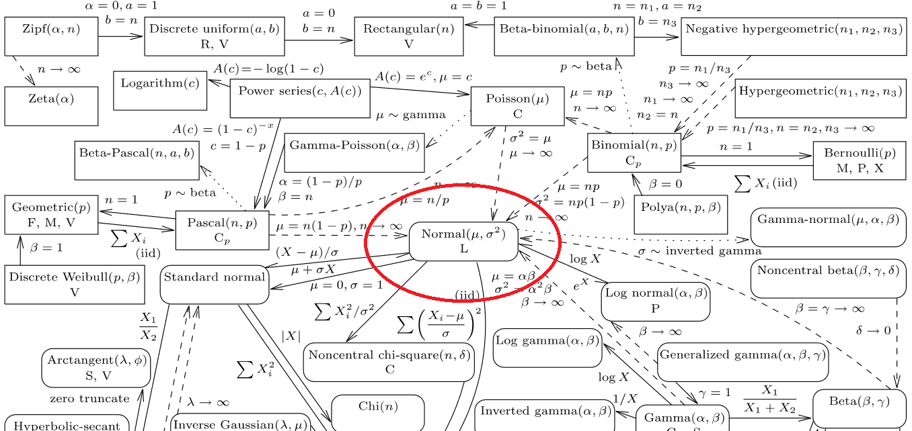
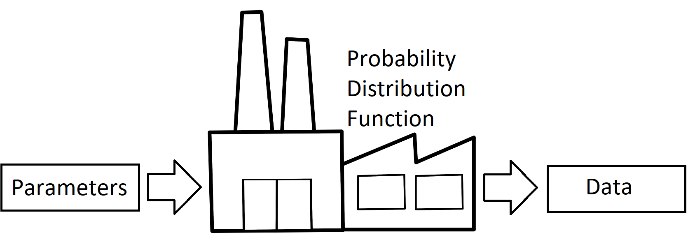
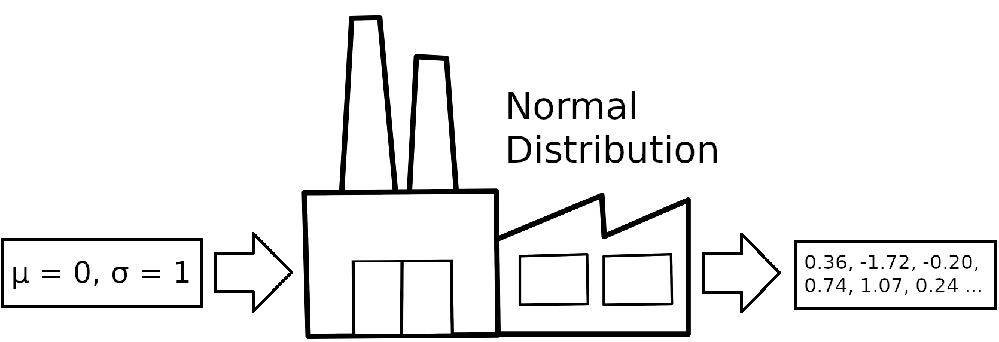
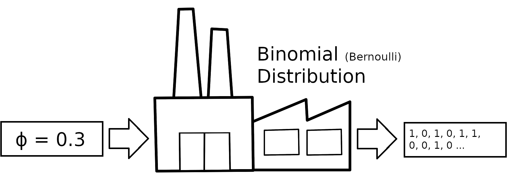
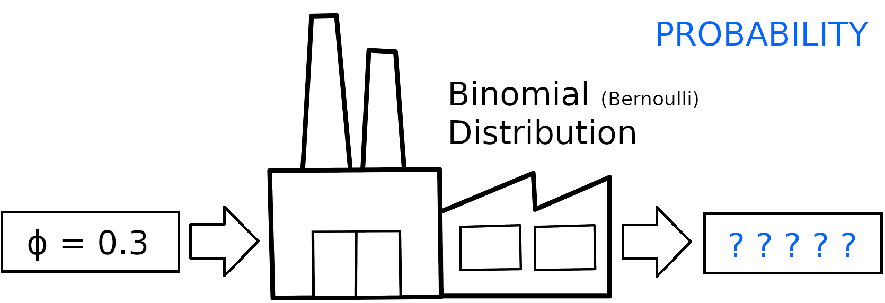
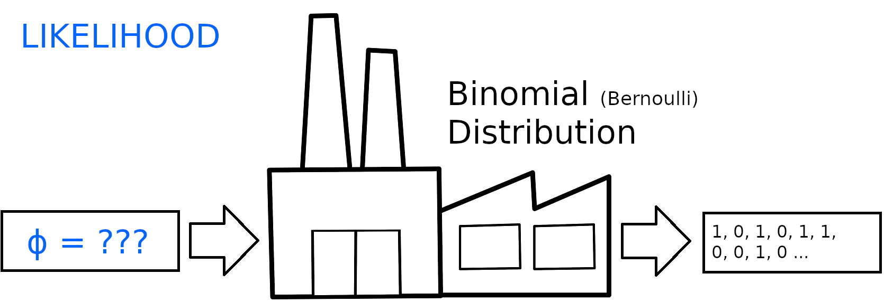
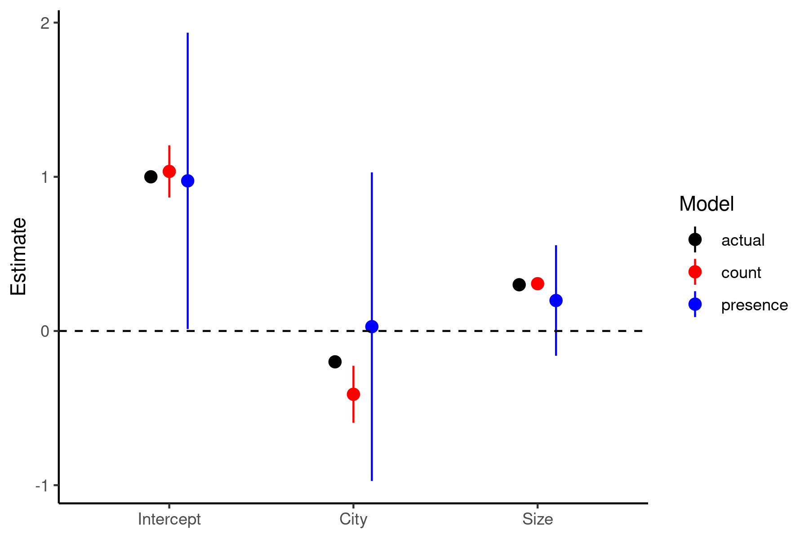

```{r setup, include=FALSE}
knitr::opts_chunk$set(echo = FALSE, eval = TRUE, message=TRUE, warning=TRUE)

library(MASS) #glm.nb
library(tidyverse)
theme_set(theme_classic())
library(ggeffects)
library(ggpubr)
library(knitr)
library(kableExtra)
library(latex2exp)
library(rmutil) #Beta-binomial

set.seed(123)

#Functions
logit <- function(x) log(x/(1-x))
invLogit <- function(x) exp(x)/(1+exp(x))

#Generate data that violate lm assumptions:
n <- 100
x <- runif(n,-10,10)
yhat <- 1 - 0.2*x #Expected value
y0 <- yhat + rnorm(n,0,2) #OK
y1 <- rpois(n,exp(yhat))  #Poisson process
y2 <- rbinom(n,1,invLogit(yhat))  #Binomial process

d1 <- data.frame(x,yhat,y0,y1,y2) #Dataframe


```

# Part 1: The exponential family

## Outline 

::: columns

:::: column

- Meet (some of) the exponential family!
  - Normal
  - Binomial
  - Poisson
  - Beta-Binomial
  - Negative Binomial
- "Play time"

:::: 

:::: column


Christmas gifts for the nerds in your life

::::

:::

## Problem: not everything is normal

::: columns

:::: column

```{r, echo=FALSE, fig.width=3, fig.height=2} 
ggplot(d1,aes(x,y2))+geom_point()+geom_smooth(method='lm',se=TRUE,formula=y~x,col='orange')+
  theme(plot.margin = unit(c(0.1,0.1,0,0.1),'cm'))
```

- Some types of data can never be transformed to make the residuals normal
- Solution: __use the distribution that generates the data!__

:::: 

:::: column

```{r, echo=FALSE, fig.width=3,fig.height=3.5} 
par(mfrow=c(2,1),mar=c(0,0,0,0))
m2 <-lm(y2~x,data=d1) 
plot(m2, which=c(1,2),caption='',cex=0.75,cex.axis=1e-5,tck=0)
```

::::

:::

## But how do I know which distribution to use?

{width=100%}   
[_And if thou gaze long into an abyss, the abyss will also gaze into thee_ - F. Nietzsche](http://www.stat.rice.edu/~dobelman/courses/texts/leemis.distributions.2008amstat.pdf)

## Let's take a look at some _common_ ones!

```{r, fig.height=2.75, fig.width=5} 
n <- 1000
dists <- c('Normal','Binomial','Poisson','Bernoulli')
data.frame(dist=factor(rep(dists,each=n),levels=dists),
           x=c(rnorm(n,0,1),rbinom(n,10,0.25),rpois(n,1),rbinom(n,1,0.6))) %>% 
  ggplot(aes(x=x))+geom_histogram(bins=30)+facet_wrap(~dist,scales='free')+labs(x=NULL,y=NULL)
```

Time to meet the Exponential family!

## The Normal Distribution (aka _Gaussian_)

::: columns

:::: column

- Imagine many random + and - numbers added together
- If you do this _many_ times:
  - Most cancel out (somewhere around 0)
  - Few are far away from 0 (tails of distribution)
- Common in nature, because of many small + and - factors adding together
  - e.g. Height is driven by many sets of genes

::::

:::: column

[A Galton Board in action](https://d.stockcharts.com/img/articles/2019/04/1554241718392985801900.gif): 

::::

:::

## The Normal Distribution - scary math!

::: columns

:::: column

- 2 parameters: mean ($\mu$) and standard deviation ($\sigma$)

\begin{equation*}
p(\textcolor{blue}{x}|\textcolor{darkturquoise}{\mu},\textcolor{red}{\sigma}) = \frac{1}{\textcolor{red}{\sigma}\sqrt{2\pi}}e^{-\frac{1}{2}(\frac{\textcolor{blue}{x}-\textcolor{darkturquoise}{\mu}}{\textcolor{red}{\sigma}})^2}
\end{equation*}

- Probability distribution function (PDF) for the Normal distribution
- Tells you about the probability of getting some number _given_ $\mu$ and $\sigma$

::::

:::: column

\pause

Example: what is the probability of getting a 4, if the mean is 5 and SD is 1?

\begin{equation*}
\begin{split}
p(\textcolor{blue}{4}|\textcolor{darkturquoise}{5},\textcolor{red}{1}) = & \frac{1}{\textcolor{red}{1}\sqrt{2\pi}}e^{-\frac{1}{2}(\frac{\textcolor{blue}{4}-\textcolor{darkturquoise}{5}}{1})^2}\\
= \sim & 0.24
\end{split}
\end{equation*}

In R, this is easy:

\pause

```{r, echo=TRUE}
#d stands for "density"
dnorm(x=4,mean=5,sd=1)
```

::::

:::

## The Normal Distribution

::: columns

:::: column

```{r, fig.height=5, fig.width=5}
data.frame(x=c(0:10)) %>% 
  ggplot(aes(x=x))+stat_function(fun=dnorm,n=100,args=list(mean=5,sd=1))+
  geom_vline(xintercept=4,linetype='dashed',color='blue')+
  annotate('text',x=3,y=dnorm(4,5,1),label=round(dnorm(4,5,1),3),color='blue')+
  annotate('text',x=7.5,y=dnorm(4,5,1)*1.1,label='mu == 5',colour='darkturquoise',size=6,parse=TRUE)+
  annotate('text',x=7.5,y=dnorm(4,5,1)*1,label='sigma==1',colour='red',size=6,parse=TRUE)+
  labs(y=TeX('$p(x|\\mu,\\sigma)$'))+
  ylim(0,0.4)
```

::::

:::: column

```{r, fig.height=5, fig.width=5}
data.frame(x=c(0:10)) %>% 
  ggplot(aes(x=x))+stat_function(fun=dnorm,n=100,args=list(mean=5,sd=3))+
  geom_vline(xintercept=4,linetype='dashed',color='blue')+
  annotate('text',x=3,y=dnorm(4,5,3)+0.01,label=round(dnorm(4,5,3),3),color='blue')+
  annotate('text',x=7.5,y=dnorm(4,5,3)*1.2,label='mu == 5',colour='darkturquoise',size=6,parse=TRUE)+
  annotate('text',x=7.5,y=dnorm(4,5,3)*1,label='sigma==3',colour='red',size=6,parse=TRUE)+
  labs(y=TeX('$p(x|\\mu,\\sigma)$'))+
  ylim(0,0.4)
```

::::

:::

- Probability of x changes with $\mu$ and $\sigma$
- Left: $\sigma = 1$, Right: $\sigma = 3$

## The Binomial Distribution

::: columns

:::: column

- Imagine you have 10 coins, and you flip them all
- If you do this _many_ times:
  - Most will be about 5 heads/tails
  - Few will be 1 head, 9 tails (or reverse)
- Common in nature where outcomes are binary
  - e.g. 10 seeds from a plant, how many will germinate?
- If N = 1, this is called a _Bernoulli trial_

::::

:::: column

```{r, fig.height=6, fig.width=5}
data.frame(x=0:10) %>% mutate(d=dbinom(x,10,0.5)) %>% 
  ggplot(aes(x=x,y=d))+geom_col()+
  labs(x='Number of heads per 10 flips',y='Frequency')+
  scale_x_continuous(breaks=-1:10)
```

::::

:::


## The Binomial Distribution - scary math!

::: columns

:::: column

- 1 parameter: probability of success ($\phi$), plus...
- Number of "coin flips" ($N$)

\small

\begin{equation*}
p(\textcolor{blue}{x}|\textcolor{darkturquoise}{\phi},N) = \binom{N}{\textcolor{blue}{x}} \textcolor{darkturquoise}{\phi}^{\textcolor{blue}{x}} (1-\textcolor{darkturquoise}{\phi})^{N-\textcolor{blue}{x}} 
\end{equation*}

\normalsize

- Probability mass function (PMF); density = continuous
- Tells you about the probability of getting $\textcolor{blue}{x}$ "successes" _given_ $\phi$ and $N$

::::

:::: column

\pause

Example: what is the probability of getting 4 successes, if $\textcolor{darkturquoise}{\phi}$ is 0.25 and N is 15?

\small

\begin{equation*}
\begin{split}
p(\textcolor{blue}{4}|\textcolor{darkturquoise}{0.25},15) = & \binom{15}{\textcolor{blue}{4}} \textcolor{darkturquoise}{0.25}^{\textcolor{blue}{4}} (1-\textcolor{darkturquoise}{0.25})^{15-\textcolor{blue}{4}}  \\
= \sim & 0.23
\end{split}
\end{equation*}

\pause

In R, this is easy:

```{r, echo=TRUE}
dbinom(x=4,size=15,prob=0.25)
```

::::

:::

## The Binomial Distribution

::: columns

:::: column

```{r, fig.height=5, fig.width=5}
nSuccess <- 4
n <- 15
phi <- 0.25
data.frame(x=c(0:15)) %>% mutate(d=dbinom(x,n,phi)) %>% 
  ggplot(aes(x=factor(x),y=d))+
  geom_point()+
  geom_vline(xintercept=nSuccess+1,linetype='dashed',color='blue')+
  annotate('text',x=6,y=dbinom(nSuccess,n,phi),label=round(dbinom(nSuccess,n,phi),3),color='blue')+
  annotate('text',x=9.5,y=dbinom(nSuccess,n,phi)*1.1,label=paste('phi == ',phi),colour='darkturquoise',size=6,parse=TRUE)+
  annotate('text',x=9.5,y=dbinom(nSuccess,n,phi)*1,label=paste('N == ',n),colour='black',size=6,parse=TRUE)+
  labs(y=TeX('$p(x|\\phi,N)$'),x='Number of successes')+
  ylim(0,0.25)
```

::::

:::: column

```{r, fig.height=5, fig.width=5}
nSuccess <- 4
n <- 15
phi <- 0.75
data.frame(x=c(0:15)) %>% mutate(d=dbinom(x,n,phi)) %>% 
  ggplot(aes(x=factor(x),y=d))+
  geom_point()+
  geom_vline(xintercept=nSuccess+1,linetype='dashed',color='blue')+
  annotate('text',x=4,y=dbinom(nSuccess,n,phi)+0.01,label=round(dbinom(nSuccess,n,phi),4),color='blue')+
  annotate('text',x=9.5,y=0.22,label=paste('phi == ',phi),colour='darkturquoise',size=6,parse=TRUE)+
  annotate('text',x=9.5,y=0.2,label=paste('N == ',n),colour='black',size=6,parse=TRUE)+
  labs(y=TeX('$p(x|\\phi,N)$'),x='Number of successes')+
  ylim(0,0.25)
```

::::

:::

- Probability of x "successes" changes with $\phi$ and $N$

## The Poisson Distribution

::: columns

:::: column

- Imagine a rare event (e.g. getting a non-junk mail letter)
- If you record the number of events every day:
  - Most days, you'll get 0 or maybe 1 letter
  - On some rare days, you'll get 3 or 4 letters
- Common in nature where rare events are measured over time/space:
  - e.g. Number of bugs caught in a net (per sweep)
- Equivalent to Binomial distribution, where $N$ is unknown

::::

:::: column

```{r, fig.height=6, fig.width=5}
data.frame(x=0:8) %>% mutate(d=dpois(x,1)) %>% 
  ggplot(aes(x=x,y=d))+geom_col()+
  labs(x='Letters per day',y='Density')
```


::::

:::

## The Poisson Distribution - scary math!

::: columns

:::: column

- 1 parameter: rate parameter ($\lambda$)

\begin{equation*}
p(\textcolor{blue}{x}|\textcolor{darkturquoise}{\lambda}) = \frac{\textcolor{darkturquoise}{\lambda} ^{\textcolor{blue}{x}} e ^{-\textcolor{darkturquoise}{\lambda}}}{\textcolor{blue}{x}!}
\end{equation*}

- Probability mass function (PMF)
- Tells you about the probability of getting $\textcolor{blue}{x}$ counts _given_ $\lambda$ 

::::

:::: column

\pause

Example: what is the probability of getting 2 counts, if $\textcolor{darkturquoise}{\lambda}$ is 1?

\small

\begin{equation*}
\begin{split}
p(\textcolor{blue}{2}|\textcolor{darkturquoise}{1}) = & \frac{\textcolor{darkturquoise}{1} ^{\textcolor{blue}{2}} e ^{-\textcolor{darkturquoise}{1}}}{\textcolor{blue}{2}!} \\
= &\sim 0.18
\end{split}
\end{equation*}

\pause

In R, this is easy:

```{r, echo=TRUE}
dpois(x=2,lambda=1)
```

::::

:::

## The Poisson Distribution

::: columns

:::: column

```{r, fig.height=5, fig.width=5}
nCounts <- 2
lambda <- 1
data.frame(x=c(0:8)) %>% mutate(d=dpois(x,lambda)) %>% 
  ggplot(aes(x=factor(x),y=d))+
  geom_point()+
  geom_vline(xintercept=nCounts+1,linetype='dashed',color='blue')+
  annotate('text',x=nCounts+1.5,y=dpois(nCounts,lambda),label=round(dpois(nCounts,lambda),3),color='blue')+
  annotate('text',x=nCounts+2,y=dpois(nCounts,lambda)*1.8,label=paste('lambda == ',lambda),colour='darkturquoise',size=6,parse=TRUE)+
  labs(y=TeX('$p(x|\\lambda)$'),x='Counts observed')+
  ylim(0,0.4)
```

::::

:::: column

```{r, fig.height=5, fig.width=5}
nCounts <- 2
lambda <- 3
data.frame(x=c(0:8)) %>% mutate(d=dpois(x,lambda)) %>% 
  ggplot(aes(x=factor(x),y=d))+
  geom_point()+
  geom_vline(xintercept=nCounts+1,linetype='dashed',color='blue')+
  annotate('text',x=nCounts+1.5,y=dpois(nCounts,lambda),label=round(dpois(nCounts,lambda),3),color='blue')+
  annotate('text',x=nCounts+2,y=dpois(nCounts,lambda)*1.5,label=paste('lambda == ',lambda),colour='darkturquoise',size=6,parse=TRUE)+
  labs(y=TeX('$p(x|\\lambda)$'),x='Counts observed')+
  ylim(0,0.4)
```

::::

:::

- Probability of x counts changes with $\lambda$


## More complications:

- The Normal distribution has a parameter for the mean and SD, but...
- What about the Binomial and Poisson distributions?
  - Binomial: mean $= Np$, SD $= \sqrt{Np(1-p)}$
  - Poisson: mean $= \lambda$, SD $= \sqrt{\lambda}$
- What if our data have additional variance?
  - _Beta Binomial_ and _Negative Binomial_ distributions
  
## The Beta Binomial Distibution

::: columns

:::: column

- Many "coin-flip" processes have longer tails than standard Binomial
  - e.g. numbers of males/females in families
- Beta-binomial adds additional dispersion to coin flip process
- 2 parameters: $\phi$ and $s$ (if $s$ is large, similar to Binomial) 
  - Also requires: $N$
  
\pause
  
```{r, eval=FALSE, echo=TRUE}
#Extra distributions
library(rmutil) 
dbetabinom(x,m=phi,size=N,s=5)
```

::::

:::: column

```{r, fig.height=6, fig.width=5}
n <- 10
phi <- 0.5
data.frame(x=0:10) %>% mutate(bin=dbinom(x,size=n,prob=phi),betabin=dbetabinom(x,size=n,m=phi,s=5)) %>% 
  pivot_longer(cols=bin:betabin,names_to='dist',values_to='d') %>% 
  mutate(dist=factor(dist,levels=c('bin','betabin'),labels=c('Binomial','Beta Binomial (s=5)'))) %>% 
  ggplot(aes(x=x,y=d))+geom_col()+facet_wrap(~dist,ncol=1) +
  labs(x='Number of heads per 10 flips',y='Density')+scale_x_continuous(breaks=-1:10)
```

::::

:::

## The Negative Binomial Distribution

::: columns

:::: column

- Unfortunately, _almost nothing_ in ecology actually follows a Poisson distribution 
- Negative Binomial is similar to a Poisson, but can have longer tails
- Also called: _Polya_ distibution (`nbinom2` in many GLM commands)
- Parameters: $\mu$ and $\theta$ (if $\theta$ is large, close to Poisson)

\pause
  
```{r,eval=FALSE,echo=TRUE}
#size = theta parameter
dnbinom(x,mu,size=1) 
```

::::

:::: column

```{r, fig.height=6, fig.width=5}
lambda <- 1
data.frame(x=0:10) %>% mutate(pois=dpois(x,lambda=lambda),nb=dnbinom(x,mu=lambda,size=1)) %>% 
  pivot_longer(cols=pois:nb,names_to='dist',values_to='d') %>% 
  mutate(dist=factor(dist,levels=c('pois','nb'),labels=c('Poisson','Negative Binomial (theta = 1)'))) %>% 
  ggplot(aes(x=x,y=d))+geom_col()+facet_wrap(~dist,ncol=1) +
  labs(x='Number of counts',y='Density')
```

::::

:::

## Summary of Common "Starter" Distributions

- Continuous data, spanning - or + numbers:
  - Normal (transformed or regular)
- Count data
  - Poisson, Negative Binomial
- Count data of successes _and_ failures
  - Binomial, Beta Binomial

\pause

These are by _no means_ the only useful distributions, but are fairly common

## First challenge (Part 1)

Let's say that you've collected data at 2 different sites. Which distributions would you start with for the following data?

- Insects caught in a trap (per day)
- Weight of seeds from a plant
- Occupied/unoccupied nest sites
- Chemical concentrations
- Size of trees (DBH or height)
- Number of male and female bats

## Second challenge (Part 2)

Now that you've figured out which distribution, try simulating some data from each "site", and plot it!

- Insects caught in a trap (per day): _Poisson or NB_
  - `rpois(n,lambda)` or `rnbinom(n,mu,size)`
- Weight of seeds: _Normal_
  - `rnorm(n,mean,sd)`
- Occupied/unoccupied nest sites: _Binomial_
  - `rbinom(n, 1, prob)` aka. _Bernoulli_ distribution
- Chemical concentrations in a pond: _Normal_
  - `rnorm(n,mean,sd)`
- Size of trees (DBH or height):_log-Normal_
  - `exp(rnorm(n,mean,sd))`
- Number of male and female bats: _Binomial or Beta Binomial_
  - `rbinom(n, size, prob)` or `rbetabinom(n,size,m,s)`

# Part 2: Maximum likelihood and GLMs

```{r setup2, include=FALSE}
set.seed(123)

#Functions
logit <- function(x) log(x/(1-x))
invLogit <- function(x) exp(x)/(1+exp(x))

#Generate data that violate lm assumptions:
n <- 100
x1 <- runif(n,-10,10) #Predictors
x2 <- runif(n,-5,5)

yhat <- 1 - 0.2*x1 + 0.3*x2 #Expected value
y0 <- yhat + rnorm(n,0,2) #Normal process
y1 <- rpois(n,exp(yhat))  #Poisson process
y2 <- rbinom(n,1,invLogit(yhat))  #Binomial (bernoulli) process

d1 <- data.frame(x1,x2,yhat,y0,y1,y2) #Dataframe

```

## Outline

- Maximum likelihood
  - A way to think about data
  - Likelihood vs Probability
- Generalized linear models
  - Link functions
  - Predictors -> Linear model

## How is our data made?

Making data can be thought of as a _factory_

- Input: __parameters__ (things that guide the process)
- Process: __probability function__
- Output: __data__ (things made by the process)



## Examples






<!-- ## Likelihood vs Probability -->

<!-- These concepts are both related to the chance of seeing something occur -->

<!-- - Probability: "I know that $\mu = 0$ and $\sigma = 1$. What are my chances of getting a number between -1 and +1?" -->
<!--   - $p(\text{data}|\mu=0,\sigma=1)$  -->
<!-- - Likelihood: "I got a bunch of numbers. What is the chance that $\mu = 0$ and $\sigma = 1$ made them?" -->
<!--   - $L(\mu=0,\sigma=1|\text{data})$  -->

<!-- We will mostly deal with _likelihoods_, because we never actually know what $\mu$ and $\sigma$ are! -->

## Likelihood vs Probability






## Likelihood vs Probability (cont.)

Probability and likelihood both use the same PDF

- "I know that $\phi$ = 0.3. What is the chance of getting 2 heads and a tail?"

```{r, echo=TRUE}
dbinom(1,1,0.3)*dbinom(1,1,0.3)*dbinom(0,1,0.3)
```

- "I got 2 heads and a tail. What is the likelihood that $\phi$ = 0.3?"

```{r, echo=TRUE}
dbinom(1,1,0.3)*dbinom(1,1,0.3)*dbinom(0,1,0.3)
```

## Likelihood vs Probability (cont.)

Let's see how _likelihood_ changes with different values of $\phi$:

```{r, echo=TRUE}
#phi = 0.3
dbinom(1,1,0.3)*dbinom(1,1,0.3)*dbinom(0,1,0.3)
```

```{r, echo=TRUE}
#phi = 0.7
dbinom(1,1,0.7)*dbinom(1,1,0.7)*dbinom(0,1,0.7)
```

Likelihood of $\phi$ = 0.7 is higher, i.e. $\phi$ = 0.7 matches our data _better_

## Likelihood

```{r, echo=FALSE, eval = TRUE, fig.width= 4, fig.height = 2.5}
llfun <- function(phi) dbinom(1,1,phi)*dbinom(1,1,phi)*dbinom(0,1,phi)

ggplot() + geom_function(fun=llfun) + xlim(0,1) + labs(x=expression(phi),y=expression(paste('Likelihood(H,H,T|',phi,')'))) + geom_vline(xintercept=2/3,linetype='dashed')

```

The best match (maximum likelihood value) is at $\phi$ = 0.666 (2 heads out of 3 flips)

## Generalized Linear Models

`glm()` will fit a model like this, and find the ML solution

```{r, echo=TRUE, size='tiny'}
dat <- data.frame(flips=c(1,1,0)) #Data (2 heads, 1 tail)
mod1 <- glm(flips~1,data=dat,family='binomial') #Note family specification
summary(mod1)
```

Wait... our estimate should be 0.666 (2/3), not `r round(coef(mod1),3)`!

## Link functions

- Some parameters of PDFs have _limits_
  - Normal: $-\infty < \mu < \infty$, $0 < \sigma$
  - Binomial: $0 < \phi < 1$
  - Poisson: $0 < \lambda$
- GLMs use _link functions_ to map values onto the appropriate parameter range
  - Normal: Identity (i.e. $\times 1$)
  - Binomial: Logit
  - Poisson/NB: Log
- $logit(0.693) = 0.666$, so the GLM actually got it right!

## What do these functions look like?

::: columns

:::: column

```{r, echo = FALSE, eval = TRUE, fig.height=4, fig.width=4}
ggplot() + geom_function(fun=logit,n=1000) + xlim(0,1) + labs(y='logit(x)',x='x')+
  annotate('text',x=0.75,y=-3,label='paste(f(x) == ln, bgroup("(", frac("x","1-x"),")"))',parse=TRUE)+
  annotate('text',x=0.75,y=-5,label='f(x)^-1 == frac(e^x,e^x+1)',parse=TRUE)

# invLogit <- function(x) exp(x)/(1+exp(x))

```

::::

:::: column

```{r, echo = FALSE, eval = TRUE, fig.height=4, fig.width=4}
ggplot() + geom_function(fun=log,n=1000) + xlim(0,10) + labs(y='log(x)',x='x')+
  annotate('text',x=6,y=-2,label='f(x) == ln(x)',parse=TRUE)+
  annotate('text',x=6,y=-3,label='f(x)^-1 == e^x',parse=TRUE)
```

::::

:::

- These functions map parameter values from the appropriate range (0-1 or 0-$\infty$) onto $-\infty$ to $+\infty$

## Why do we bother with these link function?

::: columns

:::: column

- Likelihood functions are not symmetrical on the regular scale
- On the link-scale, they are closer to a normal distribution
- Makes it easier for R to find the ML estimate (and confidence intervals)

::::

:::: column

```{r, echo=FALSE, eval = TRUE, fig.width= 3, fig.height = 2}
ggplot() + geom_function(fun=llfun) + xlim(0,1) + labs(x=expression(phi),y=expression(paste('Likelihood(H,H,T|',phi,')'))) + geom_vline(xintercept=2/3,linetype='dashed')

```

```{r, echo=FALSE, eval = TRUE, fig.width= 3, fig.height =2}
#Uses logit-phi (-Inf to +Inf) rather than phi (0 to 1)
llfun2 <- function(lphi){
  phi <- invLogit(lphi)
  ll <- dbinom(1,1,phi)*dbinom(1,1,phi)*dbinom(0,1,phi)
  return(ll)
}

ggplot() + geom_function(fun=llfun2) + xlim(-5,8) + labs(x=expression(paste('logit(',phi,')')),y=expression(paste('Likelihood(H,H,T|',phi,')'))) + geom_vline(xintercept=logit(2/3),linetype='dashed')

```

::::

:::

## How do linear models fit into this?

::: columns

:::: column

- Usually we aren't interested in finding only a single parameter $\phi$.
- Solution: $\phi$ becomes a _linear_ function of the predictors

- Simple linear models take the form:
\begin{equation*}
\begin{split}
\textcolor{orange}{\hat{y}} & = \textcolor{blue}{b_0} + \textcolor{blue}{b_1}\textcolor{darkturquoise}{x_1} ... + \textcolor{blue}{b_i}\textcolor{darkturquoise}{x_i} \\
y & \sim Normal(\textcolor{orange}{\hat{y}},\textcolor{red}{\sigma})
\end{split}
\end{equation*}

::::

:::: column

- Generalized linear models are similar, except that:
1. Expected value ($\phi$) fed through a link function
2. Data is fit to a non-normal probability function

\vspace{12pt}

\begin{equation*}
\begin{split}
logit(\textcolor{orange}{\hat{\phi}}) & = \textcolor{blue}{b_0} + \textcolor{blue}{b_1}\textcolor{darkturquoise}{x_1} ... + \textcolor{blue}{b_i}\textcolor{darkturquoise}{x_i} \\
flips & \sim Binomial(\textcolor{orange}{\hat{\phi}})
\end{split}
\end{equation*}

::::

:::

\center Instead of finding $\phi$, __R finds the coefficients ($\textcolor{blue}{b_0}$, $\textcolor{blue}{b_1}$ ... $\textcolor{blue}{b_i}$) that create $\phi$__

## How do I fit GLMs in R?

Syntax and model output is very similar to `lm`

```{r, echo=TRUE, size='tiny'}
# y ~ x, where x is the predictor of y (~1 for just intercept)
mod_binomial <- glm(y2 ~ x1 + x2 , data = d1, family = 'binomial') #Fit a binomial GLM
summary(mod_binomial)
```

Dispersion and deviance will be discussed later...

## How do I get partial effects plots?

`crPlot` (from `car`) and `ggpredict` (`ggeffects`) work with fitted `glm` models

```{r, echo = TRUE, size='tiny', fig.height=2.5,fig.width=5}
ggpredict(mod_binomial, terms='x1 [all]') %>% #Partial effect of x1 term
  ggplot(aes(x, predicted)) + geom_line() +
  geom_ribbon(aes(ymin = conf.low, ymax = conf.high), alpha = 0.3) +
  labs(x = 'x1', y = expression(paste('Chance of Success (',phi,')')))
```

## A challenger approaches!

- Dr. Roberto Darkley (Robert Barkley's evil nemesis) sent 2 people out to check out some bat roosts in Edmonton and Calgary. One of them dutifully counted bats at each roost, but the other one was really lazy, and just recorded "bats or no bats" (1 or 0).
- Fit a model to each of their data (found in `batDatGLM.csv`) using a GLM
  - `batCounts` should be modeled using a Poisson GLM, and `batPres` should use a Binomial GLM
  - Terms to include: `city` and `size` (no interaction)
- How do the models look? Compare the coefficients and see if they are different
  - Bonus: make a partial regression plot of terms in the Poisson GLM

## Model results




# Part 3: Models behaving badly


```{r setup3, include=FALSE}
library(MASS) #glm.nb
library(tidyverse)
theme_set(theme_classic())
library(ggeffects)
library(ggpubr)
library(knitr)


set.seed(123)

#Functions
logit <- function(x) log(x/(1-x))
invLogit <- function(x) exp(x)/(1+exp(x))

#Generate data that violate lm assumptions:
n <- 100
x <- runif(n,-10,10)

xMat <- model.matrix(~x)
coefs <- c(1,-0.2)
yhat <- xMat %*% coefs


#Expected value
y0 <- yhat + rnorm(n,0,2) #OK
y1 <- rpois(n,exp(yhat))  #Poisson process
y2 <- rnbinom(n,mu=exp(yhat),size=1)  #NB process
# y2 <- rbinom(n,1,invLogit(yhat))  #Binomial process

d1 <- data.frame(x,yhat,y0,y1,y2) #Dataframe

#Second df for partial residual example
A <- sample(letters[1:3],n,TRUE)
xMat <- model.matrix(~A+x)
coefs <- c(1,-1,0.5,-0.2)
yhat <- xMat %*% coefs

y0 <- yhat + rnorm(n,0,2) #Normal
y1 <- rpois(n,exp(yhat))  #Poisson process
y2 <- rbinom(n,1,invLogit(yhat))  #Binomial process

d2 <- data.frame(A,x,yhat,y0,y1,y2) #Dataframe

rm(n,x,y0,y1,y2,xMat,A,yhat)

```

## Motivation

- Are my model results reliable?
  - Residual checks
  - Overdispersion
  - Zero-inflation
- Model selection - which terms should I use?
  - log-likelihood, $\chi^2$ tests, and AIC
  - ML vs REML
- Other things
  - Binomial GLMs with >1 trial
  - Offsets in count models
  - $R^2$ for GLMs
- Show-and-tell!

## Problem 1: Residual checks

::: columns

:::: column

- In LMs, residual checks are used to make sure that:
1. Terms are linearly related
2. Generating process is valid
3. Variance is constant
- "Regular" residuals don't work this way for GLMs!

```{r}
m1 <- glm(y1~x,data=d1,family='poisson')
plot(y1~x,data=d1,pch=19)
lines(sort(d1$x),exp(cbind(rep(1,nrow(d1)),sort(d1$x)) %*% coef(m1)),lwd=1,col='blue')
# x, yhat, y
resNo <- 81 #Line number to use as example
lines(rep(d1$x[resNo],2),c(exp(d1$yhat[resNo]),d1$y1[resNo]),col='red')
r1 <- d1$y1[resNo] - exp(d1$yhat[resNo])
text(x=d1$x[resNo],mean(c(exp(d1$yhat[resNo]),y=d1$y1[resNo])),
     labels=paste('Residual = +',round(r1,3)),adj=-0.1,col='red',cex=3)
```

::::

:::: column

```{r}
plot(predict(m1),residuals(m1,type='response'),xlab='Predicted value',ylab='Residuals');abline(h=0,lty='dashed')
points(x=predict(m1)[resNo],y=residuals(m1,type='response')[resNo],col='black',pch=19)
lines(x=rep(predict(m1)[resNo],2),y=c(0,residuals(m1,type='response')[resNo]),col='red')
```

```{r}
colVec <- rep('black',nrow(d1)); colVec[resNo] <- 'red'
pchVec <- rep(1,nrow(d1)); pchVec[resNo] <- 19
qqnorm(residuals(m1,type='response'),col=colVec,pch=pchVec); qqline(residuals(m1,type='response'))

```


::::

:::

## There are _many_ kinds of residuals!

In addition to _response_ (regular) residuals there are:

- Working residuals
- Pearson residuals
- __Deviance residuals__

Deviance residuals use _likelihood_:

\begin{equation*}
r_{dev} = sign(y-\hat{y})\sqrt{2(log(L(y|\theta_s))-log(L(y|\theta))))}
\end{equation*}

- This may look scary, but R does this all for you!
- These are analogous to regular residuals in LMs
- For more about the different kinds of residuals, see [here](https://www.datascienceblog.net/post/machine-learning/interpreting_generalized_linear_models/)

## Solution: use deviance residuals for GLMs

::: columns

:::: column

Keep in mind:

- Residuals from GLMs will never be as "pretty" as those from LMs
- _Especially_ true for:
  - Binomial GLMs
  - Poisson/Negative Binomial GLMs with many zeros

```{r}
m1 <- glm(y1~x,data=d1,family='poisson')
plot(y1~x,data=d1,pch=19)
lines(sort(d1$x),exp(cbind(rep(1,nrow(d1)),sort(d1$x)) %*% coef(m1)),lwd=1,col='blue')
# x, yhat, y
resNo <- 81 #Line number to use as example
lines(rep(d1$x[resNo],2),c(exp(d1$yhat[resNo]),d1$y1[resNo]),col='red')
r1 <- d1$y1[resNo] - exp(d1$yhat[resNo])
text(x=d1$x[resNo],mean(c(exp(d1$yhat[resNo]),y=d1$y1[resNo])),
     labels=paste('Residual = +',round(r1,3)),adj=-0.1,col='red',cex=3)
```

::::

:::: column

```{r}
plot(predict(m1),residuals(m1,type='deviance'),xlab='Predicted value',ylab='Deviance Residuals');abline(h=0,lty='dashed')
points(x=predict(m1)[resNo],y=residuals(m1,type='deviance')[resNo],col='black',pch=19)
lines(x=rep(predict(m1)[resNo],2),y=c(0,residuals(m1,type='deviance')[resNo]),col='red')
```

```{r}
colVec <- rep('black',nrow(d1)); colVec[resNo] <- 'red'
pchVec <- rep(1,nrow(d1)); pchVec[resNo] <- 19
qqnorm(residuals(m1,type='deviance'),col=colVec,pch=pchVec); qqline(residuals(m1,type='deviance'))

```


::::

:::

## Problem 2: Overdispersion

::: columns

:::: column

- Binomial and Poisson families have __no__ variance term (e.g. _SD_).
- Sometimes this assumption doesn't work! (Very common for Poisson models)
- Strong overdispersion biases SEs, meaning that p-values are useless

::::

:::: column

```{r}
m2 <- glm(y2~x,data=d1,family='poisson')

do.call('cbind',predict(m2,se.fit=TRUE)[c(1:2)]) %>% data.frame() %>%
  mutate(x=d1$x,y=d1$y2,upr=fit+se.fit*2,lwr=fit-se.fit*2) %>%
  mutate(across(c(fit,upr,lwr),exp)) %>% arrange(x) %>%
  ggplot(aes(x=x))+geom_point(aes(y=y))+
  geom_ribbon(aes(ymax=upr,ymin=lwr),alpha=0.3)+
  geom_line(aes(y=fit))
```

Example: data are much more variable than the predictions from the model

::::

:::

## Problem 2: Overdispersion

```{r, size='tiny'}
summary(m1)
```

- In Poisson or Binomial models, Residual deviance $\div$ Degrees of Freedom should be $\sim$ 1
- Residual deviance is the sum of all deviance from the model
- This model looks OK (`r round(m1$deviance,2)` $\div$ `r round(m1$df.residual,2)` = `r with(m1, round(deviance/df.residual,2))`)

## Problem 2: Overdispersion

```{r, size='tiny'}
m2 <- glm(y2~x,data=d1,family='poisson')
summary(m2)
```

- This model does __not__ look OK (`r round(m2$deviance,2)` $\div$ `r round(m2$df.residual,2)` = `r with(m2, round(deviance/df.residual,2))`)
- Generated using Negative Binomial, but fit to Poisson

## Causes

Overdispersion can be caused by different things:

- Using the wrong probability distribution
  - e.g. Poisson, but should be Negative Binomial
- Lots of zeros in count data
  - e.g. Very short observation period
- Leaving out an important term
  - e.g. An important _interaction_ term was omitted
- Random effects\footnotemark not accounted for
  - e.g. Data collected at different sites, but ignored

\footnotetext{Random effects discussed later}

## Solutions for overdispersion

Try the following (in this order):

1. Consider terms that may have been left out
    1. Fixed effects
    2. Random effects
2. Try distributions that account for overdispersion
    1. Negative Binomial, Beta Binomial, Zero-inflated Poisson\footnotemark
    2. Quasi-binomial\footnotemark[\value{footnote}] and quasi-poisson\footnotemark[\value{footnote}]
    3. Transform counts to presence/absence
3. Lower your expectations, and use a lower critical p-value (e.g. 0.01 instead of 0.05)
4. Design a better study :(

\footnotetext{These can be annoying to deal with, so avoid if possible}

## Negative Binomial Regression

```{r, echo=TRUE, size='tiny'}
library(MASS) #Required for NB models
m3 <- glm.nb(y2~x,data=d1)
summary(m3) #No longer overdispersed!
```

<!-- - Model is no longer overdispersed (Residual deviance $\div$ d.f. = `r round(m3$deviance,2)` $\div$ `r m3$df.residual` = `r round(m3$deviance/m3$df.residual,2)` ) -->

## Negative Binomial Regression

::: columns

:::: column

```{r fig.height=5,fig.width=4}
do.call('cbind',predict(m2,se.fit=TRUE)[c(1:2)]) %>% data.frame() %>%
  mutate(x=d1$x,y=d1$y2,upr=fit+se.fit*2,lwr=fit-se.fit*2) %>%
  mutate(across(c(fit,upr,lwr),exp)) %>% arrange(x) %>%
  ggplot(aes(x=x))+geom_point(aes(y=y))+
  geom_ribbon(aes(ymax=upr,ymin=lwr),alpha=0.3)+
  geom_line(aes(y=fit))+labs(title='Poisson regression')
```

::::

:::: column

```{r, fig.height=5,fig.width=4}
do.call('cbind',predict(m3,se.fit=TRUE)[c(1:2)]) %>% data.frame() %>%
  mutate(x=d1$x,y=d1$y2,upr=fit+se.fit*2,lwr=fit-se.fit*2) %>%
  mutate(across(c(fit,upr,lwr),exp)) %>% arrange(x) %>%
  ggplot(aes(x=x))+geom_point(aes(y=y))+
  geom_ribbon(aes(ymax=upr,ymin=lwr),alpha=0.3)+
  geom_line(aes(y=fit))+labs(title='Negative Binomial Regression')
```

::::

:::

## Zero-inflation: drunk monks

An analogy:

1. Monks at a monastery make copies of manuscripts. Most days they make very few (0 or 1), but occasionally they make many (2-5)
2. Some days they decide to try out the beer that's been brewing in the cellar! No manuscripts get made on those days.
3. The number of manuscripts made (per day) follows a _zero-inflated Poisson distribution_

This is _mixture_ of a Poisson and a Binomial:

<!-- \begin{equation*} -->
<!-- ZIPoisson(y | \lambda, \phi) = -->
<!-- \begin{cases} -->
<!-- Poisson(0|\lambda)\text{ OR }Binomial(0|\phi) & \text{if } y = 0 \\ -->
<!-- Poisson(y|\lambda) & \text{if } y > 0 -->
<!-- \end{cases} -->
<!-- \end{equation*} -->

\begin{tikzpicture}[scale=0.5]
	\begin{pgfonlayer}{nodelayer}
		\node [style=rectangle] (0) at (-8.25, 0) {Binomial ($\phi$)};
		\node [style=rectangle] (5) at (-3.75, 1) {No work};
		\node [style=rectangle] (6) at (-3.75, -1) {Work};
		\node [style=rectangle] (8) at (0.5, -1) {Poisson ($\lambda$)};
		\node [style=invisRect] (10) at (1.75, -3.25) {};
		\node [style=invisRect] (11) at (7, 1) {0 manuscripts};
		\node [style=invisRect] (12) at (7, -1) {1+ Manuscripts};
	\end{pgfonlayer}
	\begin{pgfonlayer}{edgelayer}
		\draw [style=oneWay] (0) to (6);
		\draw [style=oneWay] (6) to (8);
		\draw [style=oneWay] (0) to (5);
		\draw [style=oneWay] (5) to (11);
		\draw [style=oneWay] (8) to (12);
		\draw [style=oneWay] (8) to (11);
	\end{pgfonlayer}
\end{tikzpicture}


## Zero-inflation: graphical model

```{r, fig.width=7, fig.height=5}
n <- 200
data.frame(p=rpois(n,2),zi=rbinom(n,1,0.1)) %>%
  mutate(proc=ifelse(zi==1,'Extra Zeros','Poisson'),p=ifelse(zi==1,0,p)) %>%
  group_by(proc,p) %>% count() %>% ungroup() %>%
  mutate(proc=factor(proc,levels=c('Extra Zeros','Poisson'))) %>%
  ggplot(aes(x=factor(p)))+geom_col(aes(y=n,fill=proc))+
  labs(x='Counts',y='Frequency',fill='Process')+scale_fill_manual(values=c('red','black'))+
  theme(legend.position = c(0.8,0.8))

```

## Problem: hard to fit

- Hard for R to tell the difference between ZIP/ZINB, and a Poisson/NB with a low mean ($\lambda$).
- This needs a lot of data in order to work! Consider longer sampling periods in order to reduce zeros

::: columns

:::: column

```{r, fig.width=5, fig.height=5}
data.frame(p=rpois(n,0.8)) %>%
  group_by(p) %>% count() %>% ungroup() %>%
  ggplot(aes(x=factor(p)))+geom_col(aes(y=n),fill='black')+
  labs(x='Counts',y='Frequency')

```

::::

:::: column

```{r, fig.width=5, fig.height=5}
n <- 200
data.frame(p=rpois(n,1),zi=rbinom(n,1,0.1)) %>%
  mutate(proc=ifelse(zi==1,'Extra Zeros','Poisson'),p=ifelse(zi==1,0,p)) %>%
  group_by(proc,p) %>% count() %>% ungroup() %>%
  mutate(proc=factor(proc,levels=c('Extra Zeros','Poisson'))) %>%
  ggplot(aes(x=factor(p)))+geom_col(aes(y=n,fill=proc))+
  labs(x='Counts',y='Frequency',fill='Process')+scale_fill_manual(values=c('red','black'))+
  theme(legend.position = c(0.8,0.8))

```

::::

:::


## Model selection

How many terms should be in my model?

- Same principle as in regular linear models: __what do you think the process is?__
  - Just because a term is "not significant" doesn't mean it should be dropped out!
  - Just because a term is "significant" doesn't mean it should be left in!
  - I find graphical models very helpful for this (see Lecture 4, p. 17)
  - Avoid selecting models based on $R^2$. Avoid stargazing\footnotemark (hunting for "better" p-values or AIC scores)
- To test whether terms are important in predicting your data (similar to), use _likelihood-ratio tests_
  - `drop1(model,test='Chisq')`
  - AIC tests usually say the same thing as LR tests

\footnotetext{"My God, it's full of stars!" -2001, A Space Odyssey}

<!-- ## _log_ likelihood -->

<!-- ::: columns -->

<!-- :::: column -->

<!-- - Probabilities multiplied together quickly become _very small_ -->
<!-- - Computers can't distinguish between extremely big or small numbers -->
<!-- - Therefore, it uses _log-likelihoods_ (also easier to calculate) -->

<!-- :::: -->

<!-- :::: column -->

<!-- ```{r, echo=FALSE, eval = TRUE, fig.width= 3, fig.height = 2} -->
<!-- #Uses logit-phi (-Inf to +Inf) rather than phi (0 to 1) -->
<!-- llfun2 <- function(lphi){ -->
<!--   phi <- invLogit(lphi) -->
<!--   ll <- dbinom(1,1,phi)*dbinom(1,1,phi)*dbinom(0,1,phi) -->
<!--   return(ll) -->
<!-- }  -->

<!-- ggplot() + geom_function(fun=llfun2) + xlim(-5,8) + labs(x=expression(paste('logit(',phi,')')),y=expression(paste('Likelihood(H,H,T|',phi,')'))) + geom_vline(xintercept=logit(2/3),linetype='dashed') -->

<!-- ``` -->

<!-- ```{r, echo=FALSE, eval = TRUE, fig.width= 3, fig.height =2} -->

<!-- ggplot() + geom_function(fun=~log(llfun2(.))) + xlim(-5,8) + labs(x=expression(paste('logit(',phi,')')),y=expression(paste('log-likelihood(H,H,T|',phi,')'))) + geom_vline(xintercept=logit(2/3),linetype='dashed') -->

<!-- ``` -->

<!-- :::: -->

<!-- ::: -->

## ML vs REML

- Maximum likelihood (ML) estimates of variance (e.g. SD) are always smaller than the actual variance (biased)
- Restricted maximum likelihood (REML) uses a mathematical trick to get around this, but...
- This means that models with different numbers of terms don't have the same REML estimates
- Likelihood between these models technically can't be compared!

Solution:

  1. Use ML if comparing between models with different fixed effects, then...
  2. Re-fit with REML once you've decided on a model

## Other useful things about GLMs!

- Binomial GLMs with >1 trial
- Offsets in count models
- $R^2$ for GLMs
- Partial effects plots

## Binomial GLMs with >1 trial

- If you're measuring single "success/failures", 1s and 0s are used
- If multiple trials occur, R requires counts of successes and failures
- Example: "I counted male and female critters at different sites. Does temperature affect sex ratios?"

```{r, eval=FALSE, echo=TRUE}
#Number of females and males are in 2 separate columns in d1
glm(cbind(females,males) ~ temp, family='binomial',data = d1)
```

This will correctly account for different numbers of critters ("trials") at each site


## Offsets in count models

- Poisson/NB models assume that counts occur over the same period of time
- Count models use integers only, so you can't just do: $counts \div hours$
- Solution: use _offsets_ to deal with different observation times
  - Predictor with a slope fixed at 1
- Example: "I counted critters for different lengths of time at each site. Does temperature affect counts?"

```{r, eval=FALSE, echo=TRUE}
#hours = observation time at each site, and
#   must be log-transformed before being used in an offset
#
glm(counts ~ offset(log(hours)) + temp, family='poisson',data = d1)
```

This will return estimates that have been scaled to a 1-hour observation time

## R-squared for GLMs

- Bad news: there isn't really any good way to get $R^2$ (explained variance) for non-`lm` models
- OK news: there are many _pseudo_-$R^2$ measures that are _sort of_ like $R^2$, but nobody really agrees on which one is best
- Good news: ecologists tend to not know or care about this

Solution: pick a single type of $R^2$ and use that, or omit it completely \footnotemark

- See [here](https://bbolker.github.io/mixedmodels-misc/glmmFAQ.html#how-do-i-compute-a-coefficient-of-determination-r2-or-an-analogue-for-glmms), [here](https://stats.stackexchange.com/questions/46345/how-to-calculate-goodness-of-fit-in-glm-r) or [here](http://statistics.ats.ucla.edu/stat/mult_pkg/faq/general/Psuedo_RSquareds.htm) for more info on $R^2$
- Try `rsquaredglmm()` from `piecewiseSEM` or `r.squaredGLMM()` from `MuMIn`

\footnotetext{But be prepared to argue with supervisors, committee members, or reviewers! They will want some kind of measure of how well your model predicted your data.}

## Partial effects plots

- `library(ggeffects)` and `library(effects)` work for partial effects plots, but...
- Residuals are tricky to display, unless you plot them on the link scale

```{r, fig.height=5, fig.width=10}
m4 <- glm(y1~x+A,data=d2,family='poisson')

p1 <- ggplot(d2,aes(x=x,y=y1,col=A))+geom_point()+geom_smooth(method='glm',formula=y~x,method.args = list(family = "poisson"))+
  theme(legend.position = 'none')
p2 <- plot(ggpredict(m4,terms='x'))
p3 <- plot(ggpredict(m4,terms='A'))
ggarrange(p1,p2,p3,ncol=3)
```

## Partial effects plots

- Plots from `effects` use _working residuals_ (not on the link scale)

```{r message=FALSE, warning = FALSE, echo=TRUE, fig.width=8, fig.height=4, size='tiny'}
library(effects)
plot(allEffects(m4,residuals=TRUE))
```


## Show-and-tell!

```{r echo=FALSE, out.width='100%'}
  include_graphics('./showMe.png',dpi=NA)
```


