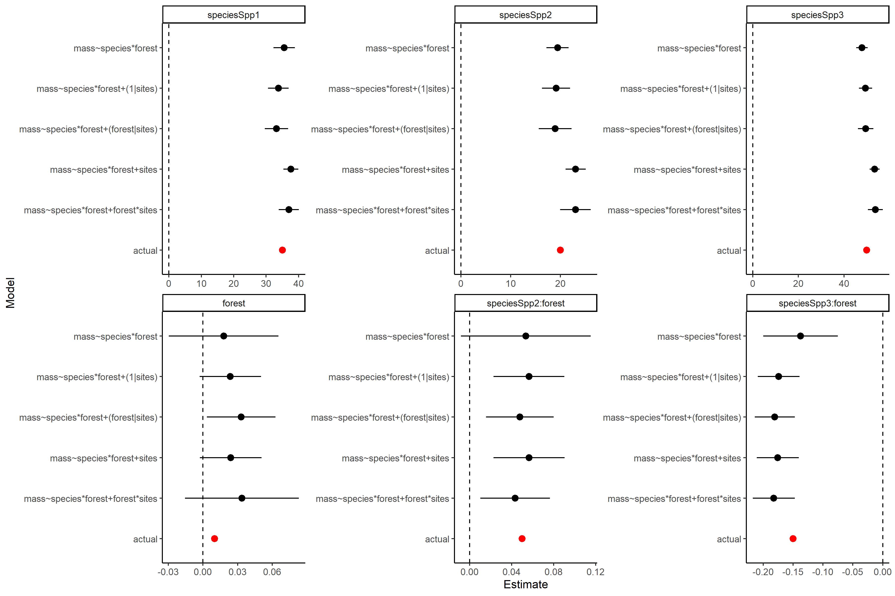
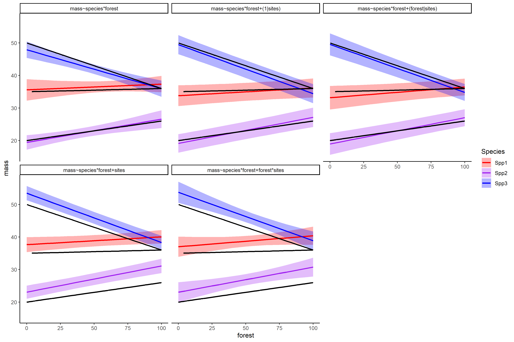

```{r setup, include=FALSE}
#Trick to get smaller R code size with out resorting to LaTeX text sizes
knitr::opts_chunk$set(echo = FALSE, eval = TRUE, message=TRUE, warning=TRUE, cache=TRUE)
library(tidyverse)
theme_set(theme_classic())
library(lme4)
library(ggeffects)
library(ggpubr)
library(glmmTMB)
library(DHARMa)

set.seed(123)

# #Generate data - from earlier lecture
# n <- 150
# ngroups <- 15
# x <- runif(n,-10,10) #Single fixed effect predictor
# g <- sample(letters[1:ngroups],n,TRUE) #Groups
# intercept <- 1
# slopeX <- 0.5
# sigmaR <- 3 #Residual sigma 
# sigmaG <- 5 #Group intercept sigma
# sigmaG_slope <- abs(slopeX*2) #Slope sigma (half slope value)
# 
# #Correlated intercepts and slopes, using Choleski matrices
# raneffs <- matrix(rnorm(ngroups*2,0,1),ncol=2) #Uncorrelated unit normals
# slopeCor <- 0.7 #Intercept-slope correlation
# corMat <- matrix(c(1,slopeCor,slopeCor,1),ncol=2) #Correlation matrix
# cholCorMat <- chol(corMat) #Choleski transform of corMat
# raneffs <- raneffs %*% cholCorMat #Induces correlation in slopes
# raneffs <- raneffs * matrix(rep(c(sigmaG,sigmaG_slope),each=ngroups),ncol=2,
#                             dimnames=list(letters[1:ngroups],c('Int','Slope'))) #Changes SD for each column
# raneff_int <- model.matrix(~g-1) %*% raneffs[,1] #Intercept vector
# raneff_slope <- x * model.matrix(~g-1) %*% raneffs[,2]  #Slope vector
# 
# yhat <- intercept + slopeX*x + raneff_int + raneff_slope  #Expected value
# y <- rnorm(n,yhat,sigmaR) #Data
# dat <- data.frame(y,x,site=g) #Assemble into data frame


#Generate data
n <- 160
ngroups <- 16
x <- runif(n,-10,10) #Single fixed effect predictor
g <- sample(letters[1:ngroups],n,TRUE) #Groups
intercept <- 1
slopeX <- 0.5
sigmaR <- 3 #Residual sigma
sigmaG <- 5 #Group intercept sigma
sigmaG_slope <- abs(slopeX*2) #Slope sigma (half slope value)

#Correlated intercepts and slopes, using Choleski matrices
raneffs <- matrix(rnorm(ngroups*2,0,1),ncol=2) #Uncorrelated unit normals
slopeCor <- 0.7 #Intercept-slope correlation
corMat <- matrix(c(1,slopeCor,slopeCor,1),ncol=2) #Correlation matrix
cholCorMat <- chol(corMat) #Choleski transform of corMat
raneffs <- raneffs %*% cholCorMat #Induces correlation in slopes
raneffs <- raneffs * matrix(rep(c(sigmaG,sigmaG_slope),each=ngroups),ncol=2,
                            dimnames=list(letters[1:ngroups],c('Int','Slope'))) #Changes SD for each column
raneff_int <- model.matrix(~g-1) %*% raneffs[,1] #Intercept vector
raneff_slope <- x * model.matrix(~g-1) %*% raneffs[,2]  #Slope vector

yhat <- intercept + slopeX*x + raneff_int + raneff_slope  #Expected value
y <- rnorm(n,yhat,sigmaR) #Data (normal)
dat <- data.frame(y,x,site=g) #Assemble into data frame
y2 <- rnbinom(n,mu=exp(yhat/5),sigmaR) #Data (NB)
dat2 <- data.frame(y=y2,x,site=g) #2nd data frame with NB data

# #Generate spatially correlated random intercepts
# 
# #Squared-exponential distance function
# covFun <- function(sigma,rho,d) (sigma^2)*exp((-rho^2)*(d^2))
# 
# lat <- runif(ngroups,-10,10) #"Latitude"
# lon <- runif(ngroups,-10,10) #"Longitude"
# distMat <- as.matrix(dist(cbind(lat,lon),diag=TRUE,upper=TRUE)) #Matrix of distances
# covMat <- covFun(sigmaG,0.1,distMat) #Covariance matrix
# corMat <- cov2cor(covMat) #Correlation matrix
# cholCorMat <- chol(corMat) #Choleski matrix
# raneffs <- rnorm(ngroups,0,1) %*% cholCorMat #Induce correlation
# raneff_int <- model.matrix(~g-1) %*% raneffs[1,] #Intercept vector
# yhat <- intercept + slopeX*x + raneff_int  #Expected value
# y <- rnorm(n,yhat,sigmaR) #Data (normal)
# y2 <- rnbinom(n,mu=exp(yhat/5),sigmaR) #Data (NB)
# lat <- model.matrix(~g-1) %*% lat
# lon <- model.matrix(~g-1) %*% lon
# dat2 <- data.frame(y,y2,x,site=g,lat,lon) #Assemble into data frame


```

## Outline

- Linear mixed effects models (LMMs)
  - A bit of math
  - Fixed vs. random effects
  - Random intercepts and slopes
- Generalized linear mixed effects models (GLMMs)
  - Residuals checks
  - Some sage advice
- Hypothesis testing and inference
  - Slopes and intercepts
  - Entire terms
  - AIC, $R^2$, and "Star-Gazing"

# Part 1: Mixed effects models

## What are mixed effects models?

Many different names:

1. Mixed effects models
2. Random effects models
3. Hierarchical models
4. Empirical/Bayesian hierarchical models
5. Latent variable models
6. Split-plot models\footnotemark

I like the term _heirarchical models_, as this is the closest to what I will teach you

\footnotetext{Earlier form of variance partitioning}

## Scary math

Unfortunately, we need a review of matrix algebra in order to explain this:

- This is a matrix: $$ A = \begin{bmatrix}
1 & 4 & 7 \\
2 & 5 & 8 \\
3 & 6 & 9
\end{bmatrix}
$$
  
- This is a vector: $$ b = \begin{bmatrix}
1 & 2 & 3 
\end{bmatrix}
$$
  
- Multiplying them looks like this:

$$ A \times b = Ab = 1 \times \begin{bmatrix}
1  \\
2 \\
3 
\end{bmatrix} + 2 \times \begin{bmatrix}
4  \\
5  \\
6 
\end{bmatrix} + 3 \times \begin{bmatrix}
7  \\
8 \\
9 
\end{bmatrix} = \begin{bmatrix}
30  \\
36 \\
42 
\end{bmatrix}$$

## Why do we call them "linear models"?

- _Linear_ mapping of __coefficients__ onto a __model matrix__ (from your data)

- Coefficients: $$ \beta = \begin{bmatrix}
0.1 & 1.8 & -0.03 
\end{bmatrix}
$$

- Model matrix: $$ X = \begin{bmatrix}
1 & 1 & 10 \\
1 & 1 & 12 \\
1 & 0 & 9 \\
\vdots & \vdots & \vdots
\end{bmatrix}
$$

- Multiplying them looks like: $$ \hat{y} = X\beta = 
\begin{bmatrix}
1.60  \\
1.54 \\
-0.17 \\
\vdots
\end{bmatrix}$$

## This is exactly what R does to fit models:

```{r, echo=TRUE, size='tiny'}
head(dat)
m1 <- lm(y~x,data=dat) #Uses x to predict y
summary(m1)
```

## This is exactly what R does to fit models (cont.):

```{r, echo=TRUE, size='tiny'}
head(model.matrix(m1))
coef(m1)
pred2 <- model.matrix(m1) %*% coef(m1) #predicted = matrix * coefs
head(data.frame(pred1=predict(m1),pred2)) #same thing!
```

## Groups are coded by "dummy variables" (0s and 1s)

```{r, echo=TRUE, size='tiny'}
m2 <- lm(y~site,data=dat) #Use site to predict y
head(model.matrix(m2)) #0s and 1s used to identify groups
coef(m2) #This uses the 1st site as the "control" group
```

## Structure of LMs... now with matrices!

- All linear models take the form:
\begin{equation*} 
\begin{split}
\textcolor{orange}{\hat{y}} & = \textcolor{darkturquoise}{X}\textcolor{blue}{\beta} = \textcolor{blue}{b_0}\textcolor{darkturquoise}{1} + \textcolor{blue}{b_1}\textcolor{darkturquoise}{x_1} ... + \textcolor{blue}{b_i}\textcolor{darkturquoise}{x_i} \\
y & \sim Normal(\textcolor{orange}{\hat{y}},\textcolor{red}{\sigma})
\end{split}
\end{equation*}

- $y$ is a vector of data you want to predict
- $\textcolor{orange}{\hat{y}}$ is a vector of _predicted values_ for $y$
- $\textcolor{darkturquoise}{X} = \textcolor{darkturquoise}{\{1,x_1...\}}$ is a matrix of _predictors_ for _y_
- $\textcolor{blue}{\beta} = \textcolor{blue}{\{b_0,b_1,...\}}$ is a vector of _coefficients_
- $y\sim Normal(\textcolor{orange}{\hat{y}},\textcolor{red}{\sigma})$ means:
  - "$y$ follows a Normal distribution with mean $\textcolor{orange}{\hat{y}}$ and SD $\textcolor{red}{\sigma}$"
  
## Fixed effects vs. Random effects

Say that $\textcolor{darkturquoise}{X}$ is a model matrix coding for 10 sites\footnotemark, and _y_ is something we're interested in predicting

::: columns

:::: column

\begin{equation*}
\begin{split}
\textcolor{orange}{\hat{y}} & = \textcolor{blue}{b_0} + \textcolor{darkturquoise}{X}\textcolor{blue}{\beta} \\
y & \sim Normal(\textcolor{orange}{\hat{y}},\textcolor{red}{\sigma})
\end{split}
\end{equation*}

\hfill\newline

- Site coefficients ($\textcolor{blue}{\beta}$) are unrelated to each other
- $\textcolor{red}{\sigma}$ is the SD of _residuals_
- Site is a __fixed effect__

::::

:::: column

\begin{equation*}
\begin{split}
\textcolor{orange}{\hat{y}} & = \textcolor{blue}{b_0} + \textcolor{darkturquoise}{X}\textcolor{purple}{\zeta} \\
y & \sim Normal(\textcolor{orange}{\hat{y}},\textcolor{red}{\sigma}) \\
\textcolor{purple}{\zeta} & \sim Normal(0,\textcolor{red}{\sigma_{site}})
\end{split}
\end{equation*}

- Site coefficients ($\textcolor{purple}{\zeta}$) are related to each other via a _Normal_ distribution
- $\textcolor{red}{\sigma}$ is the SD of _residuals_, $\textcolor{red}{\sigma_{site}}$ is the SD of _sites_
- Site is a __random effect__

::::

:::


\footnotetext{Intercept is a separate variable}

## Mixed effects = fixed + random effects

A mixed effects model has both __fixed__ and __random__ effects

\begin{equation*}
\begin{split}
\textcolor{orange}{\hat{y}} & = \textcolor{darkturquoise}{X}\textcolor{blue}{\beta} + \textcolor{gray}{U}\textcolor{purple}{\zeta} \\
y & \sim Normal(\textcolor{orange}{\hat{y}},\textcolor{red}{\sigma}) \\
\textcolor{purple}{\zeta} & \sim Normal(0,\textcolor{red}{\sigma_{site}})
\end{split}
\end{equation*}

- $\textcolor{darkturquoise}{X}$ = fixed effects matrix (e.g. intercept, temperature)
- $\textcolor{blue}{\beta}$ = fixed effects coefficients
- $\textcolor{gray}{U}$ = random effects matrix (e.g. sites)
- $\textcolor{purple}{\zeta}$ = random effects coefficients
- $\textcolor{red}{\sigma}$, $\textcolor{red}{\sigma_{site}}$ = variance terms

## Mixed effect model example

Let's go back to our earlier example:

- We're interested in predicting _y_ using _x_ (fixed effects)
- Data was collected at a number of _sites_, which may affect _y_ "somehow"
- Effect of each site is normally distributed

```{r echo=TRUE, message=FALSE, warning=FALSE, size='tiny'}
head(dat)
library(lme4) #Mixed effects library 
mm1 <- lmer(y ~ x + (1|site),data=dat) #site is fit as "random intercepts"
```

## Mixed effect model example

::: columns

:::: column

```{r, echo=TRUE, size='tiny'}
summary(mm1)
```

::::

:::: column

Results from `lmer` model:

- Random effects:
  - _residual_ and _site_ variance ($\textcolor{red}{\sigma}$, $\textcolor{red}{\sigma_{site}}$)
- Fixed effects: 
  - Intercept and slope estimates ($\textcolor{blue}{\beta}$)
  - No d.f. and p-value \footnotemark
  - If you need p-values for parameters, you can use the [_lmerTest_](https://rdocumentation.org/packages/lmerTest/versions/3.1-3/topics/lmerTest-package) package (or just calculate them yourself using means/SEs)

::::

:::

\footnotetext{`lme4` author doesn't think they can be calculated. I somewhat agree}

## Mixed effect model results

::: columns

:::: column

- In a _random intercepts_ model, the regression line of _x_ on _y_ is allowed to move up or down around the main regression line for each site

- These changes in intercepts are _normally distributed_

::::

:::: column

```{r, fig.height=4, fig.width=4, warning=FALSE, message=FALSE}
p1 <- dat %>% mutate(pred=predict(mm1),gpred=predict(mm1,re.form=~0)) %>% 
  ggplot(aes(x=x,y=y,col=site))+
  geom_point(show.legend = FALSE)+
  geom_line(aes(y=gpred),col='black',size=2)
p1 + geom_line(aes(y=pred),show.legend = FALSE)+guides(col=guide_legend(ncol=2))
```

::::

:::

## Mixed effect model results (cont.)

For plotting, we want a partial effects plot that marginalizes across sites (i.e. "What does the trend look like at the average site?")

- `ggpredict` works well for this. If you want partial residuals, you'll have to add them in yourself using `predict` and `residual`

```{r, fig.height=2, fig.width=4,warning=FALSE}
p2 <- ggpredict(mm1,terms='x') %>% data.frame() %>% #Gets predictions from mm1
  ggplot(aes(x=x))+ #Plots using ggplot
  geom_ribbon(aes(ymax=conf.high,ymin=conf.low),alpha=0.3) + #Intervals
  geom_line(aes(y=predicted))
ggarrange(p1+geom_line(aes(y=pred),show.legend = FALSE)+ylim(-15,20),
          p2+ylim(-15,20)+labs(y='y'),
          ncol=2,legend = 'none')
```

## Random slopes + intercepts

Suppose that _y_ wasn't just higher or lower at each site, but that the effect of _x_ on _y_ was higher or lower at each site

\begin{equation*}
\begin{split}
\textcolor{orange}{\hat{y}} & = \textcolor{darkturquoise}{X}\textcolor{blue}{\beta} + \textcolor{gray}{U}\textcolor{purple}{\zeta_{int}} + \textcolor{gray}{U\textcolor{darkturquoise}{_x}}\textcolor{purple}{\zeta_{slope}} \\
y & \sim Normal(\textcolor{orange}{\hat{y}},\textcolor{red}{\sigma}) \\
\textcolor{purple}{\zeta_{int}} & \sim Normal(0,\textcolor{red}{\sigma_{int}}) \\
\textcolor{purple}{\zeta_{slope}} & \sim Normal(0,\textcolor{red}{\sigma_{slope}})
\end{split}
\end{equation*}

- $\textcolor{darkturquoise}{X}$ = fixed effects matrix (e.g. intercept, temperature)
- $\textcolor{blue}{\beta}$ = fixed effects coefficients
- $\textcolor{gray}{U}$ = random intercept matrix (e.g. sites)
- $\textcolor{gray}{U\textcolor{darkturquoise}{_x}}$ = random slopes matrix (e.g. temperature)
- $\textcolor{purple}{\zeta_{int}}, \textcolor{purple}{\zeta_{slope}}$ = random intercept and slope coefficients
- $\textcolor{red}{\sigma},\textcolor{red}{\sigma_{int}},\textcolor{red}{\sigma_{slope}}$ = variance terms

## Random slope and intercept example:

::: columns

:::: column

```{r, echo=TRUE, size='tiny'}
#Intercept varies with site, and slope of x can
#   also vary with site (both hierarchical)
mm2 <- lmer(y ~ x + (x|site),data=dat) 
summary(mm2)
```

::::

:::: column

\hfill\newline

Results from `lmer` model:

- Random effects:
  - _residual_, _slope_, and _site_ variance ($\textcolor{red}{\sigma}$, $\textcolor{red}{\sigma_{int}}$, $\textcolor{red}{\sigma_{slope}}$)
  - Correlation b/w intercept and slope = `r round(attr(VarCorr(mm2)[[1]],which='correlation')[1,2],2)`
    - Sites with higher intercept _also_ have a higher slope
- Fixed effects: 
  - Intercept and slope estimates
  
::::

:::

## Model matrices

- X
```{r}
head(model.matrix(mm2))
```

- U
```{r}
head(model.matrix(~site-1,data=dat))
```
- Ux
```{r}
head(model.matrix(~site-1,data=dat) * dat$x)
```
- 


## Mixed effect model results

- Regression line of _x_ on _y_ is allowed to move up or down around the main regression line for each site (random intercepts)
- Slope of regression line can be more or less steep for each site (random slopes)
- Changes in intercepts and slopes are _normally distributed_, and in this example, are correlated with each other 

```{r, fig.height=3, fig.width=6}
dat %>% mutate(pred=predict(mm2),gpred=predict(mm2,re.form=~0)) %>% 
  ggplot(aes(x=x,y=y,col=site))+
  geom_point()+
  geom_line(aes(y=gpred),col='black',size=2) +
  geom_line(aes(y=pred))+guides(col=guide_legend(ncol=2))
```

<!-- ## Mixed effect model validation -->

<!-- - Similar to linear models, but we _also_ check whether the random intercepts are normally distributed -->
<!-- <!-- - If one site intercept is very different from the others, this is a clue for investigation! --> -->

<!-- ```{r} -->
<!-- par(mfrow=c(2,3)) -->
<!-- plot(fitted(mm2),resid(mm2,type='working'),xlab='Fitted values',ylab='Working residuals'); abline(h=0) -->
<!-- qqnorm(resid(mm2,type='working'),main='Residuals');qqline(resid(mm2,type='working')) -->
<!-- qqnorm(ranef(mm2)$site[,1],main='Random Intercepts');qqline(ranef(mm2)$site[,1]) -->
<!-- qqnorm(ranef(mm2)$site[,2],main='Random Slopes');qqline(ranef(mm2)$site[,2]) -->
<!-- plot(ranef(mm2)$site,xlab='Random Intercept',ylab='Random Slope',main='Intercept-Slope Correlation') -->
<!-- # par(mfrow=c(1,1)) -->
<!-- ``` -->

<!-- ## Hypothesis testing -->

<!-- Is this fixed effect important? (e.g. ANOVA) -->

<!-- - Use likelihood-based test via `drop1` (likelihood ratio test, AIC) -->
<!-- - Be careful to fit model with `REML = FALSE`! -->

<!-- ```{r, echo=TRUE, text='tiny'} -->
<!-- mm1 <- update(mm1,REML=FALSE) #Refit model using ML rather than REML -->
<!-- drop1(mm1,test='Chisq') #x has a very strong effect! -->
<!-- ``` -->

<!-- ## Hypothesis testing (cont.) -->

<!-- How do I know this effect is different from _x_? -->
<!-- - Use Wald Z-test (2-sided p-value from Z-test) -->

<!-- ```{r} -->
<!-- mm1 <- update(mm1,REML=TRUE) #Reset to REML -->
<!-- meanEst <- fixef(mm1)[2] #Get mean -->
<!-- seEst <- sqrt(vcov(mm1)[2,2]) #Get standard error -->
<!-- (1-pnorm(meanEst/seEst,0,1))*2 #p-value from 2-sided Z-test -->
<!-- ``` -->

<!-- - `glht` from `library(multcomp)` works with `lmer` models if you are comparing between coefficients (e.g. "Is treatment A different from B and C?") -->

## Why do we need to do any of this?

_"My supervisor told me to just use site as a fixed effect. Why can't I do that?"_ 

- You can do it this way, but you may encounter the following problems:
  - You lose the _partial pooling_ that occurs in mixed effects models = Worse estimates of site effects!
  - You lose 1 d.f. for each site = Type II error $\uparrow$ = You may not find the fixed effect of interest, even if it's there!
  - Sites with low sample sizes may cause your models to break
  - People\footnotemark who have read statistics books published after 1980 may ask questions
- However, if you have a low number of sites (1-10), fixed effects may work better
  - Hard to estimate $\sigma_{site}$ if number of sites is low
  - If stakes are high, it may be better to be more conservative about site intercepts
  - Easier to interpret (p-values, ANOVA, etc.)
  
\footnotetext{e.g. me}

## First challeng

- You're interested in how forest cover influences the mass of three bat species. Maybe some of the species do better in forests?
- You've weighed a bunch of bats across different forest covers (`batMass.csv`). However, these were collected across 15 separate sites. Perhaps some of the variation is just caused by the site?
- Fit a mixed effects model with the fixed effects you're interested in (__forest cover__, __species__), and include __site__ as a random effect (_intercept_ or _slope_)
- Your supervisor doesn't like hierarchical models, and tells you to just use site as another fixed term in an `lm` model. Do you get different results if you use their approach?

## Results:



## Results:



# Part 2: GLMMs

## What if my response variable is non-normal?

::: columns

:::: column

- Linear model (LM)

\begin{equation*} 
\begin{split}
\textcolor{orange}{\hat{y}} & = \textcolor{darkturquoise}{X}\textcolor{blue}{\beta} \\
y & \sim Normal(\textcolor{orange}{\hat{y}},\textcolor{red}{\sigma})
\end{split}
\end{equation*}

:::: 

:::: column

- Generalized linear model (GLM)

\begin{equation*} 
\begin{split}
logit(\textcolor{orange}{\hat{\phi}}) & = \textcolor{darkturquoise}{X}\textcolor{blue}{\beta} \\
y & \sim Binomial(\textcolor{orange}{\hat{\phi}})
\end{split}
\end{equation*}

::::

:::

::: columns

:::: column

\vspace{12pt}

- Linear mixed effects model (LMM)

\begin{equation*}
\begin{split}
\textcolor{orange}{\hat{y}} & = \textcolor{darkturquoise}{X}\textcolor{blue}{\beta} + \textcolor{gray}{U}\textcolor{purple}{\zeta} \\
y & \sim Normal(\textcolor{orange}{\hat{y}},\textcolor{red}{\sigma}) \\
\textcolor{purple}{\zeta} & \sim Normal(0,\textcolor{red}{\sigma_{site}})
\end{split}
\end{equation*}

:::: 

:::: column

\vspace{12pt}

- Generalized linear mixed effects model (GLMM)

\begin{equation*}
\begin{split}
logit(\textcolor{orange}{\hat{\phi}}) & = \textcolor{darkturquoise}{X}\textcolor{blue}{\beta} + \textcolor{gray}{U}\textcolor{purple}{\zeta} \\
y & \sim Binomial(\textcolor{orange}{\hat{\phi}}) \\
\textcolor{purple}{\zeta} & \sim Normal(0,\textcolor{red}{\sigma_{site}})
\end{split}
\end{equation*}

::::

:::


## How do I fit GLMMs?

- `glmer` and `glmer.nb` from `library(lme4)` work for Binomial, Poisson, and Negative Binomial data

```{r glmerNBexample, echo=TRUE, eval=FALSE}
library(lme4) 
glmm1 <- glmer.nb(y~x+(x|site),data=dat2) #Negative binomial GLMM 
summary(glmm1) #glmer.nb takes a long time to run
```

- `glmmTMB` from `library(glmmTMB)` works for those above, _plus_ a bunch of others
  - e.g. Zero-inflation, Beta-binomial, Spatial Models

```{r glmmTMBexample, echo=TRUE, eval=TRUE}
library(glmmTMB) 
glmm2 <- glmmTMB(y~x+(x|site),data=dat2,family=nbinom2())
summary(glmm2) #Similar results, but quicker
```

## Fitting GLMMs - `glmer.nb`

```{r glmerNBexample, echo=FALSE, eval=TRUE, size='tiny'}
```

## Fitting GLMMs - `glmmTMB`

```{r glmmTMBexample, echo=FALSE, eval=TRUE, size='tiny'}
```

## Residual checks on `glmmTMB` models

- Extract residuals and make your own plots, or use `simulateResiduals` from `library(DHARMa)` (see [here](https://cran.r-project.org/web/packages/glmmTMB/vignettes/model_evaluation.pdf))
- `DHARMa` also has useful functions for checking overdispersion and zero-inflation (found [here](https://cran.r-project.org/web/packages/DHARMa/vignettes/DHARMa.html))
  
```{r, message=FALSE, warning=FALSE, fig.height=3, fig.width=5, size='tiny'}
library(DHARMa)
glmm2_res <- simulateResiduals(glmm2)
plot(glmm2_res) #No residual problems here
```

## Partial residual plots for `glmmTMB` models

- `ggpredict()` from `library(ggeffects)` works with `glmmTMB` models

```{r}
library(ggeffects)
glmm2_eff <- ggpredict(glmm2,terms='x')
plot(glmm2_eff)
```

# Part 3: Hypothesis testing and inference

# I fit a model... now what?

- Congratulations, your model ran and it met the assumptions of regression... 
- Time to see if your predictions are supported by your data!
- For each of the terms in your model:
  - Was the term "important" in your model?
  - If so, what direction was the effect in?
- How well did your model fit your data (overall)?
- Some other bits of advice

## Step 1: was the term "important"?

In linear models, this is done using an ANOVA F-test (also shown at the bottom of a `summary()` statement):

```{r anovaLM}
lmMod1 <- lm(mpg~disp+gear,data=mtcars)
anova(lmMod1)
```
## But wait, there's more!

Unfortunately, if we have more than 1 term in the model, the order of terms can change your answer:

```{r}
#lmMod1 <- lm(mpg~disp+gear,data=mtcars)
lmMod2 <- lm(mpg~gear+disp,data=mtcars)
anova(lmMod1); anova(lmMod2)
```
## Solution: use a Type II ANOVA

- We're usually interested in the strength of a term on its own, _not after other terms are accounted for_ (Type I ANOVA)
- For this, we use a Type II ANOVA. This can be done using `drop1()` (or `Anova()` in the `car` package)
-
```{r }
drop1(lmMod1,test='F') 
```
- 
```{r}
drop1(lmMod2,test='F')
```

## Model selection

How many terms should be in my model?

- Same principle as in regular linear models: __what do you think the process is?__
  - Just because a term is "not significant" doesn't mean it should be dropped out!
  - Just because a term is "significant" doesn't mean it should be left in!
  - Avoid selecting models based on $R^2$ or AIC alone. Avoid stargazing\footnotemark (hunting around for "better" p-values or AIC scores)
- To test whether terms are important in predicting your data (similar to), use _likelihood-ratio tests_
  - `drop1(model,test='Chisq')`
  - AIC tests usually say the same thing as LR tests

\footnotetext{"My God, it's full of stars!" -2001, A Space Odyssey}

## _log_ likelihood

::: columns

:::: column

- Probabilities multiplied together quickly become _very small_
- Computers can't distinguish between extremely big or small numbers
- Therefore, it uses _log-likelihoods_ (also easier to calculate)

::::

:::: column

```{r, echo=FALSE, eval = TRUE, fig.width= 3, fig.height = 2}
#Uses logit-phi (-Inf to +Inf) rather than phi (0 to 1)
llfun2 <- function(lphi){
  phi <- invLogit(lphi)
  ll <- dbinom(1,1,phi)*dbinom(1,1,phi)*dbinom(0,1,phi)
  return(ll)
}

ggplot() + geom_function(fun=llfun2) + xlim(-5,8) + labs(x=expression(paste('logit(',phi,')')),y=expression(paste('Likelihood(H,H,T|',phi,')'))) + geom_vline(xintercept=logit(2/3),linetype='dashed')

```

```{r, echo=FALSE, eval = TRUE, fig.width= 3, fig.height =2}

ggplot() + geom_function(fun=~log(llfun2(.))) + xlim(-5,8) + labs(x=expression(paste('logit(',phi,')')),y=expression(paste('log-likelihood(H,H,T|',phi,')'))) + geom_vline(xintercept=logit(2/3),linetype='dashed')

```

::::

:::

## ML vs REML

- Maximum likelihood (ML) estimates of variance (e.g. SD) are always smaller than the actual variance (biased)
- Restricted maximum likelihood (REML) uses a mathematical trick to get around this, but...
- This means that models with different numbers of terms don't have the same REML estimates
- Likelihood between these models technically can't be compared!

Solution:

  1. Use ML if comparing between models with different fixed effects, then...
  2. Re-fit with REML once you've decided on a model

