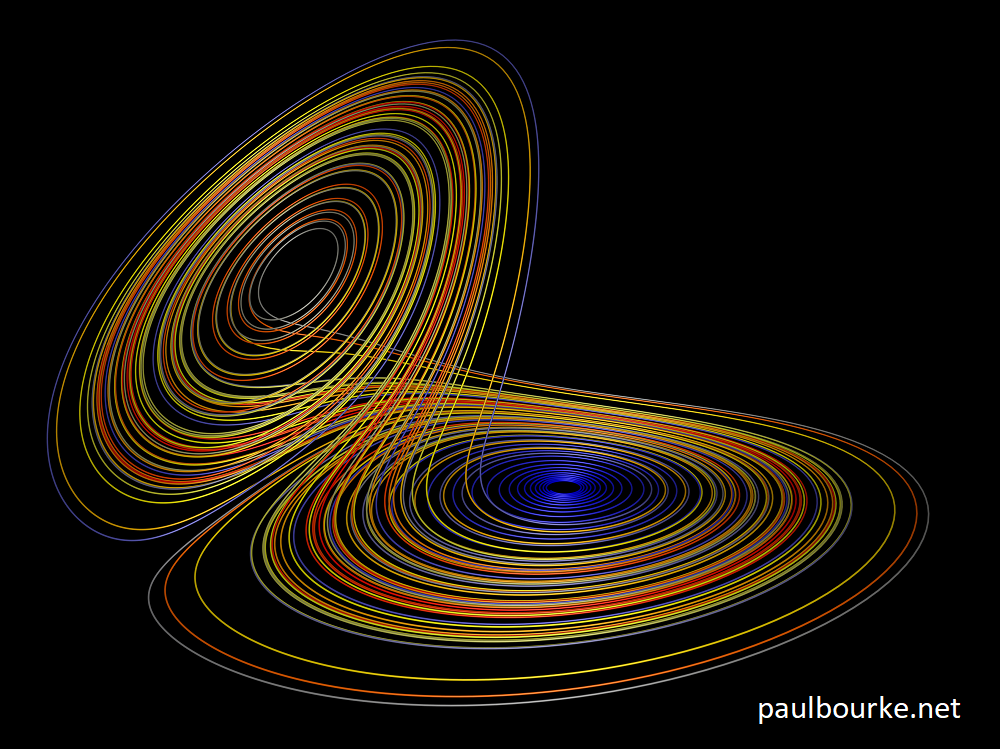
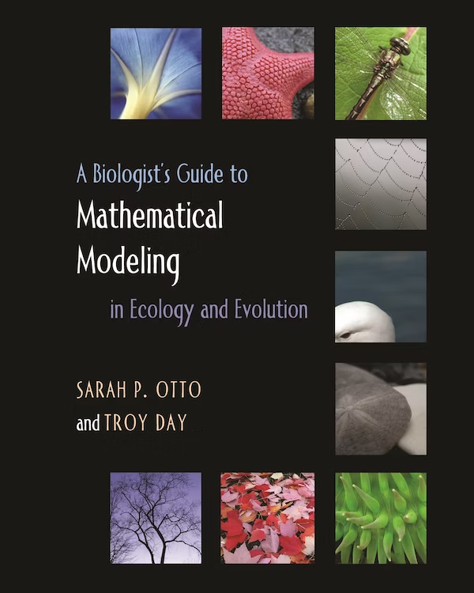
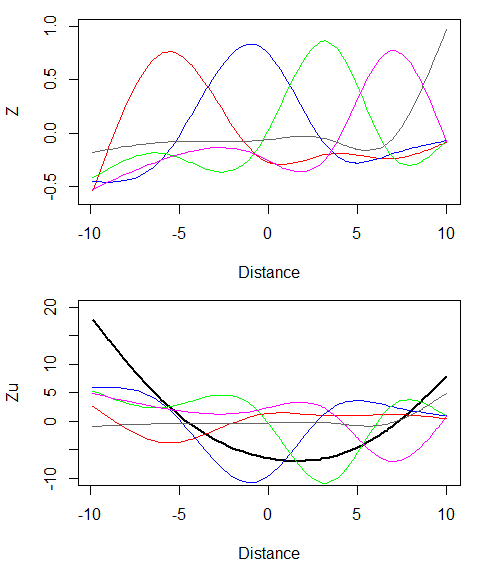

```{r setup, include=FALSE}
#Trick to get smaller R code size with out resorting to LaTeX text sizes
knitr::opts_chunk$set(echo = FALSE, eval = TRUE, message=TRUE, 
                      warning=TRUE, cache = TRUE, fig.height=5,fig.width=5)
library(tidyverse)
theme_set(theme_classic())
library(ggpubr)
library(mgcv)
library(latex2exp)

```

## Outline

::: columns

:::: column

- What are nonlinear models?
- Mechanistic models
  - Some common models
  - Strategies for fitting
- Empirical models
  - Some common models
  - GAMs

::::

:::: column

{width=100%}
[The Lorenz System](https://paulbourke.net/fractals/lorenz/): a classical 3D nonlinear system

::::

:::


## What are nonlinear models?

- __Linear models__ take the form:
\begin{equation*} 
\begin{split}
\textcolor{orange}{\hat{y}} & = \textcolor{darkturquoise}{X}\textcolor{blue}{\beta} = \textcolor{blue}{b_0}\textcolor{darkturquoise}{1} + \textcolor{blue}{b_1}\textcolor{darkturquoise}{x_1} ... + \textcolor{blue}{b_i}\textcolor{darkturquoise}{x_i} \\
y & \sim Normal(\textcolor{orange}{\hat{y}},\textcolor{red}{\sigma})
\end{split}
\end{equation*}

- __Nonlinear models__ are any kind of model that can't be reduced to this linear (matrix) form:
\begin{equation*} 
\begin{split}
\textcolor{orange}{\hat{y_{t}}} & = \textcolor{orange}{\hat{y_{t-1}}} \textcolor{blue}{r}(1-\frac{\textcolor{orange}{\hat{y_{t-1}}}}{\textcolor{blue}{k}})\\
y & \sim Normal(\textcolor{orange}{\hat{y}},\textcolor{red}{\sigma})
\end{split}
\end{equation*}

## Two common situations 

1. "I have governing equations for this system, and I want to fit them to my data"
  - e.g. Logistic growth equation, Michaelis-Menten kinematrics, Ricker model

2. "I don't know what equations represent my system, but I need some kind of _smooth_ process that describes them"
  - e.g. Changes in organism population over growing season, changes in stock prices over time

# Part 1: Mechanistic models

## Governing equations

Dynamics of some systems can be described by a set of equations, either in _discrete_ or _continuous_ time

::: columns

:::: {.column width='40%'}

- Exponential growth: _Discrete time_

\begin{equation*}
  n_t = n_{t-1}r
\end{equation*}

::::

:::: {.column width='60%'}

- Exponential growth: _Continuous time_

\begin{equation*}
  \frac{dn}{dt} = nr
\end{equation*}

::::

:::

\vspace{0.5cm}

::: columns

::::{.column width='40%'}

- Predator prey cycles: _Discrete time_

\begin{equation*}
\begin{split}
\text{prey}_t =& \text{prey}_{t-1}(r_1 - a_1\text{pred}_{t-1})\\
\text{pred}_t =& \text{pred}_{t-1}(a_2\text{prey}_{t-1}-d)
\end{split}
\end{equation*}

::::

::::{.column width='60%'}

- Predator prey cycles: _Continuous time_

\begin{equation*}
\begin{split}
\frac{d\text{prey}}{dt} =& r-a_1\text{pred}\\
\frac{d\text{pred}}{dt} =& a_2\text{prey}-d
\end{split}
\end{equation*}

::::

:::

## Some other common dynamic models

::: columns

:::: column

- Logistic growth

\begin{equation*}
  n_t = n_{t-1}(1+ r(1-\frac{n_{t-1}}{k}))
\end{equation*}

::::

:::: column

- Michaelis-Menten

\begin{equation*}
  \frac{dp}{dt} = \frac{V_{max}a}{K_m+a}
\end{equation*}

::::

:::

\vspace{0.5cm}

::: columns

:::: column

- Beverton-Holt model

\begin{equation*}
\begin{split}
\text{N}_t =& \frac{R_0 N_{t-1}}{1+N_{t-1}/M}
\end{split}
\end{equation*}

::::

:::: column

- Susceptible-Infected-Recovered (SIR) model

\begin{equation*}
\begin{split}
\frac{dS}{dt} =& -\frac{\beta I S}{N}\\
\frac{dI}{dt} =& \frac{\beta I S}{N} - \gamma I \\
\frac{dR}{dt} =& \gamma I
\end{split}
\end{equation*}

::::

:::

## Where do these equations come from?

::: columns

:::: column

- Mostly from literature, sometimes from your own derivations

- Can be derived from causal models, flow diagrams, organismal life cycles

- Math-heavy topic for another class! If you're interested, I might start with this book:

::::

:::: column

{width=80%}

::::

:::

## Fitting nonlinear models: transformations

::: columns

:::: column

- Sometimes you can transform your data to approximate nonlinear models
- e.g. $y = b_0e^{xb1}$ (Exponential growth)
  - Transformation: $ln(y)=ln(b_0e^{xb1})=ln(b_0)+ln(e^{xb1})=ln(b_0)+xb_1$
  - Linear model in R: `lm(log(y)~x)`
<!-- - e.g. $\frac{dp}{dt} = \frac{V_{max}a}{K_m+a}$ (Michaelis-Menten) -->
<!--   - Transformation: $\frac{dt}{dp} = \frac{K_m+a}{V_{max}a}=\frac{K_m}{V_{max}a}+\frac{a}{V_{max}a}=\frac{K_m}{V_{max}a}+\frac{1}{V_max}$ -->
<!-- - Linear model in R: `lm((1/v)~(1/a))` -->
- This can cause problems because _distances_ don't mean the same thing at all ranges of x-values; in general, it's better to use a NLM if you're able to

::::

:::: column

```{r}
expDat <- data.frame(x=1:10) %>% mutate(yhat=0.4*exp(x*0.5),y=yhat*rnorm(10,1,0.2)) #Multiplicative error

p1 <- ggplot(data=expDat,aes(x,y))+geom_point()+geom_line(aes(y=yhat),col='orange')
p2 <- ggplot(data=expDat,aes(x,log(y)))+geom_point()+geom_line(aes(y=log(yhat)),col='orange')
ggarrange(p1,p2,ncol=1,nrow=2)

```

::::

:::

## Fitting nonlinear models: simple example

::: columns

:::: column

- We have a _pretty good idea_ what rules the system is following, and we want to figure out the parameters that it uses

- Simple example: let's start with a simple linear model, where we have _2 parameters_ $\textcolor{blue}{b_0}$ and $\textcolor{blue}{b_1}$ that we're looking for

\begin{equation*}
\begin{split}
\textcolor{orange}{\hat{y}} & = \textcolor{darkturquoise}{X}\textcolor{blue}{\beta} = \textcolor{blue}{b_0} + \textcolor{blue}{b_1}\textcolor{darkturquoise}{x_1}
\end{split}
\end{equation*}

- We're trying to find the parameters of a line that _most closely_ fits our data:

::::

:::: column

```{r lmExamp}
set.seed(1)
N <- 100
B <- c(1,2)
x1 <- runif(N,-2,2)
X <- cbind(Int=1,x1)
yhat <- as.vector(X %*% B)
y <- yhat + rnorm(N)
dat <- data.frame(yhat,y,x1)
p1 <- ggplot(dat)+geom_point(aes(x1,y))
p1

```

::::

:::

## Fitting mechanistic models (cont.)

::: columns

:::: column

- How might we define "closest fit" in a mathematical sense?

- One common measure is _sum of squared distances_. This is just the difference between the data and the \textcolor{orange}{line}:
\begin{equation*}
S = \sum_{i=1}^N(y_i - (\textcolor{blue}{b_0} + \textcolor{blue}{b_1}\textcolor{darkturquoise}{x_i}))^2
\end{equation*}

- Here are three "guesses" at the slope and intercept, along with their SS scores. Which one looks to be the best?

<!-- - In this case, there is a _definite_ solution: $\hat\beta = (\textcolor{darkturquoise}{X^T}\textcolor{darkturquoise}{X})^{-1}X^Ty$ -->

::::

:::: column

```{r lmExamp2}

#Function to calculate SS from b0, b1, and data (x & y)
ssFun <- function(B,xdat=dat$x1,ydat=dat$y) sum((ydat - (B[1] + B[2]*xdat))^2)

ss1 <- paste('b0 = 1, b1 = 2, SS = ', round(with(dat,ssFun(c(1,2),),1)))
ss2 <- paste('b0 = 2, b1 = 3, SS = ', round(with(dat,ssFun(c(2,3)),1)))
ss3 <- paste('b0 = -2, b1 = 1, SS = ', round(with(dat,ssFun(c(-2,1)),1)))


p1 +
  geom_abline(intercept=B[1],slope=B[2],linetype='dashed')+
  geom_abline(intercept=B[1]+1,slope=B[2]+1,linetype='dashed',col='red')+
  geom_abline(intercept=B[1]-3,slope=B[2]-1,linetype='dashed',col='blue') +
  annotate(geom='text',x=-1,y=6,label=ss1)+
  annotate(geom='text',x=-1,y=5,col='red',label=ss2)+
  annotate(geom='text',x=-1,y=4,col='blue',label=ss3)

```

::::

:::

## Map of fitting surface

We can try this for a whole bunch of intercepts and slopes:

```{r lmExamp3, fig.width=8, fig.height=4}

expand.grid(B0=seq(-10,10,length.out=60),B1=seq(-10,10,length.out=40)) %>%
  rowwise() %>% mutate(SS=sqrt(with(dat,ssFun(c(B0,B1),x1,y)))) %>%
  ggplot(aes(x=B0,y=B1,fill=SS))+geom_raster()+
  # scale_fill_distiller(direction = 1,palette = 'YlOrRd')
  annotate(geom = 'point',x=1,y=2,col='black',pch=3)+
  annotate(geom = 'point',x=2,y=3,col='red',pch=3)+
  annotate(geom = 'point',x=-2,y=1,col='blue',pch=3)+
  scale_fill_viridis_c(direction=-1)+
  theme(legend.position = 'none')+labs(x='Intercept',y='Slope')

```

## Getting R to do this

::: columns

:::: column

- It's pretty clear where the best intercept and slope is, but how do we get R to do this?

- First, we need a function that returns SS given a set of parameters:
  ```{r, echo=TRUE, eval=FALSE}
  #Function to calculate SS
  ssFun <- function(B,xdat,ydat){
    sum((ydat - (B[1] + B[2]*xdat))^2)
  }
  ```

- Next, we use the `optim` function to find the intercept and slope values that return the minimum value of SS. How did it do? (Actual values: $b_0$:1, $b_1$:2)

::::

:::: column

```{r optimExamp, echo=TRUE}
  #Starts at 0,0 and "looks around" from there
  optim(par = c(0,0) , fn = ssFun)
```

```{r , fig.height=2,fig.width=5}
p1 + geom_abline(intercept=0.9769795,slope=2.0779779)
```

::::

:::


## General framework

Here are some simple rules for fitting models:

1. Think about how your system works. What rules do you think your system follows?

2. Write down these rules as equations, with __parameters__ that control the system at time `t`
  - Some differential ($\frac{dx}{dt}$) equations can sometimes be solved by hand
  - Otherwise you need to use an ODE solver (`fme` in R)

3. Come up with an _objective function_ that describes the differences between predictions and actual data

4. Get R to find parameters that _minimize_ the objective function

5. See how well your model predicted your data:
  - Are all of your parameters _identifiable_ from your data?
  - Do you need to go back to step 1?

## Fitting mechanistic models: nonlinear example

::: columns

:::: column

- Let's move on to a nonlinear model (Michaelis-Menten), where we also have _2 parameters_ $\textcolor{blue}{b_0}$ and $\textcolor{blue}{b_1}$ that we're looking for

\begin{equation*}
\textcolor{orange}{\hat{y}} = \frac{\textcolor{blue}{b_0}\textcolor{darkturquoise}{x_1}}{\textcolor{blue}{b_1}+\textcolor{darkturquoise}{x_1}}
\end{equation*}

- Again, we're trying to find the parameters of a nonlinear curve that _most closely_ fits our data:

::::

:::: column

```{r micMenExample}
set.seed(1)
purTrt <- Puromycin %>% filter(state=='treated') %>% select(-state)
# B <- coef(nls(rate ~ SSmicmen(conc, Vm, K), data = purTrt)) #"Actual" coefs

#Michaelis-Menten
MMfun <- function(b,x) (b[1]*x)/(b[2]+x)

#Function to calculate SS from b0, b1, and data (x & y)
ssFunMM <- function(B,xdat=purTrt$conc,ydat=purTrt$rate){
  sum((ydat - (MMfun(B,xdat)))^2)
}

ss1 <- paste('b0 = 212, b1 = 0.06, SS = ', round(with(dat,ssFunMM(c(212,0.06)),1)))
ss2 <- paste('b0 = 100, b1 = 0.1, SS = ', round(with(dat,ssFunMM(c(200,0.1)),1)))
ss3 <- paste('b0 = 250, b1 = 0.01, SS = ', round(with(dat,ssFunMM(c(250,0.01)),1)))

p1 <- ggplot(purTrt) + geom_point(aes(x=conc,y=rate))

p1 +
  annotate(geom='line',x=seq(0.02,1.1,0.02),y=MMfun(c(212,0.06),seq(0.02,1.1,0.02)))+
  annotate(geom='line',x=seq(0.02,1.1,0.02),y=MMfun(c(200,0.1),seq(0.02,1.1,0.02)),col='red')+
  annotate(geom='line',x=seq(0.02,1.1,0.02),y=MMfun(c(250,0.01),seq(0.02,1.1,0.02)),col='blue')+
  annotate(geom='text',x=0.6,y=220,label=ss1)+
  annotate(geom='text',x=0.6,y=150,col='red',label=ss2)+
  annotate(geom='text',x=0.6,y=270,col='blue',label=ss3)

```


::::

:::

## Nonlinear example (cont.)

```{r micMenExample2, fig.width=8, fig.height=4}
expand.grid(B0=seq(100,300,length.out=60),B1=seq(0.01,0.50,length.out=40)) %>%
  rowwise() %>% mutate(SS=with(dat,sqrt(ssFunMM(c(B0,B1))))) %>%
  ggplot(aes(x=B0,y=B1,fill=SS))+geom_raster()+
  annotate(geom = 'point',x=212,y=0.06,col='black',pch=3)+
  annotate(geom = 'point',x=200,y=0.1,col='red',pch=3)+
  annotate(geom = 'point',x=250,y=0.01,col='blue',pch=3)+
  scale_fill_viridis_c(direction=-1)+
  theme(legend.position = 'none')
```

## Get R to do it

::: columns

:::: column

Mind your starting parameters!

```{r}
(op1 <- optim(par = c(0,0) , fn = ssFunMM))
```

```{r, fig.height=3,fig.width=5}
ggplot(purTrt) + geom_point(aes(x=conc,y=rate))+
  annotate('line',x=seq(0.02,1.1,by=0.02),y=MMfun(op1$par,seq(0.02,1.1,by=0.02)))
```

::::

:::: column

Better to start with more "realistic" values

```{r}
(op2 <- optim(par = c(200,0.01) , fn = ssFunMM))
```

```{r, fig.height=3,fig.width=5}
ggplot(purTrt) + geom_point(aes(x=conc,y=rate))+
  annotate('line',x=seq(0.02,1.1,by=0.02),y=MMfun(op2$par,seq(0.02,1.1,by=0.02)))
```

::::

:::

## First challenge: logistic growth

::: columns

:::: column

The logistic growth model $n_t = n_{t-1}(1+ r(1-\frac{n_{t-1}}{k}))$ is commonly used in ecology. Its definite solution is:

\begin{equation*}
  n(t) = \frac{Kn_0e^{rt}}{K+n_0(e^{rt}-1)}
\end{equation*}

- Write an _objective function_ for this equation. It should take a vector of parameters ($[n_0, K, r]$) as its first input, a vector of time steps $t$ as input for the equation, and a vector of $n$ values to compare against.

- There's a dataset of _budgie_ numbers on two different islands collected over several years located here. Get R to fit a logistic growth model for each island

- Does it look like the K value (carrying capacity) differs much between islands?

::::

:::: column

```{r budgies}
bDat <- read.csv('./budgies.csv') 
bDat %>% pivot_longer(-year) %>% 
  ggplot(aes(x=year,y=value,col=name))+geom_point()+
  labs(x='Year',y='Budgies',col='Island')+
  scale_colour_manual(values=c('blue','red'))+
  coord_cartesian(ylim=c(NA,1000))+
  theme(legend.position = c(0.8,0.85))
```

::::

:::

## Logistic growth results

::: columns

:::: column

First we create a function that calculates the logistic growth curve at time `t`

```{r, echo=TRUE}
lgFun <- function(t,K,r,n0){
  (K*n0*exp(r*t))/(K+n0*(exp(r*t)-1))} 
```

Looks like it works! `curve` is handy for showing what a set of function output along `x` will look like:

```{r, echo=TRUE,fig.width=5,fig.height=4}
curve(lgFun(x,100,1,10),from=0,to=10) 
```

::::

:::: column

Next we make the objective function, which is the sum of squared differences between `ydat` and the logistic growth function. `B` is now a single vector that contains `K`, `r`, and `n0`:

```{r, echo=TRUE}
ssFunLG <- function(B,xdat=bDat$year,ydat){
  sum((lgFun(xdat,B[1],B[2],B[3])-ydat)^2)}
```


Unfortunately, this gives weird answers (negative starting values). This is actually just a flat line:

```{r, echo=TRUE}
optim(c(100,1,1),fn = ssFunLG,ydat=bDat$islandA)$par
```

::::

:::

## Logistic growth results (cont.)

Let's try writing the objective function again, but now we'll scale the `n0` parameter (`B[3]` below) to be on the _log_ scale. This prevents it from going below zero:

```{r, echo=TRUE}
ssFunLG2 <- function(B,xdat=bDat$year,ydat) sum((lgFun(xdat,B[1],B[2],exp(B[3]))-ydat)^2)
```

This runs, and starting values (`n0`) are now in log-units. This looks better, but since `n0` is so low, it might just be best to set it at a value close to zero:

```{r, echo=TRUE}
optim(c(100,1,1),fn = ssFunLG2,ydat=bDat$islandA)$par
```

One last re-write of the objective function! Now we set `n0` to `1e-4` ($1e-4$), which is close to zero, and put it in the place of `B[3]`:

```{r, echo=TRUE}
ssFunLG3 <- function(B,xdat=bDat$year,ydat) sum((lgFun(xdat,B[1],B[2],1e-4)-ydat)^2) 
```

## Logistic growth results (cont.)

::: columns

:::: column

Now we fit a model for each island group. 
```{r, echo=TRUE}
o1 <- optim(c(100,1),fn = ssFunLG3,ydat=bDat$islandA)
o2 <- optim(c(100,1),fn = ssFunLG3,ydat=bDat$islandB) 
```

Looks like reasonable values:

```{r}
o1$par
o2$par
```

Now we can plot the results. This uses a bit of fancy `pivot_longer` code to get things into the correct columns. It also looks like Island A has a higher K value!

::::

:::: column

```{r}
bDat %>% mutate(predA=lgFun(t=year,K=o1$par[1],r=o1$par[2],n0=1e-4),
                predB=lgFun(t=year,K=o2$par[1],r=o2$par[2],n0=1e-4)) %>% 
  pivot_longer(-year,names_to=c('.value','set'),names_pattern = '(island|pred)(A|B)') %>% 
  ggplot(aes(x=year,col=set))+
  geom_point(aes(y=island))+
  geom_line(aes(y=pred))+
  scale_colour_manual(values=c('blue','red'))+
  labs(x='Year',y='Budgies',col='Island')
```
::::

:::

## How do you get SEs on parameters?

- Easy way: bootstrapping

- Medium way: MCMC sampling (Bayesian estimation), or profile likelihood

- Hard way: calculate Hessian of the objective function (serious math)

## "There's got to be a better way!"

Good news: someone already did the scary math for you!

```{r ssExamples, fig.width=14, fig.height=6}
# SSasymp: Asymptotic Regression
#   - SSasympOff, SSasympOrig are reparameterizations
#   - SSweibull is similar but has extra pwr parameter
p1 <- ggplot(data.frame(x=seq(0,10,by=0.1)),aes(x))+
  stat_function(fun=function(x) SSasymp(x,10,0,0.1))+
  stat_function(fun=function(x) SSasymp(x,5,0,0.1),col='red')+
  stat_function(fun=function(x) SSasymp(x,10,2,1),col='blue')+
  annotate(geom='text',x=5,y=9,label='Asym: 10, R0: 0, lrc: 0.1')+
  annotate(geom='text',x=5,y=6,col='red',label='Asym: 5, R0: 0, lrc: 0.1')+
  annotate(geom='text',x=5,y=11,col='blue',label='Asym: 10, R0: 2, lrc: 1')+
  labs(title=TeX('\\textbf{SSasymp}: $Asym+(R0-Asym)e^{-e^{lrc}x}$'))

#SSbiexp: Biexponential
p2 <- ggplot(data.frame(x=seq(0,10,by=0.1)),aes(x))+
  stat_function(fun=function(x) SSbiexp(x,3,0.1,0,0))+
  stat_function(fun=function(x) SSbiexp(x,1,1,-1.6,-1.4),col='red')+
  stat_function(fun=function(x) SSbiexp(x,-3,-1,1,-1.3),col='blue')+
  annotate(geom='text',x=5,y=2,label='A1: 3, lrc1: 0.1, A2: 0, lrc2: 0')+
  annotate(geom='text',x=5,y=-1,col='red',label='A1: 1, lrc1: 1, A2: -1.6, lrc2: -1.4')+
  annotate(geom='text',x=5,y=-2,col='blue',label='A1: -3, lrc1: -1, A2: -1, lrc2: -1.3')+
  labs(title=TeX('\\textbf{SSbiexp}: $A_1e^{-e^{lrc1}x}+A_2e^{-e^{lrc2}x}$'))

#SSfol - First-order compartmental model (drug absorption)
p3 <- ggplot(data.frame(x=seq(0,10,by=0.1)),aes(x))+
  stat_function(fun=function(x) SSfol(4,x,-2.5,0.5,-3))+
  stat_function(fun=function(x) SSfol(5,x,-1.5,0.95,-2),col='red')+
  stat_function(fun=function(x) SSfol(1,x,-0.1,0.95,-2),col='blue')+
  annotate(geom='text',x=7.5,y=5,label='Dose:4, lKe: -2.5, lKa: 0.5, lCl: -3')+
  annotate(geom='text',x=7.5,y=3,col='red',label='Dose: 5, lKe: -1.5, lKa: 0.95, lCl: -2')+
  annotate(geom='text',x=7.5,y=0.5,col='blue',label='Dose: 1, lKe: -0.1, lKa: 0.95, lCl: -2')+
  labs(title=TeX('\\textbf{SSfol}: $Dose \\times e^{lKe+lKa-lCl}(e^{-e^{lKe}x} - e^{-e^{lKa}x})/(e^{lKa} - e^{lKe})$'))

#SSlogis: Logistic model
# - SSfpl is a reparameterization
p4 <- ggplot(data.frame(x=seq(0,10,by=0.1)),aes(x))+
  stat_function(fun=function(x) SSlogis(x,10,5,1))+
  stat_function(fun=function(x) SSlogis(x,10,2,1),col='red')+
  stat_function(fun=function(x) SSlogis(x,8,5,2),col='blue')+
  annotate(geom='text',x=8.5,y=8,label='Asym: 10, xmid: 5, scal: 1')+
  annotate(geom='text',x=2,y=9,col='red',label='Asym: 10, xmid: 2, scal: 1')+
  annotate(geom='text',x=8.5,y=5,col='blue',label='Asym: 10, xmid: 5, scal: 2')+
  labs(title=TeX('\\textbf{SSlogis}: $Asym/(1+e^{\\frac{xmid-x}{scal}})$'))

#SSgompertz: growth model
p5 <- ggplot(data.frame(x=seq(0,10,by=0.1)),aes(x))+
  stat_function(fun=function(x) SSgompertz(x,10,1,0.5))+
  stat_function(fun=function(x) SSgompertz(x,10,2,0.5),col='red')+
  stat_function(fun=function(x) SSgompertz(x,5,1,0.1),col='blue')+
  annotate(geom='text',x=7,y=9,label='Asym: 10, b2: 1, b3: 0.5')+
  annotate(geom='text',x=7,y=8,col='red',label='Asym: 10, b2: 2, b3: 0.5')+
  annotate(geom='text',x=7,y=4,col='blue',label='Asym: 5, b2: 1, b3: 0.1')+
  labs(title=TeX('\\textbf{SSgompertz}: $(Asym)e^{-b_2b_3^x}$'))

#SSmicmen: Michalis-Menten (enzyme reaction rate)
p6 <- ggplot(data.frame(x=seq(0,10,by=0.1)),aes(x))+
  stat_function(fun=function(x) SSmicmen(x,10,1))+
  stat_function(fun=function(x) SSmicmen(x,5,1),col='red')+
  stat_function(fun=function(x) SSmicmen(x,10,0.1),col='blue')+
  annotate(geom='text',x=7,y=8,label='Vmax: 10, K: 1')+
  annotate(geom='text',x=7,y=3.5,col='red',label='Vmax: 5, K: 1')+
  annotate(geom='text',x=7,y=11,col='blue',label='Vmax: 10, K: 0.1')+
  labs(title=TeX('\\textbf{SSmicmen}: $V_{max}x/(K+x)$'))

ggarrange(p1,p2,p3,p4,p5,p6,ncol=3,nrow=2)
```

## Even better news, nls can profile likelihoods!


## Second challenge

Try fitting the same `budgies` data using `nls` instead of `optim`, and test whether the difference in K values between islands is significant!

Syntax for `nls`:

```{r, echo=TRUE, eval=FALSE}
a <- nls(y ~ (K*0.01*exp(r*x))/(K+0.01*(exp(r*x)-1)), data =dat, start = list(K=1,r=1)) #Define the function
b <- nls(y ~ lgFun(x,K,r,0.01), data=dat,start=list(K=1,r=1)) #Uses a function

```

## Second challenge results

```{r}
nmod1 <- nls(islandA ~ lgFun(year,Kval,rval,0.001), data=bDat,start=list(Kval=250,rval=6.5))
nmod2 <- nls(islandB ~ lgFun(year,Kval,rval,0.001), data=bDat,start=list(Kval=250,rval=6.5))

summary(nmod1)
summary(nmod2)

```

# Part 2: Empirical models

## Empirical smoothing

::: columns

:::: column

- Sometimes we don't know the specific rules that govern your system, but we want to know the _general shape_
  - e.g. population changes across time or space, temperature across seasons
- We want something that can give us _general predictions_ across the range of your data without actually dealing with the underlying process
- Solution: "empirical" smoothing

::::

:::: column

```{r mkVdat}
set.seed(1)
vdat <- data.frame(x=-30:30,y=volcano[30,])
vdat$y <- with(vdat,(y-mean(y))/sd(y)+rnorm(length(y),0,0.4))
plot(y~x,data=vdat)
```

::::

:::


## "Guess the family"

::: columns

:::: column

```{r co2Plot,message=F,warning=F}
co2mod <- CO2 %>%
  filter(Type=='Quebec') %>%
  #Code for nls begins here
  nls(uptake~SSasymp(conc,A,B,C),
      start=list(A=30,B=-15,C=-5),data=.)

#Makes predictions along CO2 gradient
data.frame(conc=seq(50,1000,20)) %>%
  mutate(predUp=predict(co2mod,newdata=.)) %>%
  #Code for ggplot begins here
  ggplot(aes(conc,predUp))+
  geom_line()+ #Data from prediction line
  #CO2 data
  geom_point(data=filter(CO2,Type=='Quebec'),
             aes(conc,uptake))+
  labs(x='CO2 Concentration',y='Uptake',title='uptake~SSasymp(conc,A,B,C)')
```

::::

:::: column

- Sometimes you can use a preset nonlinear family that looks "similar enough" to your data

- e.g. `SSlogis`, `SSweibull`

- See also: "Transformations" slide from first section

::::

:::


## Polynomial smoothing

If the pattern is "wiggly", you can use polynomials:

::: columns

:::: column

```{r}
filter(CO2,Type=='Quebec') %>%
  ggplot(aes(conc,uptake))+
  geom_point()+
  geom_smooth(method='lm',formula=y~poly(x,2),col='black')+
  labs(x='CO2 Concentration',y='Uptake')
```

::::

:::: column

```{r}

ggplot(vdat,aes(x,y))+geom_point()+
  geom_smooth(method='lm',col='black',formula=y~poly(x,6))

```

::::

:::

## Problems with polynomials

- How many orders of polynomials do you use? Limited to discrete values
- Polynomial models don't do well outside of the range of prediction, especially at the edges of your data

```{r polyProblems, fig.fullwidth=TRUE}
lapply(c(2,6,25),function(p){
ggplot(vdat,aes(x,y))+geom_point()+
  geom_smooth(method='lm',col='black',formula=y~poly(x,p)) +
  labs(title=paste('p =',p))
}) %>% c(.,ncol=3,nrow=1) %>% do.call(ggarrange,.) %>% print
```


## LOESS smoothers

::: columns

:::: column

- LOESS (LOcal regrESSion) fits simple polynomial model at _each_ data point,  
- Similar to a moving-average smoother ("window" of nearest N data points)

Problems:

- Computation-heavy: fits a weighted model for every data point
- Require a fair bit of data to get good predictions, sensitive to outliers
- Similar to polynomials, doesn't do well outside the range of the data

::::

:::: column

```{r loessExamp, warning=FALSE}

lmod <- loess(y~x,data=vdat,model=TRUE,control = loess.control(surface = "direct"))

vdat %>% mutate(lpred=predict(lmod)) %>% 
  ggplot(aes(x,y))+geom_point()+
  geom_line(aes(y=lpred))
```

::::

:::

## GAM: Generalized Additive Models

- Additive models are a hybrid linear model that use _basis functions_ to approximate "wiggly" data
- Uses random effects to penalize curves in order to avoid overfitting (i.e. "just wiggly enough")
- The `mgcv` package can deal with a large range of additive models, from a large range of distributions (count data, presence/absence, survival, categorical, and more)
- This package is useful for a wide variety of things, and it's definitely worth learning

## How do GAMs work?

::: columns

:::: column

GAMs take the form:

\begin{equation*}
  \begin{split}
  \text{Prediction} = & \text{Fixed Effect} + \text{Random Effect} \\
  \mu = & X\beta + Zu \\
  \text{Yield} \sim & Normal (\mu, \sigma) \\
  u \sim & Normal (0, \lambda S)
  \end{split}
\end{equation*}

- Creates _basis functions_ across the range of data stored in columns of $Z$
- Finds values $u$
- $\lambda S$ penalty term: selects for optimal "wiggliness"

::::

:::: column

{width=100%}

::::

:::

## GAM example

Let's see how this works on a dataset:

```{r gamExample}

gmod <- gam(y~s(x,bs='cr'),data=vdat)
gmodBases <- cbind(x=vdat$x,model.matrix(gmod)[,-1]) %>% 
  as.data.frame() %>% setNames(c('x',paste0('b',1:ncol(gmod$smooth[[1]]$S[[1]])))) %>% 
  pivot_longer(-x)

ggplot(gmodBases,aes(x=x,y=value,col=name))+geom_line()


```

## More GAM things

- More tips and tricks about GAMs


## First challenge: segmented regression

::: columns

:::: column

A classic nonlinear model is _segmented regression_. It's basically just two linear models smushed together:

\begin{align*}
\textcolor{orange}{\hat{y}} =&
    \begin{cases}
        \textcolor{blue}{b_0} + \textcolor{blue}{b_1}\textcolor{darkturquoise}{x} & \text{if } \textcolor{darkturquoise}{x} \leq \textcolor{blue}{a}\\
        \textcolor{blue}{b_2} + \textcolor{blue}{b_3}\textcolor{darkturquoise}{x} & \text{if } \textcolor{darkturquoise}{x} > \textcolor{blue}{a}
    \end{cases} \\
    \textcolor{blue}{b_0} +& \textcolor{blue}{b_1}\textcolor{blue}{a} = \textcolor{blue}{b_2} + \textcolor{blue}{b_3}\textcolor{blue}{a} \\
    y \sim& Normal(\textcolor{orange}{\hat{y}},\textcolor{red}{\sigma})
\end{align*}

This looks like a lot of $\textcolor{blue}{parameters}$! However, because of the equality $\textcolor{blue}{b_0} + \textcolor{blue}{b_1}a = \textcolor{blue}{b_2} + \textcolor{blue}{b_3}a$ you get 1 for free 

1. Rewrite the model in terms of 4 parameters instead of 5
2. Create a objective function to minimize across
3. Get R to find the best parameters
4. Plot your results

::::

:::: column

```{r segRegExample, fig.width=5, fig.height=5}
segRegDat <- read.csv('./segReg.csv')
ggplot(segRegDat,aes(x,y))+geom_point()+
  geom_segment(x = 0, xend = 3, y = 1, yend = 7,colour='orange')+
  geom_segment(x = 3, xend = 10, y = 7, yend = 3.5 ,colour='orange')

```

::::

:::


## First challenge results

- Broken stick model


## 2-column slide

::: columns

:::: column

a

::::

:::: column

b

::::

:::
