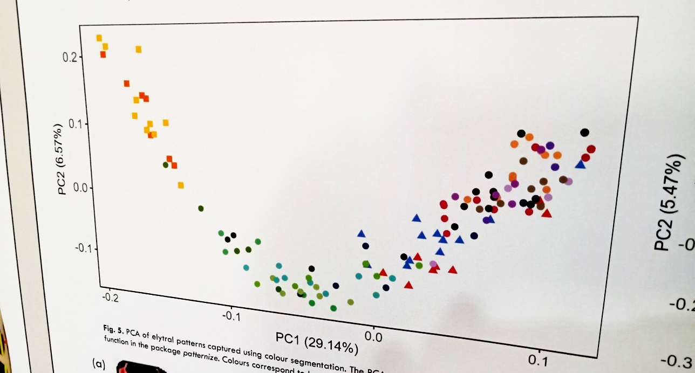

```{r setup, include=FALSE}
#Trick to get smaller R code size with out resorting to LaTeX text sizes
knitr::opts_chunk$set(echo = FALSE, eval = TRUE, message=TRUE, 
                      warning=TRUE, cache = TRUE, fig.height=5,fig.width=5)
library(tidyverse)
theme_set(theme_classic())
library(ggeffects)
library(GGally)
library(ggpubr)
library(vegan)
library(ggfortify)

varPlot <- function(pcmod){
  vars <- pcmod$sdev^2 #Eigenvalues (variance per column)
  data.frame(varPerc=100*vars/sum(vars),pc=1:length(vars)) %>% 
    ggplot(aes(x=pc,y=varPerc))+geom_point()+geom_line()+
    labs(x="PC",y="Percent variance")
}

data(dune)
data(dune.env)
data(varechem)
data(varespec)

birds <- read.csv('birds.csv')
birdMat <- as.matrix(birds[,c(-1,-2)])
birdPCA <- prcomp(birdMat)
birdNMDS <- metaMDS(birdMat)

```

## Outline

::: columns

:::: column

- What are multivariate data?
- Linear transformations
  - Principle components
  - Some common approaches
- Nonlinear transformations
  - Non-metric dimensional scaling

::::

:::: column

{width=100%}

<!-- "He had said that the geometry of the dream-place he saw was abnormal, non-Euclidean, and loathsomely redolent of spheres and dimensions apart from ours"  -->
<!-- - _Call of Chthulu, H.P. Lovecraft_ -->

::::

:::

## Some common problems

- "I've got a zillion predictors that could matter in my model, but they're all collinear"

- "I measured a zillion things for each site/critter, but I don't want to fit a zillion models"

- "I measured a zillion things. Do certain things group up into clusters?"

- "My supervisor told me to do a PCA or NMDS for my data, but I have no idea what they're talking about"

If any of these sound like your situation, then you might need to do __multivariate modeling__!

# Part 1: What are multivariate data?

## Univariate data

::: columns

:::: column

- Up until now, we've dealt mainly with __univariate__ data: one thing is changing, and is being affected by other things

- These can be normal, binomial, Poisson, etc...

- Single variance term ($\sigma$) that controls dispersion

::::

:::: column

```{r}
mtcars %>% mutate(am=factor(am,labels=c('automatic','manual'))) %>% 
  ggplot(aes(x=am,y=mpg)) + geom_boxplot()
```

::::

:::

## Multivariate data

::: columns

:::: column

- With __multivariate__ data, we have multiple things changing at once

- _Many things_ are changing, with multiple things potentially causing other things

- These are _mostly_ normal (non-normal can be tricky)

::::

:::: column

```{r carsPairPlot, message=FALSE, echo=FALSE}
mtcars %>% select(-vs:-carb) %>% 
  ggpairs()
```

::::

:::

## Multivariate normal

- Normal distributions\footnotemark don't just have a single $\sigma$, but actually a _matrix_ of values
- If the columns of our data are _independent_, then it looks like this:

\begin{equation*}
Y \sim Normal(\textcolor{orange}{M},\textcolor{red}{\Sigma})
\end{equation*}

\begin{equation*}
\textcolor{orange}{M} = [\textcolor{orange}{\mu_1}, \textcolor{orange}{\mu_2}, \textcolor{orange}{\mu_3}]
\end{equation*}

\begin{equation*}
\textcolor{red}{\Sigma} = \begin{bmatrix}
\textcolor{red}{\sigma}^2 & 0 & 0 \\
0 & \textcolor{red}{\sigma}^2 & 0 \\
0 & 0 & \textcolor{red}{\sigma}^2
\end{bmatrix}
\end{equation*}

- Zeros mean "$\mu_1$, $\mu_2$, \& $\mu_3$ aren't related to each other"
- Diagonal elements = _variance_, off-diagonal = _covariance_

\footnotetext{Multivariate Normal}

## Covariance and Correlation

Things may not be independent from each other. For example:

- $\textcolor{red}{\sigma}$ = 2 (variance = $\textcolor{red}{\sigma}^2$ = 4)
- $\mu_1$ and $\mu_2$ are strongly correlated (r=0.7), but $\mu_3$ is not related to anything (r=0). Shown here as a _correlation matrix_ ($\textcolor{red}{R}$):

\begin{equation*}
\textcolor{red}{R} = \begin{bmatrix}
1 & 0.7 & 0 \\
0.7 & 1 & 0 \\
0 & 0 & 1
\end{bmatrix}
\end{equation*}

- When multiplied by the variance, this becomes the _covariance matrix_ ($\textcolor{red}{\Sigma}$)

\begin{equation*}
\textcolor{red}{\Sigma} = \begin{bmatrix}
\textcolor{red}{\sigma_a} & \textcolor{red}{\sigma_ab} & \textcolor{red}{\sigma_ac} \\
\textcolor{red}{\sigma_ab} & \textcolor{red}{\sigma_b} & \textcolor{red}{\sigma_bc} \\
\textcolor{red}{\sigma_ac} & \textcolor{red}{\sigma_bc} & \textcolor{red}{\sigma_c}
\end{bmatrix} = \begin{bmatrix}
4 & 2.8 & 0 \\
2.8 & 4 & 0 \\
0 & 0 & 4
\end{bmatrix}
\end{equation*}

## Covariance vs Correlation

These are similar concepts, but covariance matrix has _units_, while correlation is _dimensionless_

\vspace{1cm}

::: columns

:::: column

Covariance = $\sum_{i=1}^{n} \frac{(x-\bar x)(y-\bar y)}{(n-1)}$

\begin{equation*}
\text{Covariance matrix} = \begin{bmatrix}
4 & 2.8 & 0 \\
2.8 & 4 & 0 \\
0 & 0 & 4
\end{bmatrix}
\end{equation*}

::::

:::: column

Correlation = $\frac{cov(x,y)}{\sigma_x \sigma_y}$

\begin{equation*}
\text{Correlation matrix} = \begin{bmatrix}
1 & 0.7 & 0 \\
0.7 & 1 & 0 \\
0 & 0 & 1
\end{bmatrix}
\end{equation*}

::::

:::

## How does this help with my data?

::: columns

:::: column

- Say you've measured a bunch of things, and they're mostly from normal distributions...

- You've gathered data from a _multivariate normal distribution_!

- Now your task is to model this distribution!

::::

:::: column

\begin{equation*}
Y \sim Normal(\textcolor{orange}{M},\textcolor{red}{\Sigma})
\end{equation*}

\begin{equation*}
\textcolor{orange}{M} = [\mu_1, \mu_2, \mu_3]
\end{equation*}

\begin{equation*}
\begin{split}
\textcolor{orange}{\mu_1} & =  b_{01} + b_{11}x_1 \\
\textcolor{orange}{\mu_2} & =  b_{02} + b_{12}x_1 \\
\textcolor{orange}{\mu_3} & =  b_{03} + b_{13}x_1 
\end{split}
\end{equation*}

::::

:::

## Problem: this doesn't really help

- We're _still_ stuck with fitting a zillion linear models!

- We also have to estimate the covariance as well as the variance. This might be OK for a few columns, but gets much harder when you've got lots of columns

- We need a better way for dealing with these multivariate normal data...


## Another approach

::: columns

:::: column

```{r vcPairPlot, message=FALSE}
data(varechem)
vc6 <- varechem %>% select(1:6) #First 6
vc_2 <- varechem %>% select(P,S) #Only P and S
ggpairs(vc6)
```

::::

:::: column

- Say we have a multi-column dataset that looks like this:

- What do you notice about this dataset?

- Looks like most of these columns are pretty strongly related. If we're only interested in the total "information" (variation) from this dataset...

- Perhaps we don't need all these columns? Which ones should we throw out or combine?

::::

:::

# Part 2: Principal components (linear decompositions)

## Matrix Decomposition and Principal Component

::: columns

:::: column

- Covariance matrices are a special type of matrix called a _triangular matrix_

- Can be decomposed using a math trick called the _singular value decomposition_ that breaks a matrix into its component eigenvectors and eigenvalues

- Transforms data into new coordinate space, where _most variation falls into a few columns_ called __principal components__

::::

:::: column

Covariance matrix

```{r}
round(cov(vc6),1)
```
Decomposition: $X = UDV'$

Eigenvectors ($V$):

```{r}
round(prcomp(vc6)$rotation,2)
```
Eigenvalues ($D$):

```{r}
round(prcomp(vc6)$sdev,1)^2
```

::::

:::

## Simple example: 2 dimensions

::: columns

:::: {.column width='60%'}

\vspace{1cm}

- Principal components are hard to imagine, so let's try it on only 2 dimensions:
- Rotation Matrix ($V$):
  - Columns = _Principal components_
  - Rows = _Factor Loadings_
  ```{r}
  round(prcomp(vc_2)$rotation,2)
  ```
- SD of principal components ($\sqrt{D}$):
  - Tells you _how strong_ the effect of each PC column is
  ```{r, echo=TRUE}
  round(prcomp(vc_2)$sdev,2)
  ```

::::

:::: {.column width='40%'}

```{r pcaExamp, fig.height=6.5}
vc2_pca <- prcomp(vc_2)
p1 <- ggplot(vc_2,aes(x=P,y=S))+
  geom_point()+
  with(vc2_pca,annotate('segment',x=center[1],y=center[2],
                        xend=center[1]+sdev[1]*rotation[1,'PC1'],
                        yend=center[2]+sdev[1]*rotation[2,'PC1'],
                        arrow=arrow(length=unit(0.1,'inches'))))+
  with(vc2_pca,annotate('segment',x=center[1],y=center[2],
                        xend=center[1]+sdev[2]*rotation[1,'PC2'],
                        yend=center[2]+sdev[2]*rotation[2,'PC2'],
                        arrow=arrow(length=unit(0.1,'inches')),col='red'))+
  annotate('text',x=c(45,55),y=c(30,50),label=c('PC2\n(11.5%)','PC1\n(88.4%)'),col=c('red','black'))

# p2 <- vc2_pca$x %>%
#   data.frame() %>%
#   ggplot(aes(x=PC1,PC2))+geom_point()

p2 <- autoplot(vc2_pca,scale = 0,loadings=TRUE,loadings.label=TRUE,loadings.color='blue')

ggarrange(p1,p2,ncol=1,labels = c("Original data","Transformed data"),label.x = 0.05)

```

::::

:::

## Bigger example: full dataset (14 columns)

::: columns

:::: {.column width='60%'}

Use `prcomp` to decompose matrix of `varechem` data:

```{r, echo=TRUE}
pcVare <- prcomp(varechem)
```

Rotation matrix (PCs and factor loadings)

```{r}
round(pcVare$rotation[,1:11],2)
```

SDs of principal components:

```{r}
round(pcVare$sdev,1)
```

::::

:::: {.column width='40%'}

```{r pcaExamp2, fig.height=6.5}
vc_pca <- prcomp(varechem)

p1 <- varPlot(vc_pca)
p2 <- autoplot(vc_pca,scale = 0,loadings=TRUE,loadings.label=TRUE,loadings.color='blue')
ggarrange(p1,p2,ncol=1,labels = c("PC Variance","Transformed data"),label.x = 0.05)

```

::::

:::


## Artistic analogues to this problem

::: columns

:::: column

Picasso's _Demoiselle d'Avignon_ (1907)

{width=100%}


::::

:::: column

Kawasaki rose crease pattern

{width=100%}

::::

:::

## First challenge

Let's try this on some biological data

::: columns

:::: column

_"After a severe storm on February 1, 1898, a number of moribund sparrows were taken to Hermon Bumpus’ biological laboratory at Brown University, Rhode Island. Subsequently, about half of the birds died, and Bumpus saw this as an opportunity to see whether he could find any support for Charles Darwin’s theory of natural selection..."_

```{r}
head(birds)
```

::::

:::: column

- Take a look at the bird dataset found [here](https://github.com/samuelVJrobinson/ecoStatsLectures/tree/fall2023/07%20Multivariate%20models)), and perform a PCA decomposition

- Hint: you'll need to transform it into a _matrix_ (using `as.matrix` on the relevant columns) before using `prcomp`

- How many PCs are needed to represent _most_ of the variation?

::::

:::


## First challenge results

::: columns

:::: column

Covariance matrix

```{r}
round(cov(birdMat),1)
```

Principal components

```{r}
round(birdPCA$rotation,2)
```

Variance per column

```{r}
round(birdPCA$sdev,1)^2
```

::::

:::: column

```{r birdPCAresults, fig.height=6.5}
p1 <- varPlot(birdPCA)
p2 <- autoplot(birdPCA,scale = 0,loadings=TRUE,loadings.label=TRUE,loadings.color='blue')
ggarrange(p1,p2,ncol=1)
```

::::

:::

## What's next?

- Now that we've reduced our data to only a few _uncorrelated_ columns, we can do a couple things:

- Use linear regression (or some other test) on each column, along with some other set of predictor columns

- Use some other test to see if your data are "different" (far away) from each other


## First step: plot your data

::: columns

:::: column

```{r plotPCA, fig.height=6.5}

birdPCA_df <- birdPCA$x[,1:2] %>% as.data.frame() %>% 
  bind_cols(select(birds,Survived,Bird))

p1 <- birdPCA_df %>%
  ggplot(aes(x=PC1,y=PC2,col=Survived))+
  geom_point()+
  scale_colour_manual(values=c('red','black'))

p2 <- birdPCA_df %>% 
  ggplot(aes(y=PC1,x=Survived))+geom_boxplot()
  # theme(legend.position = c(0.8,0.8))+
  # scale_colour_manual(values=c('red','black'))

ggarrange(p1,p2,ncol=1)
```
::::

:::: column

- Usually we want to see if some other thing is changing our data "somehow" (usually using a linear model)

- The first step is to plot your data. I've been using `autoplot` from `ggfortify`, but we can also plot things manually

- These data don't look particularly different in their centers, but...

- They are different in variances! What does this mean biologically?  

::::

:::

## Formal tests for differences

::: columns

:::: column

- `envfit` from the `vegan` package is a common way to test for differences between groups (or continuous variables)

- Uses a permutation test to compare "jumbled" data original data. In this case, shows no difference in group averages

```{r, echo=TRUE}
envfit(birdPCA ~ Survived,data=birds)
```

::::

:::: column

- `rda` and `cca` from `vegan` are also popular (older) methods. They basically fit linear regression to each row in the data matrix, then decompose the fitted values

- "Constrained" part is related to variables you provided, "Unconstrained" is leftover variance. You can run `anova` on this to get variable importance

```{r, echo=TRUE}
rda(birdMat ~ Survived,data=birds)
```

::::

:::

## Plotting your results

::: columns

:::: {.column width='40%'}

- For plotting your results, you generally want to show the _transformed data_ plus the direction of the effects you're interested in

- `ggplot2` has some plotting functionality, but the plots from `vegan` are more purpose-made for these kinds of data

- See the `vegan` vignette (`vignette("intro-vegan")`) for more details

::::

:::: {.column width='40%'}

```{r,echo=TRUE}
ordiplot(birdPCA,type='points',display='sites')
plot(envfit(birdPCA ~ Survived,data=birds))
```

::::

:::

## Other kinds of ordination plots

::: columns

:::: column

```{r}
ord <- decorana(dune)
plot(ord, disp="sites", type="text")
ordihull(ord, dune.env$Management, col=1:4, lwd=3)

```
::::

:::: column

```{r, message=FALSE}

ord.fit <- with(dune.env,envfit(ord ~ A1 + Management, data=dune.env, perm=999))
plot(ord, disp="sites", type="points")
plot(ord.fit,cex=0.75)
# ordisurf(ord, dune.env$A1, add=TRUE)
```

::::

:::

## Second challenge

::: columns

:::: column

- Let's try some _community_ data (counts of different species)!
- [Here](https://github.com/samuelVJrobinson/ecoStatsLectures/tree/fall2023/07%20Multivariate%20models) (`bugDat.csv`) is a dataset I collected during my Master's degree, which I spent catching a lot of bugs
- I collected bugs using a couple kinds of collection methods across the season
- Was there a large difference in collection methods?

::::

:::: column

```{r}
bugdat <- read.csv('./bugDat.csv') 
bugPreds <- bugdat %>% select(Date:Method) %>% 
  mutate(across(everything(),as.factor))
bugMat <- bugdat %>% select(-Date:-Method) %>% as.matrix()
zeroRows <- which(apply(bugMat,1,sum)==0)
bugMat <- bugMat[-zeroRows,]
bugPreds <- bugPreds[-zeroRows,]
head(bugdat)[,1:5]
```

::::

:::

# Part 3: NMDS (nonlinear decompositions)

## Problems with linear transformations

::: columns

:::: column

- Recall: PCA and other decomposition methods use a _linear mapping_ onto a new coordinates system

- This doesn't always work well: especially if you have non-normally distributed (e.g. community) data

- Individual species are often normally distributed along a gradient, creating an __arch__ in PCA space (see [here](https://ordination.okstate.edu/PCA.htm) for more details)

- Because of this, the y-axis (2nd PCA) isn't really a useful gradient to compare across

:::: 

:::: column

```{r}
ordiplot(prcomp(varespec),type='p',display = 'sites')
```

::::

:::


## The arch effect (seen at ESC 2023 poster session!)

{width=80%}


## Non-metric dimensional scaling

::: columns

:::: {.column width='60%'}

- __Non-metric multidimensional scaling__ is another way of decomposing multidimensional data

- Uses rank-order of data: _order_ matters, but not magnitude

- Uses Bray-Curtis distance, not Euclidean (better for community studies)

::::

:::: {.column width='40%'}

```{r pca_nmds, fig.height=6.5,fig.width=4, message=FALSE}
p1 <- birdPCA_df %>%
  ggplot(aes(x=PC1,y=PC2,col=Survived))+
  geom_point()+
  scale_colour_manual(values=c('red','black'))

p2 <- birdNMDS$points %>% as.data.frame() %>% 
  bind_cols(select(birds,Survived,Bird)) %>% 
  ggplot(aes(x=MDS1,y=MDS2,col=Survived))+
  geom_point()+
  scale_colour_manual(values=c('red','black'))

ggarrange(p1,p2,ncol=1,labels = c('PCA','NMDS'),label.x = 0.05)

```

::::

:::


## Nonlinear "stress" mapping

::: columns

:::: column

```{r}
stressplot(birdNMDS)
```

::::

:::: column

- Instead of using a linear transformation

- "

::::

:::


## 2-column

::: columns

:::: column

::::

:::: column

::::

:::

