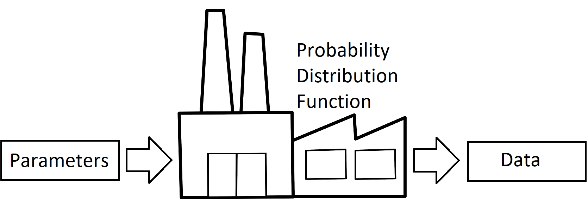
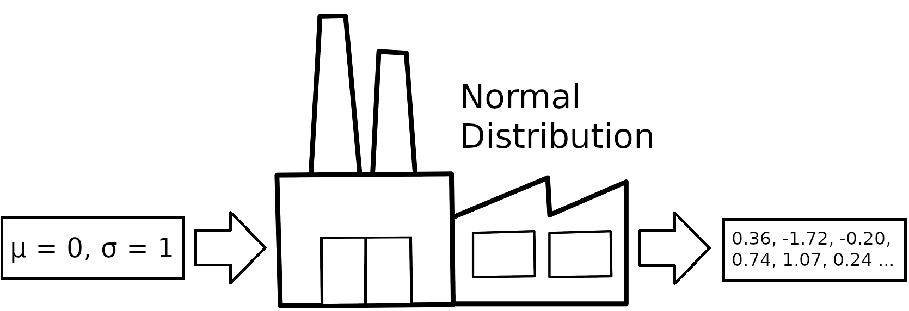
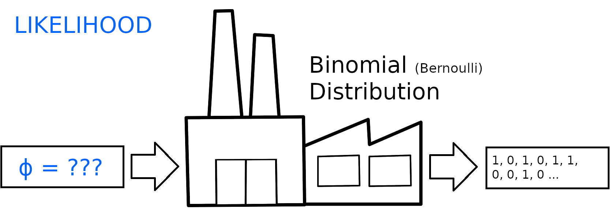
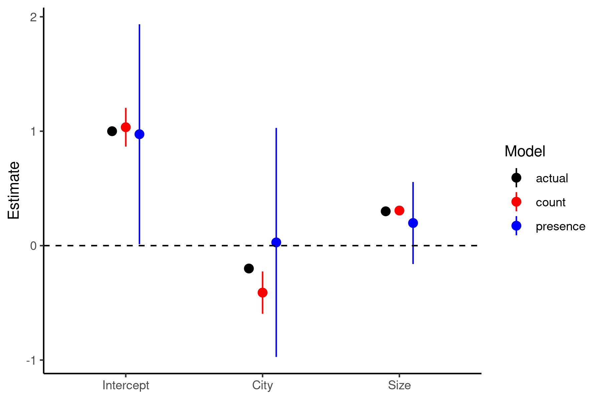

```{r setup, include=FALSE}
library(knitr)

#Trick to get smaller R code size with out resorting to LaTeX text sizes
def.chunk.hook  <- knit_hooks$get("chunk")
knit_hooks$set(chunk = function(x, options) {
  x <- def.chunk.hook(x, options)
  ifelse(options$size != "normalsize", paste0("\n \\", options$size,"\n\n", x, "\n\n \\normalsize"), x)
})

opts_chunk$set(echo = FALSE, eval = TRUE, message=TRUE, warning=TRUE, size = 'footnotesize')
library(tidyverse)
theme_set(theme_classic())
library(ggeffects)

set.seed(123)

#Functions
logit <- function(x) log(x/(1-x))
invLogit <- function(x) exp(x)/(1+exp(x))

#Generate data that violate lm assumptions:
n <- 100
x1 <- runif(n,-10,10) #Predictors
x2 <- runif(n,-5,5)

yhat <- 1 - 0.2*x1 + 0.3*x2 #Expected value
y0 <- yhat + rnorm(n,0,2) #Normal process
y1 <- rpois(n,exp(yhat))  #Poisson process
y2 <- rbinom(n,1,invLogit(yhat))  #Binomial (bernoulli) process

d1 <- data.frame(x1,x2,yhat,y0,y1,y2) #Dataframe


```


## Outline 

- Maximum likelihood
  - A way to think about data
  - Likelihood vs Probability
- Generalized linear models 
  - Link functions
  - Predictors -> Linear model

## How is our data made?

Making data can be thought of as a _factory_

- Input: __parameters__ (things that guide the process)
- Process: __probability function__ 
- Output: __data__ (things made by the process)



## Examples




<!-- ## Likelihood vs Probability -->

<!-- These concepts are both related to the chance of seeing something occur -->

<!-- - Probability: "I know that $\mu = 0$ and $\sigma = 1$. What are my chances of getting a number between -1 and +1?" -->
<!--   - $p(\text{data}|\mu=0,\sigma=1)$  -->
<!-- - Likelihood: "I got a bunch of numbers. What is the chance that $\mu = 0$ and $\sigma = 1$ made them?" -->
<!--   - $L(\mu=0,\sigma=1|\text{data})$  -->

<!-- We will mostly deal with _likelihoods_, because we never actually know what $\mu$ and $\sigma$ are! -->
  
## Likelihood vs Probability





## Likelihood vs Probability (cont.)

Probability and likelihood both use the same PDF

- "I know that $\phi$ = 0.3. What is the chance of getting 2 heads and a tail?" 

```{r, echo=TRUE}
dbinom(1,1,0.3)*dbinom(1,1,0.3)*dbinom(0,1,0.3)
```

- "I got 2 heads and a tail. What is the likelihood that $\phi$ = 0.3?"

```{r, echo=TRUE}
dbinom(1,1,0.3)*dbinom(1,1,0.3)*dbinom(0,1,0.3)
```

## Likelihood vs Probability (cont.) 

Let's see how _likelihood_ changes with different values of $\phi$:

```{r, echo=TRUE}
#phi = 0.3
dbinom(1,1,0.3)*dbinom(1,1,0.3)*dbinom(0,1,0.3)
```

```{r, echo=TRUE}
#phi = 0.7
dbinom(1,1,0.7)*dbinom(1,1,0.7)*dbinom(0,1,0.7)
```

Likelihood of $\phi$ = 0.7 is higher, i.e. $\phi$ = 0.7 matches our data _better_

## Likelihood 

```{r, echo=FALSE, eval = TRUE, fig.width= 4, fig.height = 2.5}
llfun <- function(phi) dbinom(1,1,phi)*dbinom(1,1,phi)*dbinom(0,1,phi)

ggplot() + geom_function(fun=llfun) + xlim(0,1) + labs(x=expression(phi),y=expression(paste('Likelihood(H,H,T|',phi,')'))) + geom_vline(xintercept=2/3,linetype='dashed')

```

The best match (maximum likelihood value) is at $\phi$ = 0.666 (2 heads out of 3 flips)

## Generalized Linear Models

`glm()` will fit a model like this, and find the ML solution

```{r, echo=TRUE, size='tiny'}
dat <- data.frame(flips=c(1,1,0)) #Data (2 heads, 1 tail)
mod1 <- glm(flips~1,data=dat,family='binomial') #Note family specification
summary(mod1)
```

Wait... our estimate should be 0.666 (2/3), not `r round(coef(mod1),3)`!

## Link functions

- Some parameters of PDFs have _limits_
  - Normal: $-\infty < \mu < \infty$, $0 < \sigma$
  - Binomial: $0 < \phi < 1$ 
  - Poisson: $0 < \lambda$
- GLMs use _link functions_ to map values onto the appropriate parameter range  
  - Normal: Identity
  - Binomial: Logit
  - Poisson/NB: Log
- $logit(0.693) = 0.666$, so the GLM actually got it right!
  
## What do these functions look like?

::: columns

:::: column

```{r, echo = FALSE, eval = TRUE, fig.height=4, fig.width=4}
ggplot() + geom_function(fun=logit,n=1000) + xlim(0,1) + labs(y='logit(x)',x='x')+
  annotate('text',x=0.75,y=-3,label='paste(f(x) == ln, bgroup("(", frac("x","1-x"),")"))',parse=TRUE)+
  annotate('text',x=0.75,y=-5,label='f(x)^-1 == frac(e^x,e^x+1)',parse=TRUE)

# invLogit <- function(x) exp(x)/(1+exp(x))

```

::::

:::: column

```{r, echo = FALSE, eval = TRUE, fig.height=4, fig.width=4}
ggplot() + geom_function(fun=log,n=1000) + xlim(0,10) + labs(y='log(x)',x='x')+
  annotate('text',x=6,y=-2,label='f(x) == ln(x)',parse=TRUE)+
  annotate('text',x=6,y=-3,label='f(x)^-1 == e^x',parse=TRUE)
```

::::

:::

These functions map parameter values from $-\infty$ to $+\infty$ onto the appropriate range (0-1 or 0-$\infty$) 

## Why do we bother with these link function?

::: columns

:::: column

- Likelihood functions are not symmetrical on the regular scale
- On the link-scale, they are closer to a normal distribution
- Makes it easier for R to find the ML estimate (and confidence intervals)

::::

:::: column

```{r, echo=FALSE, eval = TRUE, fig.width= 3, fig.height = 2}
ggplot() + geom_function(fun=llfun) + xlim(0,1) + labs(x=expression(phi),y=expression(paste('Likelihood(H,H,T|',phi,')'))) + geom_vline(xintercept=2/3,linetype='dashed')

```

```{r, echo=FALSE, eval = TRUE, fig.width= 3, fig.height =2}
#Uses logit-phi (-Inf to +Inf) rather than phi (0 to 1)
llfun2 <- function(lphi){
  phi <- invLogit(lphi)
  ll <- dbinom(1,1,phi)*dbinom(1,1,phi)*dbinom(0,1,phi)
  return(ll)
} 

ggplot() + geom_function(fun=llfun2) + xlim(-5,8) + labs(x=expression(paste('logit(',phi,')')),y=expression(paste('Likelihood(H,H,T|',phi,')'))) + geom_vline(xintercept=logit(2/3),linetype='dashed')

```

::::

:::

## How do linear models fit into this?

::: columns

:::: column

- Usually we aren't interested in finding only a single parameter $\phi$.
- Solution: $\phi$ becomes a _linear_ function of the predictors

- Simple linear models take the form:
\begin{equation*} 
\begin{split}
\textcolor{orange}{\hat{y}} & = \textcolor{blue}{b_0} + \textcolor{blue}{b_1}\textcolor{darkturquoise}{x_1} ... + \textcolor{blue}{b_i}\textcolor{darkturquoise}{x_i} \\
y & \sim Normal(\textcolor{orange}{\hat{y}},\textcolor{red}{\sigma})
\end{split}
\end{equation*}

:::: 

:::: column

- Generalized linear models are similar, except that:
1. Expected value ($\phi$) fed through a link function
2. Data is fit to a non-normal probability function

\vspace{12pt}

\begin{equation*} 
\begin{split}
\textcolor{orange}{logit(\hat{\phi})} & = \textcolor{blue}{b_0} + \textcolor{blue}{b_1}\textcolor{darkturquoise}{x_1} ... + \textcolor{blue}{b_i}\textcolor{darkturquoise}{x_i} \\
flips & \sim Binomial(\textcolor{orange}{\hat{\phi}})
\end{split}
\end{equation*}

::::

:::

\center __Instead of directly finding $\phi$, R now looks for ML estimates of the coefficients $\textcolor{blue}{b_0}$, $\textcolor{blue}{b_1}$, ... $\textcolor{blue}{b_i}$__

## How do I fit GLMs in R?

Syntax and model output is very similar to `lm`

```{r, echo=TRUE, size='tiny'}
# y ~ x, where x is the predictor of y (~1 for just intercept)
mod_binomial <- glm(y2 ~ x1 + x2 , data = d1, family = 'binomial') #Fit a binomial GLM
summary(mod_binomial) 
```

Dispersion and Deviance Residuals will be discussed later...

## How do I get partial effects plots?

`crPlot` (from `car`) and `ggpredict` (`ggeffects`) work with fitted `glm` models

```{r, echo = TRUE, size='tiny', fig.height=2.5,fig.width=5}
ggpredict(mod_binomial, terms='x1 [all]') %>% #Partial effect of x1 term
  ggplot(aes(x, predicted)) + geom_line() +
  geom_ribbon(aes(ymin = conf.low, ymax = conf.high), alpha = 0.3) +
  labs(x = 'x1', y = expression(paste('Chance of Success (',phi,')')))
```

## A challenger approaches!

- Dr. Roberto Darkley (Robert Barkley's evil nemesis) sent 2 people out to check out some bat roosts in Edmonton and Calgary. One of them dutifully counted bats at each roost, but the other one was really lazy, and just recorded "bats or no bats" (1 or 0).
- Fit a model to each of their data (found in `batDatGLM.csv`) using a GLM
  - `batCounts` should be modeled using a Poisson GLM, and `batPres` should use a Binomial GLM 
  - Terms to include: `city` and `size` (no interaction)
- How do the models look? Compare the coefficients and see if they are different.
  - Bonus: make a partial regression plot of terms in the Poisson GLM

## Model results



