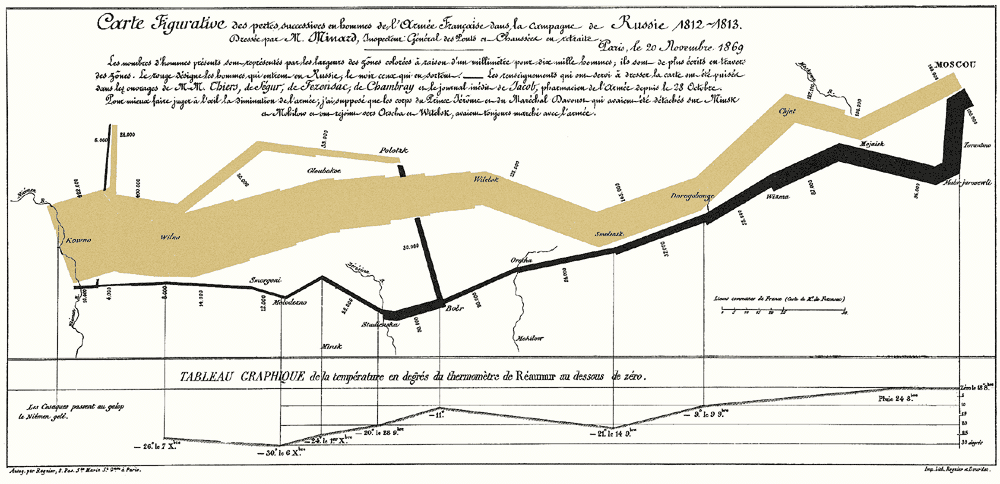
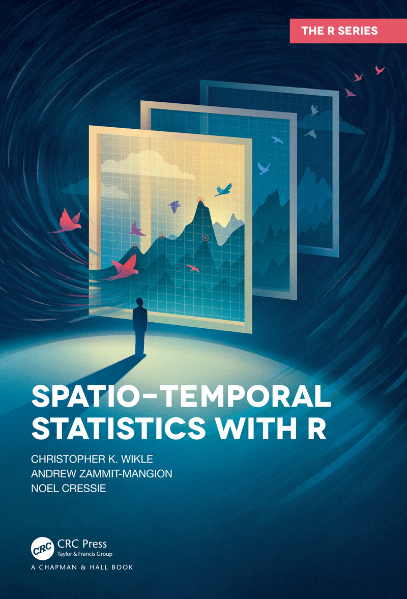
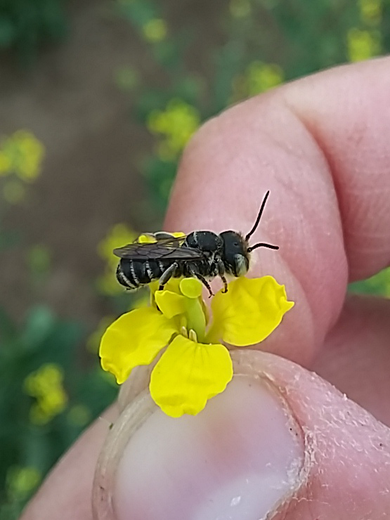
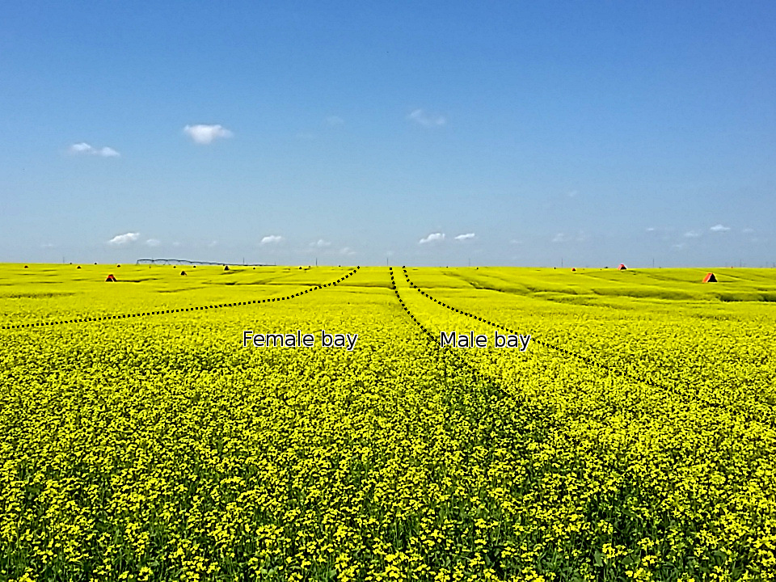

```{r setup, include=FALSE}
library(tidyverse)
theme_set(theme_classic())
library(ggpubr)
library(sf)
library(sp)
library(gstat)
library(mgcv)
library(DHARMa)
library(glmmTMB)
library(ggeffects)


knitr::opts_chunk$set(echo = FALSE, eval = TRUE, message=TRUE, 
                      warning=TRUE, cache = TRUE, fig.height=5,fig.width=5)

#Example dataframe for date/time conversions
dExamp <- data.frame(x=c(5,10),
                     d1=c('2010-05-06','2021-11-14'),
                     d2=c('2010-06-13','2022-10-14'))

set.seed(12)

manyLetters <- c(letters,paste0(rep(letters[1:5],each=length(letters)),rep(letters,5)))

#Function to make temporally correlated noise (AR1, see https://en.wikipedia.org/wiki/Autoregressive_model)
makeAR1 <- function(phi=0.5,x0=0,N=100,sigma=1){
  x <- rep(0,N)
  sigma <- rnorm(N,0,sigma)
  x[1] <- x0
  for(i in 2:N) x[i] <- x[i-1]*phi + sigma[i]
  return(x)
}

#Generate data (correlated intercepts/slopes)
n <- 260
ngroups <- 26
x <- runif(n,-10,10) #Single fixed effect predictor
g <- sample(letters[1:ngroups],n,TRUE) #Groups
intercept <- 1
slopeX <- 0.5
sigmaR <- 3 #Residual sigma 
sigmaG <- 5 #Group intercept sigma
sigmaG_slope <- abs(slopeX*2) #Slope sigma (half slope value)

#Correlated intercepts and slopes, using Choleski matrices
raneffs <- matrix(rnorm(ngroups*2,0,1),ncol=2) #Uncorrelated unit normals
slopeCor <- 0.7 #Intercept-slope correlation
corMat <- matrix(c(1,slopeCor,slopeCor,1),ncol=2) #Correlation matrix
cholCorMat <- chol(corMat) #Choleski transform of corMat
raneffs <- raneffs %*% cholCorMat #Induces correlation in slopes
raneffs <- raneffs * matrix(rep(c(sigmaG,sigmaG_slope),each=ngroups),ncol=2,
                            dimnames=list(letters[1:ngroups],c('Int','Slope'))) #Changes SD for each column
raneff_int <- model.matrix(~g-1) %*% raneffs[,1] #Intercept vector
raneff_slope <- x * model.matrix(~g-1) %*% raneffs[,2]  #Slope vector

yhat <- intercept + slopeX*x + raneff_int + raneff_slope  #Expected value
y <- rnorm(n,yhat,sigmaR) #Data (normal)
y2 <- rnbinom(n,mu=exp(yhat/4),sigmaR) #Data (NB)
dat <- data.frame(y,y2,x,site=g) #Assemble into data frame

#Generate spatially correlated random intercepts

#Squared-exponential distance function
covFun <- function(sigma,rho,d) (sigma^2)*exp((-rho^2)*(d^2)) 

lat <- runif(ngroups,-5,5) #"Latitude"
lon <- runif(ngroups,-5,5) #"Longitude"
distMat <- as.matrix(dist(cbind(lat,lon),diag=TRUE,upper=TRUE)) #Matrix of distances
covMat <- covFun(sigmaG,0.2,distMat) #Covariance matrix
# curve(covFun(sigmaG,0.2,x),0,10)
corMat <- cov2cor(covMat) #Correlation matrix
cholCorMat <- chol(corMat) #Choleski matrix
raneffs <- rnorm(ngroups,0,1) %*% cholCorMat #Induce correlation
raneff_int <- model.matrix(~g-1) %*% raneffs[1,] #Intercept vector
yhat <- intercept + slopeX*x + raneff_int  #Expected value
y <- rnorm(n,yhat,sigmaR) #Data (normal)
y2 <- rnbinom(n,mu=exp(yhat/5),sigmaR) #Data (NB)
lat <- model.matrix(~g-1) %*% lat
lon <- model.matrix(~g-1) %*% lon
dat2 <- data.frame(y,y2,x,site=g,lat,lon) #Assemble into data frame

rm(x,g,y,y2,lat,lon,yhat)

```

## Outline

::: columns

:::: {.column width='40%'}

- Spatial and temporal data
  - Some basic GIS (`sf`)
- How to think about space and time
  - Plotting
  - Variograms
  - "Continuous" random effects
- Some common modeling approaches
  - GLS (covariance)
  - Basis functions (GAMs)

::::

:::: {.column width='60%'}

{width=100%}

::::

:::

## Some common problems

- My data were sampled over time or space. I'm not really interested in time or space _per se_, so can I just ignore them and run my models?
- I am actually interested in how something changes over time or space. Can I just use day or location (lat/lon) as another term in my model?
- My supervisor told me to look for something called autocorrelation, and it sounds scary

## A common approach: random effects

"Can I just use day or site as a random effect?"

- Short answer: "Yes"
- Long answer: You might be able to do better, because of the __1st Law of Geography__:

_"...everything is related to everything else, but near things are more related than distant things."_ Waldo Tobler

- If you have spatial or temporal information, this can help R to estimate random effects more accurately
  - Can improve prediction accuracy (smaller p-values)
  - Can give you hints about the underlying causal mechanisms

# Part 1: Time and Space in R

## How R deals with time

::: columns

:::: column

- Dealing with time in R is somewhat annoying, but not complicated
- Common methods: `as.Date` (days), `as.POSIXlt` (date + time)
- Both require a date/time format: see `?strptime` for examples
- You can transform to specific formats (e.g. day of year) using `format`
- `difftime` is useful for getting differences in time points

::::

:::: column

```{r}
dExamp
```

 

```{r, echo=TRUE}
#Convert data to Date format
dateForm <- '%Y-%m-%d'
dExamp %>% 
  mutate(across(c(d1,d2),
            ~as.Date(.x,format=dateForm))) %>% 
  #Get day of year
  mutate(doy=format(d1,format='%j')) %>% 
  #Get difference in time between d2 and d1
  mutate(dChange=difftime(d2,d1,units='days'))
```


::::

:::

## Two main types of spatial data

::: columns

:::: column

__Vector__ data: points, lines, and polygons

```{r}
# par(mar=c(0,0,0,0))
exampPoly1 <- data.frame(x=c(0.13,0.10,0.21,0.44,0.62,0.66,0.58,0.37,0.13),
                         y=c(0.47,0.62,0.84,0.91,0.86,0.68,0.55,0.47,0.47))
exampPoly2 <- data.frame(x=c(0.4,0.53,0.92,0.71,0.4),
                         y=c(0.09,0.31,0.33,0.08,0.09))
plot(0,0,xlim=c(0,1),ylim=c(0,1),type='n',xlab='x',ylab='y')
points(exampPoly1); lines(exampPoly1)
points(exampPoly2)
```
R packages: `sf`, `sp`, `gstat`, `spdep`

::::

:::: column

__Raster__ data: cells

```{r}
image(volcano,xlab='x',ylab='y')
```

R packages: `stars`, `terra`
 
::::

:::

## R as a GIS

- A __Geographic Information System__ (GIS) is a system for organizing, analyzing, and displaying spatial information
- Common platforms and tools: ArcGIS, QGIS, PostGIS, Python
- A number of R packages are specifically written for dealing with GIS data, usually specific to raster or vector formats
- Ecologists mostly deal with vector data (site locations, boundary polygons) but raster data is sometimes used (NDVI, land cover classes)
- I'll show you a couple practical tips for using the `sf` package (see [here](https://r-spatial.github.io/sf/index.html) also), but there are [many other packages](https://r-spatial.org/book/) out there

\vspace{0.5cm}

If you're dealing with large amounts of spatial data _I would encourage you to take a formal GIS course_, as there is a LOT to learn!

## Common tasks: making maps

::: columns

:::: column

- Vector data are often encoded as _shapefiles_ (set of several files)
- Point data can also be read in as _csv_ files, which need to be turned into an `sf` object
- `sf` objects can be displayed in `ggplot` using `geom_sf`. Common aesthetics (colour, size) can be mapped onto the plot
  - Objects are layered on the map in order of coding
- Be careful: shapefiles can be very large, which can easily crash R!

::::

:::: column

```{r abMap, warning=FALSE}
#Reads AB boundary shapefile
abBound <- read_sf('./shapefiles/AB_only.shp') %>% 
  st_transform(4326)

#Reads city csv
csvPath <- './shapefiles/abCities.csv'
abCities <- read.csv(csvPath) %>% 
  #Converts to sf
  st_as_sf(coords = c('lon','lat'),crs=4326) 
#NOTE: crs 4326 is common lat/lon format

#Make map
(p1 <- ggplot()+ 
  #Add boundary
  geom_sf(data=abBound)+ 
  #Add cities
  geom_sf(data=abCities,aes(size=pop),col='red')+
  #Add labels
  geom_sf_text(data=abCities,aes(label=name),
  size=3,nudge_y=0.25)+
  labs(x=NULL,y=NULL,size="Population"))
```

::::

:::

## Common tasks: making maps (cont.)

::: columns

:::: column

```{r abMap, echo=TRUE,eval=FALSE, warning=FALSE}
```

::::

:::: column

```{r abMap, warning=FALSE}
```

::::

:::


## Common tasks: reprojection

::: columns

:::: column

```{r abMapProj, warning=FALSE}
abBound_utm <- abBound %>% st_transform(3401)
abCities_utm <- abCities %>% st_transform(3401)

p2 <- ggplot()+ 
  geom_sf(data=abBound_utm)+ 
  geom_sf(data=abCities_utm,aes(size=pop),
          col='red',show.legend = FALSE)+
    geom_sf_text(data=abCities_utm,aes(label=name),
               size=3,nudge_y=25000)+
  labs(x=NULL,y=NULL,size="Population")
ggarrange(p1+guides(size='none'),
          p2,ncol=2,labels = c('WGS 84','UTM-10'))
```


::::

:::: column

- The world is not flat: all maps have to "bend" the data somehow. This is called the map __projection__
- Some map projections preserve _area_, others preserve _distance_. Degrees are not all the same distance apart!
- Usually we're interested in absolute distance between locations, so _Mercator_ (UTM) is a good choice, but be careful which UTM zone you choose!
- `sf` uses `crs` codes: __4326__ is for lat/lon (WGS 84), 3401 is an Alberta-specific UTM projection
- [Many](https://epsg.io/) others are available


::::

:::

## First challenge

::: columns

:::: column

- Make this map of bird counts from the ABMI dataset, with Alberta cities and provincial boundaries overlaid on top
- Data are found [here](https://github.com/samuelVJrobinson/ecoStatsLectures/tree/fall2023/08%20Spatiotemporal%20models/shapefiles); you'll need to download the whole set of `AB_only` files, not just the `.shp` one
- `medDetects` is the median detection rate at each site over several years (I used log(`medDetects`) for this map)


::::

:::: column

```{r abmiMap}
abBound <- read_sf('./shapefiles/AB_only.shp') %>% 
  st_transform(3401)
birdDat <- read.csv('./shapefiles/birdDat.csv') %>% 
  st_as_sf(coords = c('lon','lat'),crs=4326) %>% 
  st_transform(st_crs(abBound))
abCities <- read.csv('./shapefiles/abCities.csv') %>% 
  st_as_sf(coords = c('lon','lat'),crs=4326) %>% 
  st_transform(st_crs(abBound))

ggplot()+
  geom_sf(data=birdDat,aes(col=log(medDetects)))+
  geom_sf(data=abBound,fill=NA,col='black')+
  geom_sf(data=abCities,col='red',size=1)+
  facet_wrap(~Common.Name)+
  labs(col='Detection')+
  theme(axis.text = element_text(size=8),
        legend.position=c(0.85,0.25))
  
```

::::

:::

## First challenge results

::: columns

:::: {.column width='60%'}

```{r abmiMap, eval=FALSE,echo=TRUE}
```

::::

:::: {.column width='40%'}

```{r abmiMap}
```

::::

:::


# Part 2: Spatiotemporal modeling


## Temporal or Spatial Data

- Correlation is often present in temporal data or spatial data; causes may be unknown or "uninteresting"
- Usually we are interested in accounting for these patterns, in order to better estimate the "interesting" patterns on top of them
- Last week we talked about _cross_-correlation (i.e. correlation between columns of data); this week we're talking about _auto_-correlation (i.e. correlation between individual data points in a single column)

::: columns

:::: column

```{r, fig.height=2.5, fig.width=4}
# data.frame(year=as.numeric(time(lynx)),lynxNum=as.numeric(lynx)) %>%
#   ggplot(aes(x=year,y=lynxNum))+geom_line()+
#   labs(x='Year',y='Lynx Numbers')
plot(sunspots,ylab='Sunspots per year')
```

::::

:::: column

```{r, fig.height=3, fig.width=4}
# ggplot(seals,aes(x=long,y=lat,fill=delta_long))+
#   geom_raster()+
#   scale_fill_continuous(type='viridis')+
#   labs(x='Longitude',y='Latitude')+
#   theme(legend.position = c(0.2,0.7))
image(volcano)
```

::::

:::

## Covariance

- Normal distributions\footnotemark don't just have a single $\sigma$, but a matrix of values
- If our data _y_ are _independent_, then it looks like this:

\begin{equation*}
y \sim Normal(\textcolor{orange}{\hat{y}},\textcolor{red}{\Sigma})
\end{equation*}

\begin{equation*}
\textcolor{orange}{\hat{y}} = [\mu_1, \mu_2, \mu_3]
\end{equation*}

\begin{equation*}
\textcolor{red}{\Sigma} = \begin{bmatrix}
\textcolor{red}{\sigma}^2 & 0 & 0 \\
0 & \textcolor{red}{\sigma}^2 & 0 \\
0 & 0 & \textcolor{red}{\sigma}^2
\end{bmatrix}
\end{equation*}

- Zeros mean "$\mu_1$, $\mu_2$, \& $\mu_3$ aren't related to each other"
- Diagonal elements = _variance_, off-diagonal = _covariance_

\footnotetext{Multivariate Normal}

## Covariance and Correlation

In real life, things may not be independent from each other. For example:

- $\textcolor{red}{\sigma}$ = 2 (variance = $\textcolor{red}{\sigma}^2$ = 4)
- $\mu_1$ and $\mu_2$ are strongly correlated (r=0.7), but $\mu_3$ is not related to anything (r=0). Shown here as a _correlation matrix_ ($\textcolor{red}{R}$):

\begin{equation*}
\textcolor{red}{R} = \begin{bmatrix}
1 & 0.7 & 0 \\
0.7 & 1 & 0 \\
0 & 0 & 1
\end{bmatrix}
\end{equation*}

- When multiplied by the variance, this becomes the _covariance matrix_ ($\textcolor{red}{\Sigma}$)

\begin{equation*}
\textcolor{red}{\Sigma} = \begin{bmatrix}
\textcolor{red}{\sigma}^2\times1 & \textcolor{red}{\sigma}^2\times0.7 & \textcolor{red}{\sigma}^2\times0 \\
\textcolor{red}{\sigma}^2\times0.7 & \textcolor{red}{\sigma}^2\times1 & \textcolor{red}{\sigma}^2\times0 \\
\textcolor{red}{\sigma}^2\times0 & \textcolor{red}{\sigma}^2\times0 & \textcolor{red}{\sigma}^2\times1
\end{bmatrix} = \begin{bmatrix}
4 & 2.8 & 0 \\
2.8 & 4 & 0 \\
0 & 0 & 4
\end{bmatrix}
\end{equation*}

## Let's start with an example

::: columns

:::: column

- Say we're fitting a simple linear regression on a dataset collected across space

```{r}
dat2_small <- dat2 %>% select(y,x,site,lat,lon) %>% 
  group_by(site) %>% slice(1) %>% ungroup() %>% data.frame()
head(dat2_small,5)
```

```{r,echo=FALSE}
m1 <- lm(y~x,data=dat2_small)
```

```{r, warning=FALSE, message=FALSE, fig.height=3}
plot(ggpredict(m1,terms='x'),residuals = TRUE)+
  labs(title='Model: lm(y ~ x)')
```

::::

:::: column

Things look mostly OK, right?

```{r resPlot}
par(mfrow=c(2,1),mar=c(0,0,0,0))
plot(m1, which=c(1,2),caption='',cex=0.75,cex.axis=1e-5,tck=0)
par(mfrow=c(2,1),mar=c(5.1,4.1,4.1,2.1))
```

::::

:::

## Spatial residual plot

::: columns

:::: column

- Residuals are spatially _non-independent_!
- _Variograms_ are a common tool to examine how variance changes with distance
- Uncorrelated spatial data will have a _flat_ variogram (no change in semivariance with distance)

```{r vgExample, fig.height=3}
dat2_small %>% mutate(res=residuals(m1)) %>%
  st_as_sf(coords=c('lon','lat')) %>% 
  as_Spatial() %>% #convert to an sp object
  variogram(res~1,data=.,width=0.5) %>% #calculate covariance at each distance
  ggplot(aes(x=dist,y=gamma))+geom_line()+geom_point()+
  labs(x='Distance',y='Semivariance')

```

::::

:::: column

```{r spResPlot}
dat2_small %>% 
  mutate(res=residuals(m1)) %>% 
  ggplot()+
  geom_point(aes(x=lon,y=lat,size=abs(res),col=res))+
  labs(title='Residuals across space')+
  guides(size='none')+
  scale_colour_gradient2(low='blue',mid='purple',high='red',aesthetics = 'col')

```


::::

:::

## How do variograms work?

::: columns

:::: column

- Variograms compare the squared difference (variance) between values spaced at different distances
- If close values are similar, variance increases with increasing distance before leveling off
- Analysis of the specific shape of the curve is called _variography_, and is important for spatial modeling 

::::

:::: column

```{r vgExample2}
data(meuse)
coordinates(meuse) = ~x+y
variogram(log(zinc)~1, meuse,width=50) %>% 
  ggplot(aes(x=dist,y=gamma))+geom_point()+
  geom_smooth(method='gam',formula=y~s(x))+
  labs(x='Distance',y='Semivariance')
```

::::

:::

## Gaussian Process Modelling

::: columns

:::: column

- We can model covariance between things as a function of _distance_ and use it to predict what other points in between might be (a.k.a. [Kriging](https://en.wikipedia.org/wiki/Kriging))
- Squared-exponential is fairly common\footnotemark:

\begin{equation*}
\begin{split}
\textcolor{red}{\Sigma} = & covariance \\
\textcolor{red}{\Sigma} = & variance \times correlation \\
\textcolor{red}{\Sigma} = & \textcolor{red}{\sigma}^2 \times e^{-\textcolor{magenta}{\rho}^2 Dist^2}\\
\end{split}
\end{equation*}

- Instead of finding a single $\textcolor{red}{\sigma}$ value, R now looks for $\textcolor{red}{\sigma}$ (maximum covariance) and $\textcolor{magenta}{\rho}$ (decay with distance)

::::

:::: column

```{r}
expand.grid(dist=seq(0,5,0.1),rho=c(0.5,1,2),sigma=c(1,2)) %>%
  mutate(cVal=(sigma^2)*exp((-rho^2)*(dist^2))) %>%
  mutate(category=paste0('sigma=',sigma,', rho=',rho)) %>%
  mutate(rho=factor(rho)) %>%
  ggplot(aes(x=dist,y=cVal,group=category,col=rho))+geom_line(linewidth=1)+
  labs(x='Distance (km)',y='Covariance')+scale_colour_manual(values=c('red','purple','blue'))+
  theme(legend.position = c(0.8,0.8))
```

::::

:::

\footnotetext{Also common: AR-1 (temporal processes), Mat\'{e}rn (spatial processes)}

## How do we do this in R?

::: columns

:::: column

- For simpler models, you can use a generalized linear system (`gls`)
- Here I've used `corGaus` to specify a Gaussian (squared-exponential) kernel

```{r, echo=TRUE}
corForm <- corGaus(form = ~ lat + lon)
m1_cor <- gls(y ~ x, correlation = corForm, 
              dat = dat2_small)
```

```{r}
summary(m1_cor)
```

::::

:::: column

```{r, fig.height=4}
lapply(list(m1,m1_cor),function(x) data.frame(ggpredict(x,terms='x'))) %>% 
  bind_rows(.id='model') %>% 
  mutate(model=factor(model,labels=c('m1','m1_cor1'))) %>% 
  ggplot(aes(x=x,y=predicted))+
  geom_ribbon(aes(ymax=conf.high,ymin=conf.low,fill=model),alpha=0.2)+
  geom_line(aes(col=model))
```

Not too bad in this case, but in general, high spatial correlation effectively means _your sample size is smaller_

::::

:::

## Random effects: standard

::: columns

:::: column

- Say that we collected data at `r ngroups` sites, and we're interested in the effect of _y_ on _x_
- Let's first fit a model with a random intercept for site

```{r, echo=TRUE,size='tiny'}
#Same syntax as lmer models:
lmm2 <- glmmTMB(y~x+(1|site),data=dat2)
```

- If we plot the intercepts for each site, we see that they are clustered
- `Moran's I` is a commonly test for spatial autocorrelation (see `ape` and `spdep` packages)

::::

:::: column

```{r ranefRegular, size='tiny'}
dat2 %>% select(site,lat,lon) %>% distinct() %>% arrange(site) %>% mutate(int=lmm2$sdr$par.random) %>%
  ggplot(aes(lon,lat,col=int))+geom_point(aes(size=abs(int)))+
  labs(title='Random intercepts (1|Site)',x='Longitude',y='Latitude',col='Intercept')+
  scale_colour_gradient2(low='blue',mid='purple',high='red')+
    guides(size='none')
```

::::

:::


## Random effects: spatial

::: columns

:::: column

- Re-fit model with a spatial (exponential) random effect

```{r, echo=TRUE,size='tiny'}
#Coordinates
dat2$coords <- numFactor(dat2$lon,dat2$lat)

#Group factor (only 1 here)
dat2$group <- factor(rep(1,nrow(dat2)))

#Fit model with spatial random effect
lmm3 <- glmmTMB(y~x+exp(coords+0|group),data=dat2)
```

- The spatial random _field_ is shown in the background, along with individual draws from the field (sites)

::::

:::: column


```{r ranefSpatial, size='tiny'}
#Spatial random effect field
spRanEff <- expand.grid(lon=seq(-5,5,0.5),lat=seq(-5,5,0.5)) %>%
  mutate(coords=numFactor(lon,lat),group=factor(rep(1,nrow(.))),x=0) %>%
  mutate(pred=predict(object=lmm3,newdata=.,type='response',allow.new.levels = TRUE))

#Predictions at each data location
ranIntPred <- dat2 %>% select(site:group) %>% distinct() %>% mutate(x=0) %>% 
  mutate(int=predict(object=lmm3,newdata=.,type='response')-lmm3$fit$par[1]) #Random intercepts

ggplot(spRanEff,aes(lon,lat))+
  geom_raster(aes(fill=pred))+
  # geom_point(data=ranIntPred,aes(lon,lat,fill=NULL),col='red')+
  geom_point(data=ranIntPred,aes(size=abs(int),col=int))+
  labs(x='Longitude',y='Latitude',
       title='Spatial random effect',fill='Intercept')+
  scale_fill_viridis_c(option='cividis',aesthetics = 'fill')+
  scale_colour_gradient2(low='blue',mid='purple',high='red',aesthetics = 'col')+
  guides(size='none',col='none')

```


::::

:::

## How do these differ?

::: columns

:::: column

```{r ranefRegular}
```


::::

:::: column

```{r ranefSpatial}
```

::::

:::


## Second challenge

::: columns

:::: column

```{r}
dat <- read.csv('./timeDat.csv')
head(dat)
```

```{r, fig.height=3}
ggplot(dat,aes(x=as.numeric(days),y=count))+geom_point()+
  labs(x='Days',y='Count')
```

::::

:::: column

- Things can vary in _time_ as well as space
- There is a dataset found [here](https://github.com/samuelVJrobinson/ecoStatsLectures/tree/fall2023/08%20Spatiotemporal%20models) (`timeDat.csv`) with count data recorded at each location, along with temperature and a `day` variable
- How does count change with temperature? Is there `temporal` autocorrelation between the data?
- Fit a model that accounts for location, as well as any temporal autocorrelation

::::

:::

## Second challenge results

::: columns

:::: column

```{r timeDatExamp,echo=TRUE,eval=FALSE}
dat <- read.csv('./timeDat.csv') %>%
  mutate(site=factor(site))

#Naive random effect model
m2 <- glmmTMB(count~temperature+(1|site),
              data=dat,
              family='nbinom2')

m2Res <- residuals(m2,'deviance')

dat %>% mutate(m2Res) %>% 
  mutate(days=as.numeric(days)) %>% 
  ggplot(aes(x=days,y=m2Res))+
  geom_point()+
  geom_smooth(method='loess',formula=y~x)+
  labs(x='Days',y='Residuals')
```

Looks like a fairly strong pattern in residuals

::::

:::: column

```{r timeDatExamp}
```

::::

:::

## Second challenge results (cont)

::: columns

:::: column

```{r timeDatExamp2,echo=TRUE,eval=FALSE}
#Days as "numeric factor"
dat$dayF <- numFactor(dat$days)
dat$group <- factor(rep(1,nrow(dat)))

#Fit model with temporal random effect
m2_ac <- glmmTMB(count~temperature+(1|site)+
                 exp(dayF+0|group),
              data=dat,
              family='nbinom2')
m2acRes <- residuals(m2_ac,'deviance')

dat %>% mutate(m2acRes) %>% 
  mutate(days=as.numeric(days)) %>% 
  ggplot(aes(x=days,y=m2acRes))+
  geom_point()+
  geom_smooth(method='loess',formula=y~x)+
  labs(x='Days',y='Residuals')

```

Pattern has largely disappeared

::::

:::: column

```{r timeDatExamp2}
```

::::

:::

## Second challenge results (cont...)

::: columns

:::: column

```{r}
data.frame(mod=c('1. Actual','2. Standard','3. Autocorr'),
           coef=c(0.5,fixef(m2)[[1]][2],fixef(m2_ac)[[1]][2]),
           se=c(0,sqrt(diag(vcov(m2)[[1]]))[1],sqrt(diag(vcov(m2_ac)[[1]]))[1])) %>% 
  mutate(upr=coef+se*1.96,lwr=coef-se*1.96) %>% 
  ggplot(aes(x=mod,y=coef))+geom_pointrange(aes(ymax=upr,ymin=lwr))+
  labs(x=NULL,y='Coefficient')

```

::::

:::: column

- Model with autocorrelation has greater uncertainty in prediction
- Unfortunately, neither model could separate the effect from zero
- Covariance function can be used to _plan future sampling_

```{r, fig.height=3}
data.frame(d=0:15,co=covFun(1,0.1,0:15)) %>% 
  ggplot(aes(x=d,y=co*100))+geom_line()+
  labs(x='Distance',y='% Correlation')
```


::::

:::


## What if my data varies over space AND time?

::: columns

:::: column

- You can jointly estimate covariance functions for different types of distances, however...
- Make sure that these can actually be estimated! Did you actually gather data at all combinations of space and time?
- In the literature these can be _separable_ or _non-separable_ covariance functions (see [here](https://spacetimewithr.org/) or [here](https://www.wiley.com/en-us/Statistics+for+Spatio+Temporal+Data-p-9780471692744) for more details)

::::

:::: column

{width=80%}

::::

:::

## Problem: hard for large datasets

- You'll notice that I've only been doing this for correlated random intercepts
- OK because the covariance matrix for intercepts is small (26 x 26), but the covariance matrix for the entire dataset is large (260 x 260)
- If data points are all from different times, this can start using a lot of memory and can take a _long time_
- In general, _covariance-based methods_ do not scale well to larger datasets, so we need a better way of doing things

## Solution: basis functions

::: columns

:::: column

- There are quicker ways to deal with spatial and temporal effects, including spatial partial differential equations (`R-INLA` and `TMB`, see here [here](https://pbs-assess.github.io/sdmTMB/index.html)) or Gaussian predictive process (`plgp`) models
- We're going to use an approach you've already used: additive models!
- GAMs are a common way to deal with this problem, as they move the ST variation from the covariance matrix into a random effect, which speeds up estimation

::::

:::: column

```{r}
set.seed(1)
vdat <- data.frame(x=-30:30,y=volcano[30,])
vdat$y <- with(vdat,(y-mean(y))/sd(y)+rnorm(length(y),0,0.4))
gmod1 <- gam(y~s(x,bs='cr'),data=vdat)
gmodBases1 <- cbind(x=vdat$x,model.matrix(gmod1)[,-1]) %>% 
  as.data.frame() %>% 
  setNames(c('x',paste0('b',1:ncol(gmod1$smooth[[1]]$S[[1]])))) 
gmodBases1a <- cbind(1,outer(rep(1,nrow(vdat)),coef(gmod1)[2:10])) * gmodBases1
gmodBases1a <- pivot_longer(gmodBases1a,-x)
gmodPreds1 <- data.frame(x=vdat$x,pred=as.matrix(gmodBases1[,2:10]) %*% coef(gmod1)[2:10])

gmodBases1a %>% 
  ggplot(aes(x=x,y=value,col=name))+
  geom_line(show.legend = FALSE,alpha=0.3)+
  geom_line(data=gmodPreds1,aes(y=pred),col='black',linewidth=1)+
  geom_point(data=vdat,aes(x=x,y=y),col='black',size=1)+
  coord_cartesian(ylim=c(-2,2))+
  labs(x='Distance',y='Value')

```

::::

:::

## Covariance vs Random Effects

::: columns

:::: column

Estimate covariance explicitly

\begin{equation*}
  \begin{split}
  \textcolor{orange}{\hat{y}} = & X\beta \\
  y \sim & Normal(\textcolor{orange}{\hat{y}},\textcolor{red}{\Sigma}) \\
  \textcolor{red}{\Sigma} = & 
  \begin{pmatrix}
      \textcolor{red}{\textcolor{red}{\sigma}}_{1,1} & \textcolor{red}{\sigma}_{1,2} & \cdots & \textcolor{red}{\sigma}_{1,j} \\
      \textcolor{red}{\sigma}_{2,1} & \textcolor{red}{\sigma}_{2,2} & \cdots & \textcolor{red}{\sigma}_{2,j} \\
      \vdots  & \vdots  & \ddots & \vdots  \\
      \textcolor{red}{\sigma}_{i,1} & \textcolor{red}{\sigma}_{i,2} & \cdots & \textcolor{red}{\sigma}_{i,j} 
 \end{pmatrix} \\
 \textcolor{red}{\sigma}_{i,j} = & \textcolor{magenta}{\alpha}^2\text{exp}(-\frac{1}{2\textcolor{magenta}{\rho}^2}D^2_{i,j}) 
 \end{split}
\end{equation*}

::::

:::: column

Approximate covariance with basis functions

\begin{equation*}
  \begin{split}
  \textcolor{orange}{\hat{y}} = & X\beta + Zu \\
  y \sim & Normal (\textcolor{orange}{\hat{y}}, \textcolor{red}{\sigma}) \\
  u \sim & Normal (0, \lambda S) \\
  \end{split}
\end{equation*}

::::

:::

## GAM approach

::: columns

:::: column

```{r}
dat$days <- as.numeric(dat$days)
```

```{r fitGam, echo=TRUE}
m3 <- gam(count~temperature+
            s(days,bs='cr'),
          data=dat,family='nb')
summary(m3)
```

::::

:::: column

- Continuous variables (time) can be specified as a smoother `s(time)`
- 2D distances (e.g. E & N) also possible: `s(E,N)`
  - Be careful that units are on the same length scale!
- Same caveats as other GAMs apply: do you have enough basis dimensions (`k`)? See [Lecture 6](https://github.com/samuelVJrobinson/ecoStatsLectures/tree/fall2023/06%20Nonlinear%20models)
- Test for residual autocorrelation OR do sensitivity analysis for `k`

::::

:::

## GAM results

Default GAM plots:

```{r plotGam, fig.width=8,fig.height=4}
par(mfrow=c(1,2))
plot(m3,all.terms=TRUE,mar=c(5.1,4.1,0.5,2.1))
```

## Third challenge

::: columns

:::: {.column width='60%'}

- During my PhD, I studied alfalfa leafcutting bees (_Megachile rotundata_) in canola fields. I counted bees visiting flowers at distances away from their shelters ("hives"); some of these data are found [here](https://github.com/samuelVJrobinson/ecoStatsLectures/tree/fall2023/08%20Spatiotemporal%20models) (`seedFieldDat.csv`).
- Using a GAM, model how visitation changes with: distance from shelter (`sDist`), edge of field (`eDist`), while controlling for observation time (`time`), day of year (`StartTime`), and different Fields. You can either do a model for each `Year` separately, or have `Year` as a term in the model

::::

:::: {.column width='40%'}

{width=80%}

::::

:::

## Seed canola field

{width=80%}

## To do for next week

- Find a paper that is important for your field and read it (preferably not a methods paper)
- In the Methods section, pay attention to how they write about their data collection and data analysis
  - How many samples did they gather? Was this easy to figure out?
  - Do they describe any models? If you had to write these models in R, what might they look like?
- How do they show the results of these models in the Results section?
- Was this paper easy to read? What would make it easier to understand?

