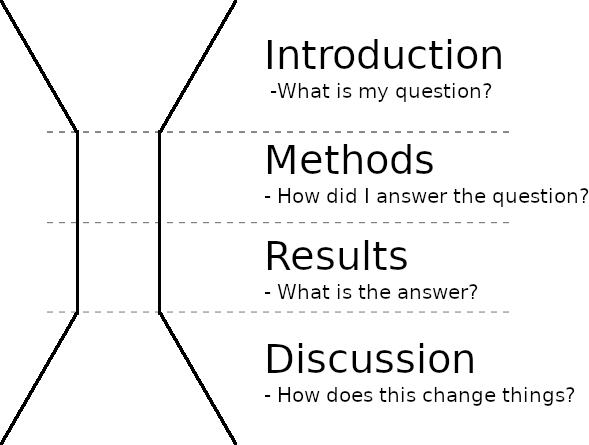

```{r setup, include=FALSE}
#Trick to get smaller R code size with out resorting to LaTeX text sizes
def.chunk.hook  <- knitr::knit_hooks$get("chunk")
knitr::knit_hooks$set(chunk = function(x, options) {
  x <- def.chunk.hook(x, options)
  ifelse(options$size != "normalsize", paste0("\n \\", options$size,"\n\n", x, "\n\n \\normalsize"), x)
})

knitr::opts_chunk$set(echo = FALSE, eval = TRUE, message=TRUE, warning=TRUE, size = 'footnotesize')
library(MASS) #glm.nb
library(tidyverse)
theme_set(theme_classic())
library(ggeffects)
library(ggpubr)
library(knitr)

#Generate data 
n <- 100
x <- runif(n,0,100)
yhat <- 5 + 0.3*x #Expected value
# y1 <- rpois(n,exp(yhat))  #Poisson process
y1 <- abs(rnorm(n,yhat,3)) #Normal process
d1 <- data.frame(x,yhat,y1) #Dataframe
# ggplot(d1,aes(x,y1))+geom_point()

```

## Outline

- Types of scientific writing
  - IMRaD manuscripts
  - Figures and tables
- Writing about statistics
  - Translating model results
- How peer review works

# Part 1: Types of scientific writing

## Where do I start?

- You've finished fitting your models, and the results make sense to you, but...
- How do I translate all these numbers into ``real" English?
- Where do I put all these numbers in the paper?
- Do I need figures and tables?

## Answer: "It depends"

\textbf{What is your story?}
\vspace{1em}
\textbf{Who is your audience?}
\vspace{1em}

- How do these numbers serve the questions I'm asking?
- Do these numbers help my audience to understand what I found?
- Would figures or tables help to prove my point more concisely or easily?
- How do these numbers relate to the rest of the literature?

## A bit of history

- (European) Universities are largely offshoots of the Christian monastic tradition
- What we now call science started in about the 1600s, largely as offshoots of astrology and alchemy
  - Biology began slightly later (1700s-1800s), as offshoots of medicine and natural history
- "Natural philosophers" (scientists) would write letters to each other about what they were up to 
- Eventually, organizations of scientists began publishing research results publicly (e.g. _Philosophical Transactions of the Royal Society_, 1665)
- Peer review was sparse, and was usually done by the editor or a board. External peer review wasn't widespread until 1950-1970
- Early science writing is _extremely_ varied, and is much different from modern science writing

## What is science writing for?

::: columns

:::: column

- "Recording secret knowledge" (Newton)
- "Describing _exactly_ how an experiment proceeded" (Bacon)
- Modern science writing does mostly the latter

::::

:::: column

{width=80%}

::::

:::

## How does this relate to statistics?

::: columns

:::: column

- Early use of statistics in science was fairly "vibes-based", at least until computers became more readily available (1950s onward)
  - Not necessarily a bad thing!
- More complex and extensive data collection requires more complex modeling approaches
  - Trade-off between realism and "explainability"
- Pushback from some quarters: One aspect of the ongoing [replication crisis](https://en.wikipedia.org/wiki/Replication_crisis)
  - _Statistics are political_
  
::::

:::: column

"I have heard from graduate students opting out of academia, assistant professors afraid to come up for tenure, mid-career people wondering how to protect their labs, and senior faculty retiring early, all because of methodological terrorism" - [Susan Fiske, APS Past President](http://datacolada.org/wp-content/uploads/2016/09/Fiske-presidential-guest-column_APS-Observer_copy-edited.pdf)

\vspace{0.5cm}

"[Fiske is] seeing her professional world collapsing... her work and the work of her friends and colleagues is being questioned in a way that no one could’ve imagined ten years ago. It’s scary, and it’s gotta be a lot easier for her to blame some unnamed "terrorists" than to confront the gaps in her own understanding of research methods." - [Andrew Gelman](https://statmodeling.stat.columbia.edu/2016/09/21/what-has-happened-down-here-is-the-winds-have-changed/)

::::

:::


## Common types of scientific writing

1. IMRaD papers: "standard" scientific papers
  - __I__ntroduction, __M__ethods, __R__esults, and __D__iscussion
2. Meta-analyses
3. Review papers
4. Perspective/opinion pieces
5. Theses 
6. Proposals
7. Data papers
8. Books/book chapters
9. "Grey" or "white" papers
10. Blogs


## IMRaD Paper Structure

::: columns

:::: column



::::

:::: column

- Most scientific papers follow the IMRaD canon
- Allows the reader to quickly assess whether this paper is useful and skip to important sections only
- Generally, statistics are discussed in the _Methods_ and _Results_ sections only

::::
  
:::


## Exercise: pick apart a paper

- We're going to go through the IMRaD paper you read this week
  - You did read it... didn't you? 
- In each of the sections, we'll identify how the author follows (or doesn't follow) the form described below
- I recommend highlighting, underline, or otherwise annotate the paper for later reference

## Introduction

- Set up your research question, using the literature
  - Moves from general ("Animals need food") to specific premises ("Bats need bugs") 
  - Explain why we should care ("Bats are really cute! Don't you like cute things?")
- Establish the _knowledge gap_ or _question_ that your research will address
  - "Forest have lots of bugs, but nobody has checked whether there are bats there too!"
- Last paragraph: strong statement that sums up what you're expecting to see
  - Hypothesis: "Bats eat bugs, and forests have lots of bugs. Therefore, ..."
  - Prediction: "... we should see more bat foraging activity in forests"
  
## Methods

- Establish how you collected the data, and how you analyzed it
  - This defends against criticism of your model or your data, and makes your results more believable
- The detail you use depends how "unusual" your model is, which depends on your audience
- Clarify what the dependent, independent variables, and random effects in your models are
- Sometimes you can just use the actual R model formula:
  -  "I fit the model using `lme4` in R using the following model structure for bat counts (while accounting for frogs and unicorns):"

\small

`lmer(batCounts ~ forest + frogs + unicorns + (1|site))`

## Results

- Brief summary of what you collected\footnote{Can sometimes go at the end of the Methods}
  - "I caught 420 bats at my 69 sampling sites."
- Present your results as an answer to the questions that you posed in the Introduction. 
  - "Forest cover caused an increase of 3 bats for each 10% of forest (p<0.001), while frogs had no effect (p=0.7)"
  - Try to keep the language as normal and direct as possible 
  - Having tons of p-values and other numbers can make the text hard to read
- If something weird happened, just say it and move on. Speculate on _why_ in the Discussion.
  - "Surprisingly, unicorns had a negative effect on bat counts."
  
## Discussion

- Relate your results to your research question. Did your results match your expectations?
- Move from specific ("Bats need bugs") to general ("Animals need food"); opposite of the Introduction
- Put the Results you found into the context of the rest of the literature.  If your results contradict other studies, why do you think that occurred?
  - "Barclay et al. (2017) showed that bats don't like forests, but our results may differ because..."
- \textbf{So what?} What new things have we learned? How might this affect theory or practice? Should non-bat people pay attention to this paper?
  
## Figures and Tables

- Figures can be excellent tools for telling your story, but...
  - Figures take up lots of room, cost $ in publications, and can overwhelm the reader if there are too many
  - Many resources for good figure design
- Tables are kind of boring, but are great for conveying lots of numbers at once
  - Useful for showing information on large numbers of coefficients
  - If you have lots of models, `library(broom)` provides summaries of all of them at once
- Tables and figures (+ captions) should be readable without knowing the rest of the text

\large
Suggestions:

1. Choose 2 or 3 figures and tables to be the __Main Characters__ in your Results section.
2. Use them to illustrate what your models show  and move the rest into a supplemental or appendix.

## Title and Abstract 

- Title: "Advertisement" of your study topic and results
  - _Why should the reader read any further? _
- Abstract: quickly and effectively tells the reader what the paper is about
  - Usually follows the IMRaD format order
  - Not a movie trailer: spoilers are expected!
- Keywords: extra words that could help search engine results

## Style

- I try to write everything in point form in order to see the heirarchical document structure (sections, paragraphs, sentences)

## My (personal) order of writing a paper

1. Methods: I usually write this section first, as it gets me "warmed up" for the rest of it\footnote{You can even write it before you collect your data!}
2. Results: I write this section after I write the Methods section
3. Discussion: I write this after my model Results. Here you can name-drop all the relevant papers you've read (make sure they're setup in the Introduction first)
4. Introduction: I find this section the trickiest to write, so I usually write it last
5. Title and Abstract: After everything else is done, you can _advertise and summarize_!

# Part 2: Writing about statistics


  
## Models as evidence for arguments

- Scientific discourse can be thought of as a series of logical arguments
- When making an argument, you bring evidence to support your claims
- We use experiments/observations, mathematics, and previous literature to support our claims
  - None of these are assumption-free: The reader must be convinced that these are appropriate!
- Models also act as a _piece of evidence_, translating raw data into "ammunition" for your claim
  - Model structure and performance checks (residual plots, etc.) should _also_ convince the reader that this is believable

Show the _bare minimum_ number of statistics needed to convince people. If it's not relevant to your story, move it somewhere else.

## Example arguments:

- Premise 1: Bats eat bugs
- Premise 2: Forests have lots of bugs
- Claim: Therefore, bats should prefer forests \footnotemark

::: columns

:::: column

Example 1:

- Evidence: The model of my data __supports this claim__ 
- Conclusion: This means that our understanding of bugs, bats, and forests is pretty good

::::

:::: column

Example 2:

- Evidence: The model of my data __does not support this claim__
- Conclusion: One of these premises is wrong, or we left out an important premise

::::

:::

\footnotetext[1]{Inductive reasoning}

## Models as reflections of reality

::: columns

:::: column

- Models are meant to reflect an _underlying biological process_
- Things like effect size (mean/SE) reflect the relative strength of the factors involved
- Things like $R^2$ reflect how well the model fits the data _overall_
- Causality is implied, but has to be justified

\vspace{1em}
"Keep your eye on the biology!" 

::::

:::: column

```{r, fig.width=5, fig.height=5} 
ggplot(d1,aes(x,y1))+geom_point() + labs(x='Forest cover (%)',y='Bat counts') + 
  geom_smooth(method='lm',formula=y~x)
```

What might the underlying physical process be here?

::::

:::

## Evidence type 1: coefficients

::: columns

:::: column

- Slopes and intercepts have physical interpretations
  - Intercept: How many bats at 0 % forest?
  - Slope\footnotemark: + 1 % forest = + 1 bat
- Interpretation can be:
  - Yes/no: "Is there any relationship?"
  - Directional: "Is the relationship positive?"
  - Magnitude: "How big is the slope?"
  
:::: 

:::: column

```{r, fig.width=5, fig.height=5} 
ggplot(d1,aes(x,y1))+geom_point() + labs(x='Forest cover (%)',y='Bat counts') + 
  geom_smooth(method='lm',se=FALSE,formula=y~x)
```

::::

:::

\footnotetext{For GLMs, slopes are in log or log-odds (logit) units}

## Evidence type 2: variance

::: columns

:::: column

- Variance has a physical interpretation
  - What is the variation in bat counts at a given level of forest?
- $R^2$ relates actual to modeled variance: what % of variance does your model explain?
- GLMs: different distributions model variance differently
- Hierarchical models deal with many levels of variance
  - Tells you where the variance in your system is coming from

::::

:::: column

```{r, warning = FALSE, fig.width=5, fig.height=5} 
ggplot(d1,aes(x,y1))+geom_point() + labs(x='Forest cover (%)',y='Bat counts') + 
  geom_ribbon(data=data.frame(d1, predict(lm(y1~x,data=d1), interval = "confidence")),
              aes(x=x,ymax=upr,ymin=lwr),alpha=0.2)+
  geom_ribbon(data=data.frame(d1, predict(lm(y1~x,data=d1), interval = "prediction")),
              aes(x=x,ymax=upr,ymin=lwr),alpha=0.1)
```

::::
  
:::

# Part 3: Peer review

## How do journals work?

- Journals can be society publications (BES, ESA, IEEE) or from academic publishing companies (Wiley, Elsevier, Taylor \& Francis)
- Most journals have a _lead editor_ and an _editorial board_. These will be the people who will first see your submitted manuscript
- Peer review is done for free by working scientists
- Traditional publishing: costs you nothing, costs the U of C library \$ (depending on subscription)
- Open-access publishing: costs you \$1000-5000 depending on the journal, but then anyone can read it
- Keep an eye out for predatory or "papermill" journals! Some sets of open-access journals (MDPI) have a _suspiciously fast_ peer review process

## OK, you've got a paper written! Now what?

- Identify a journal you'd like to submit it to
  - Which journals do you cite the most in the paper? Maybe one of those? Check their [Aims and Scope](https://besjournals.onlinelibrary.wiley.com/hub/journal/13652664/aims-and-scope/read-full-aims-and-scope)
  - Helps to start thinking about it earlier, and have a tier-list
  - __Ask your supervisor!__ They will have good experience with this
- Assemble the document in the way that the journal wants. Check their [Guidelines for Authors](https://besjournals.onlinelibrary.wiley.com/hub/journal/13652664/about/author-guidelines)
  - Check that the document conforms to the types of papers they publish
  - Some journals are more lenient about the first submissions (e.g. just a pdf with simple formatting)
  - Double-blind journals require you to remove all identifying info (separate title page that the reviewer never sees)
- Submit the article and wait for a response!
  - Think about who you might recommend as a reviewer. Who would you want to read your paper?
  - A _cover letter_ helps convince the editor they should give your paper a chance
  
## How to peer review

## Final remarks

- Good writing is re-writing
  - What is obvious to you may not be obvious to your readers. Revision is annoying and painful, but it __will__ help!
  - "[Good writing is:] Telepathy, of course" (Stephen King)
  - I find writing in point form useful, as it lets me hash out the general paragraph and section structure
- Use the literature
  - There are tons of poorly-written papers out there, but...
  - Was there a paper that you found easy to understand? Re-read it, and figure out why!
  - Check out how other scientists display their statistics, and imitate/avoid their style
- Use your supervisor and committee members 
  - They have a much wider picture of the field, and have lots of writing and editing experience
  - This means that they can be a good stand-in for your audience
  
Remember: \textsc{Good writing is good storytelling}

## Practice

\large
Pull up a blank text document. Using a model that you have fit to some data, write:

- Description of your research question for the Introduction. What do you expect to see, and why?
- Short description of the model for the Methods
- Short summary of what the model is telling you for the Results 

Point form is fine, but try to find important points that you could convert into topic sentences in an actual paragraph

## 2-column slide

::: columns

:::: column

::::

:::: column

::::

:::
  