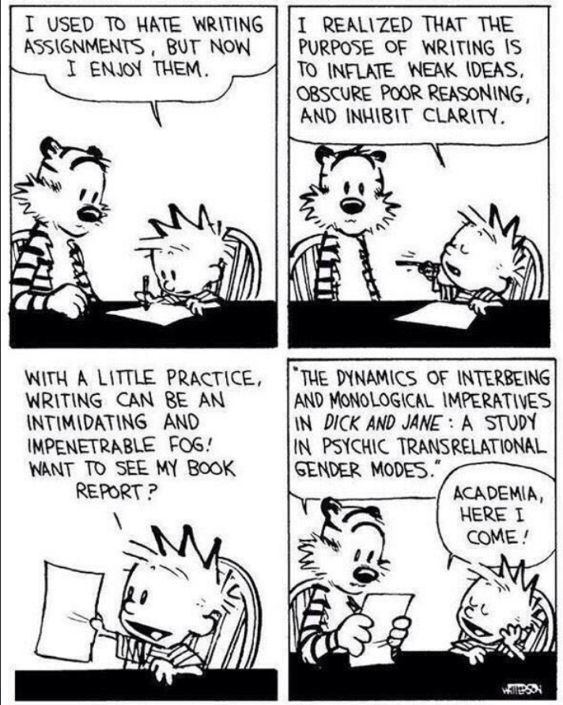
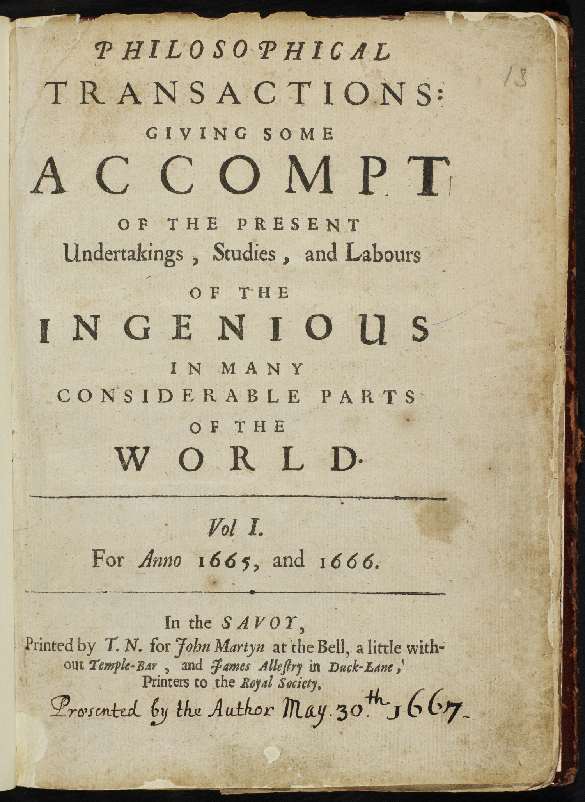
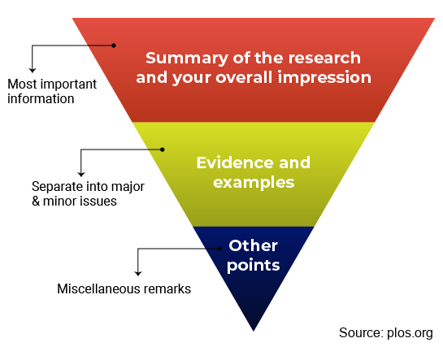

```{r setup, include=FALSE}
knitr::opts_chunk$set(echo = FALSE, eval = TRUE, message=TRUE, 
                      warning=TRUE, cache = TRUE, fig.height=5,fig.width=5)
library(MASS) #glm.nb
library(tidyverse)
theme_set(theme_classic())
library(ggeffects)
library(ggpubr)
library(knitr)

#Generate data 
n <- 100
x <- runif(n,0,100)
yhat <- 5 + 0.3*x #Expected value
# y1 <- rpois(n,exp(yhat))  #Poisson process
y1 <- abs(rnorm(n,yhat,3)) #Normal process
d1 <- data.frame(forest=x,batAbund=y1,unicorns=round(runif(n,0,300))) #Dataframe
# ggplot(d1,aes(x,y1))+geom_point()

```

## Outline

::: columns

:::: {.column width='60%'}

\vspace{1cm}

- Types of scientific writing
  - IMRaD manuscripts
  - Figures and tables
- Writing about statistics
  - Translating model results
- How peer review works

::::

:::: {.column width='40%'}

{width=100%}

::::

:::

# Part 1: Types of scientific writing

## Where do I start?

- You've finished fitting your models, and the results make sense to you, but...
- How do I translate all these numbers into ``real" English?
- Where do I put all these numbers in the paper?
- Do I need figures and tables?

## Answer: "It depends"

\textbf{What is your story?}
\vspace{1em}
\textbf{Who is your audience?}
\vspace{1em}

- How do these numbers serve the questions I'm asking?
- Do these numbers help my audience to understand what I found?
- Would figures or tables help to prove my point more concisely or easily?
- How do these numbers relate to the rest of the literature?

## A bit of history

::: columns

:::: column

- (European) Universities are largely offshoots of the Christian monastic tradition
- What we now call science started in about the 1600s, largely as offshoots of astrology and alchemy
  - Biology began slightly later (1700s-1800s), as offshoots of medicine and natural history
- "Natural philosophers" (scientists) would write letters to each other about what they were up to 

::::

:::: column

{width=100%}
::::

:::

## A bit of history (cont.)

::: columns

:::: column

{width=80%}

::::

:::: column

- Eventually, organizations of scientists began publishing research results publicly (e.g. _Philosophical Transactions of the Royal Society_, 1665)
- Peer review was sparse, and was usually done by the editor or a board. External peer review wasn't widespread until 1950-1970
- Early science writing is _extremely_ varied, and is much different from modern science writing

::::

:::

## What is science writing for?

::: columns

:::: {.column width='60%'}

- "Recording secret knowledge" (Newton)
- "Describing _exactly_ how an experiment proceeded" (Bacon)
- Modern science writing does mostly the latter:
  - Text should be understood by your peers, not obscured
  - Not _all_ details are needed, only those that help make your arguments (e.g. I don't need to know the brand of pipette tips)
- More recent push for _replicability_, with data and code being stored in online repositories

::::

:::: {.column width='40%'}

{width=100%}

::::

:::

## How does this relate to statistics?

::: columns

:::: {.column width='40%'}

- Early use of statistics in science was fairly "vibes-based", at least until computers became more readily available (1950s onward)
  - Not necessarily a bad thing!
- More complex and extensive data collection requires more complex modeling approaches
  - Trade-off between realism and "explainability"
- Pushback from some quarters: One aspect of the ongoing [replication crisis](https://en.wikipedia.org/wiki/Replication_crisis)
  - _Statistics are political_
  
::::

:::: {.column width='60%'}

<!-- \pause -->

"I have heard from graduate students opting out of academia, assistant professors afraid to come up for tenure, mid-career people wondering how to protect their labs, and senior faculty retiring early, all because of methodological terrorism" - [Susan Fiske, APS Past President](http://datacolada.org/wp-content/uploads/2016/09/Fiske-presidential-guest-column_APS-Observer_copy-edited.pdf)

\vspace{0.5cm}

<!-- \pause -->

"[Fiske is] seeing her professional world collapsing... her work and the work of her friends and colleagues is being questioned in a way that no one could’ve imagined ten years ago. It’s scary, and it’s gotta be a lot easier for her to blame some unnamed "terrorists" than to confront the gaps in her own understanding of research methods." - [Andrew Gelman](https://statmodeling.stat.columbia.edu/2016/09/21/what-has-happened-down-here-is-the-winds-have-changed/)

::::

:::


## Common types of scientific writing

1. IMRaD papers: "standard" scientific papers
  - Introduction, Methods, Results, and Discussion
2. Meta-analyses
3. Review papers
4. Perspective/opinion pieces
5. Theses 
6. Proposals
7. Data papers
8. Books/book chapters
9. "Grey" or "white" papers
10. Blogs


## IMRaD Paper Structure

::: columns

:::: column

{width=100%}

::::

:::: column

- Most scientific papers follow the IMRaD canon
- Allows the reader to quickly assess whether this paper is useful and skip to important sections only
- Generally, statistics are discussed in the _Methods_ and _Results_ sections only

::::
  
:::

## Group exercise: "pick apart a paper"

- We're going to go through the IMRaD paper you read this week
  - You did read it... didn't you? 
- In each of the sections, we'll identify how the author follows (or doesn't follow) the form described below
- I recommend highlighting, underlining, or annotating the paper for later reference

## Introduction

- Set up your research question, using the literature
  - Moves from general ("Animals need food") to specific premises ("Bats need bugs") 
  - Explain why we should care ("Bats are really cute! Don't you like cute things?")
- Establish the _knowledge gap_ or _question_ that your research will address
  - "Forest have lots of bugs, but nobody has checked whether there are bats there too!"
- Last paragraph: strong statement that sums up what you're expecting to see
  - Hypothesis: "Bats eat bugs, and forests have lots of bugs. Therefore, ..."
  - Prediction: "... we should see more bat foraging activity in forests"
  
## Methods

- Establish how you collected the data, and how you analyzed it
  - This defends against criticism of your model or your data, and makes your results more believable
- The detail you use depends how "unusual" your model is, which depends on your audience
- Clarify what the dependent, independent variables, and random effects in your models are
- Sometimes you can just use the actual R model formula:
  -  "I fit the model using `lm` in R using the following model structure for bat counts (while accounting for unicorns):"
  - `lm(batCounts ~ forest + unicorns)`

## Results

- Brief summary of what you collected\footnote{Can sometimes go at the end of the Methods}
  - "I caught 420 bats at my 69 sampling sites."
- Present your results as an answer to the questions that you posed in the Introduction. 
  - "Forest cover caused an increase of 3 bats for each 10% of forest (p<0.001), while unicorns had no effect (p=0.19)"
  - Try to keep the language as normal and direct as possible 
  - Having tons of p-values and other numbers can make the text hard to read
- If something weird happened, just say it and move on. Speculate on _why_ in the Discussion.
  - "Surprisingly, frogs had a negative effect on bat counts."
  
## Discussion

- Relate your results to your research question. Did your results match your expectations?
- Move from specific ("Bats need bugs") to general ("Animals need food"); opposite of the Introduction
- Put the Results you found into the context of the rest of the literature.  If your results contradict other studies, why do you think that occurred?
  - "Barclay et al. (2017) showed that bats don't like forests, but our results may differ because..."
- \textbf{So what?} What new things have we learned? How might this affect theory or practice? Should non-bat people pay attention to this paper?
  
## Figures and Tables

- Figures can be excellent tools for telling your story, but...
  - Figures take up lots of room, cost $ in publications, and can overwhelm the reader if there are too many
  - Many resources for good figure design: aim to minimize extra information
- Tables are kind of boring, but are great for conveying lots of numbers at once
  - Useful for showing information on large numbers of coefficients
  - If you have lots of models, `library(broom)` provides summaries of all of them at once
- Tables and figures (+ captions) should be readable without knowing the rest of the text

\large

<!-- \pause -->

Suggestions:

1. Choose 2 or 3 figures and tables to be the __Main Characters__ in your Results section.
2. Use them to illustrate what your models show  and move the rest into a supplemental or appendix.

## Title and Abstract 

- Title: "Advertisement" of your study topic and results
  - _Why should the reader read any further? _
- Abstract: quickly and effectively tells the reader what the paper is about
  - Usually follows the IMRaD format order
  - Not a movie trailer: spoilers are expected!
- Keywords: extra words that could help search engine results

## Give your paper a score!

- How did they do on each section? Did any of them not live up to expectations?
- How is the style of the paper? 
  - Did the writing make it difficult to read? Was it too long/short?

## Note on research proposals

::: columns

:::: {.column width='40%'}

- Similar structure to the Introduction and Methods of an IMRaD manuscript
- Results and Discussion are shorter, and focus on _what you think you will find_, and _why that matters_
- In the assignment for this class, the Results and Discussion will include an analysis of simulated or archived data, both aimed at answering the same questions as above

::::

:::: {.column width='60%'}

<!-- \pause -->

Overall, a proposal must convince the reader that:

1. The question is important
  - "Other people have asked these questions, but they haven't answered this one..."
  - This is a relevant question, either practically or theoretically
2. The question can be answered
  - "If you did such-and-such an experiment or observation..."
3. You can do the work to answer it
  - "I have a plan to carry out this experiment or observation..."
  - Formal proposals include a timeline and a budget, as well as a list of personnel

::::

:::

# Part 2: Writing about statistics

## Models as evidence for arguments

- Scientific discourse can be thought of as a series of logical arguments
- When making an argument, you bring evidence to support your claims
- We use experiments/observations, mathematics, and previous literature to support our claims
  - None of these are assumption-free: The reader must be convinced that these are appropriate!
- Models also act as a _piece of evidence_, translating raw data into "ammunition" for your claim
  - Model structure and performance checks (residual plots, etc.) should _also_ convince the reader that this is believable

Show the _bare minimum_ number of statistics needed to convince people. If it's not relevant to your story, move it somewhere else.

## Example arguments:

- Premise 1: Bats eat bugs
- Premise 2: Forests have lots of bugs
- Claim: Therefore, bats should prefer forests \footnotemark

\vspace{1em}

::: columns

:::: column

<!-- \pause -->

Example 1:

- Evidence: The model of my data __supports this claim__ 
- Conclusion: This means that our understanding of bugs, bats, and forests is pretty good

::::

:::: column

<!-- \pause -->

Example 2:

- Evidence: The model of my data __does not support this claim__
- Conclusion: One of these premises is wrong, or we left out an important premise

::::

:::

\footnotetext[1]{Inductive reasoning}

## Models as reflections of reality

::: columns

:::: column

- Models are meant to reflect an _underlying biological process_
- Things like effect size (mean/SE) reflect the relative strength of the factors involved
- Things like $R^2$ reflect how well the model fits the data _overall_
- Causality is implied, but has to be justified
- "Keep your eye on the biology!" 

::::

:::: column

<!-- \pause -->

```{r batFig1, fig.width=5, fig.height=5} 
(p1 <- ggplot(d1,aes(x,y1))+geom_point() + labs(x='Forest cover (%)',y='Bat counts') + 
  geom_smooth(method='lm',formula=y~x))
```

What might the underlying physical process be here?

::::

:::

## Evidence type 1: coefficients

::: columns

:::: column

- Slopes and intercepts have physical interpretations
  - Intercept: How many bats at 0 % forest?
  - Slope\footnotemark: + 1 % forest = + 1 bat
- Interpretation can be:
  - Yes/no: "Is there any relationship?"
  - Directional: "Is the relationship positive?"
  - Magnitude: "How big is the slope?"
  
:::: 

:::: column

<!-- \pause -->

```{r batFig2, fig.width=5, fig.height=5} 
(ggplot(d1,aes(x,y1))+geom_point() + labs(x='Forest cover (%)',y='Bat counts') + 
  geom_smooth(method='lm',se=FALSE,formula=y~x))
```

::::

:::

\footnotetext{For GLMs, slopes are in log or log-odds (logit) units}

## Evidence type 2: variance

::: columns

:::: column

- Variance has a physical interpretation
  - What is the variation in bat counts at a given level of forest?
- $R^2$ relates actual to modeled variance: what % of variance does your model explain?
- GLMs: different distributions model variance differently
- Hierarchical models deal with many levels of variance
  - Tells you where the variance in your system is coming from

::::

:::: column

<!-- \pause -->

```{r batFig3, warning = FALSE, fig.width=5, fig.height=5} 

predInt1 <- data.frame(d1, predict(lm(y1~x,data=d1), interval = "confidence"))
predInt2 <- data.frame(d1, predict(lm(y1~x,data=d1), interval = "prediction"))

ggplot(d1,aes(x,y1))+geom_point() + labs(x='Forest cover (%)',y='Bat counts') + 
  geom_ribbon(data=predInt1,aes(x=x,ymax=upr,ymin=lwr),alpha=0.2)+
  geom_ribbon(data=predInt2,aes(x=x,ymax=upr,ymin=lwr),alpha=0.1)
```

::::
  
:::

## Example write-up

::: columns

:::: column

Say we fit a model of bat counts that looks like this

```{r batMod}
m1 <- lm(batAbund ~ forest + unicorns, data=d1)
summary(m1)

```

::::

:::: column

\tiny

Methods:

"I collected data from 100 sites around Calgary, and recorded..."

"I used a linear model to estimate the effect of forest cover and unicorns on bat abundance. Models were fit using `lm()` in R and were checked for..." 

\vspace{1em}

Results:

"My model identified a strong, positive effect of forest cover, with each additional $10\%$ of forest cover adding an additional 3 bats (Figure 1, $p<0.0001$), while the effect of unicorns was weak ($p=0.19$). The model also explained $\sim88\%$ of the variance in bat abundance, further highlighting the importance of forest cover to bats..."


```{r, fig.height=3,fig.width=5}
p1
```

::::

:::
  


## Challenge: analyse and explain

::: columns

:::: column

\vspace{1em}

- I have a dataset of plant abundance `plantDat.csv` (see [here](https://github.com/samuelVJrobinson/ecoStatsLectures/tree/fall2023/09%20Writing)) containing records of plant presence/absence, deer browsing, soil depth, and slope
- Come up with a reasonable set of hypotheses about plant presence/absence (given the available data)
- Fit a model that tests those hypotheses, verify the model, and explain the model approach in plain English 
- Explain the model results, and make an accompanying "Figure 1" to go with the results

::::

:::: column

```{r plantMod, fig.width=5,fig.height=6}
plantDat <- read.csv('./plantDat.csv')

plantDat %>% pivot_longer(-plantPres) %>% 
    ggplot(aes(x=value,y=plantPres))+geom_point()+
    facet_wrap(~name,scales = 'free',ncol=1,
              strip.position = 'bottom')+
    geom_smooth(method='gam',formula=y~s(x),
                method.args=list(family='binomial'))+
  labs(x=NULL,y='Plant presence')+
  theme(strip.background = element_blank(),
           strip.placement = "outside",
        panel.spacing = unit(0, "lines"))

```

::::

:::

<!-- ## Further advice: style -->

<!-- - I try to write everything in point form in order to see the hierarchical document structure (sections, paragraphs, sentences) -->
<!--   - Use topic sentences to structure your paragraphs, and make sure they flow together logically -->
<!-- - Avoid breaking up sentences with excessive stats. Use tables and figures to your advantage, and reduce the amount of writing! -->
<!-- - Make sure that spelling and grammar is correct. Avoid the excessive use of passive voice (e.g. "data were collected") -->

## My (personal) order of writing a paper

1. Methods: I usually write this section first, as it gets me "warmed up" for the rest of it\footnote{You can even write it before you collect your data!}
2. Results: I write this section after I write the Methods section
3. Discussion: I write this after my model Results. Here you can name-drop all the relevant papers you've read (make sure they're setup in the Introduction first)
4. Introduction: I find this section the trickiest to write, so I usually write it last
5. Title and Abstract: After everything else is done, you can _advertise and summarize_!

# Part 3: Peer review

## How do journals work?

- Journals are usually society publications (BES, ESA, IEEE) run out of academic publishing companies (Wiley, Elsevier, Taylor \& Francis)
- Most journals have a _lead editor_ and an _editorial board_. These will be the people who will first see your submitted manuscript
  - Peer review is done for free by working scientists
- Traditional publishing: costs you nothing, costs the U of C library \$ (depending on subscription)
- Open-access publishing: costs you \$1000-5000 depending on the journal, but then anyone can read it
  - Keep an eye out for predatory or "papermill" journals! Some sets of open-access journals (MDPI) have a _suspiciously fast_ peer review process

## OK, you've got a paper written! Now what?

- Identify a journal you'd like to submit it to
  - Which journals do you cite the most in the paper? Maybe one of those? Check their [Aims and Scope](https://besjournals.onlinelibrary.wiley.com/hub/journal/13652664/aims-and-scope/read-full-aims-and-scope)
  - Helps to start thinking about it earlier, and have a tier-list
  - __Ask your supervisor!__ They will have good experience with this
- Assemble the document in the way that the journal wants. Check their [Guidelines for Authors](https://besjournals.onlinelibrary.wiley.com/hub/journal/13652664/about/author-guidelines)
  - Check that the document conforms to the types of papers they publish
  - Some journals are more lenient about the first submissions (e.g. just a pdf with simple formatting)
  - Double-blind journals require you to remove all identifying info (separate title page that the reviewer never sees)
- Submit the article and wait for a response!
  - Think about who you might recommend as a reviewer. Who would you want to read your paper?
  - A _cover letter_ helps convince the editor they should give your paper a chance
  
## 

\centering

\vspace{1em}

{width=100%}
  
## What the editor will do

- An editor will skim the paper and make sure that the topic is relevant. If not, your paper gets a _desk reject_
- If it looks generally OK, the editor will contact peer reviewers and ask them to review the paper
- Once they've gotten the comments back, the editor will assemble the comments, and read the paper a bit more to see if they agree with them
- They will contact you with their decision based on the reviewer's comments: _reject_, _accept with major revisions_, or _accept with minor revisions_
  - They may use _reject and resubmit_, depending on the journal
  - They may temper the claims from _bad or rude peer reviewers_, or may remove them entirely!

## My (personal) style of peer review

- Read the paper once through without writing anything down
- Go back through each section and write general "overall" comments
  - e.g. "Intro needs to be trimmed down", "Results section is disorganized", "I don't understand the relevance of X"
- Write line-by-line comments where needed
  - e.g. "L40: change `insect` to `arthropod`", "L89: How does this test work, and is it commonly used?", "L112: Citation needed, perhaps Smith et al. 2020?"
- Think about what could improve the paper, and provide a suggested way forward where possible! (e.g. "I suggest moving this paragraph to here...")

## My (personal) style of peer review (cont.)

::: columns

:::: {.column width='60%'}

- Put all the comments together in a single document, split into overall and line-by-line, and re-read your comments. 
  - _Do you need to tone things down a bit?_ (or tone them up)
- Make a reject/accept decision on the paper. Try to be as objective as possible:
  - "This person didn't do exactly what I would have, but does it matter to the results or overall story?"
  - "Maybe I don't think these results are very interesting, but are they believable given the evidence?"
- If the paper is accepted, how much time will it take to do revisions? (Major vs Minor)

::::

:::: {.column width='40%'}

{width=100%}

::::

:::

<!-- \pause -->

There are many other appproaches to doing peer review: see [here](https://doi.org/10.1007/s00264-020-04504-1), [here](https://www.britishecologicalsociety.org/wp-content/uploads/2019/06/BES-Guide-Peer-Review-2019.pdf?utm_source=web&utm_medium=web&utm_campaign=better_science), or [here](https://authorservices.wiley.com/Reviewers/journal-reviewers/how-to-perform-a-peer-review/step-by-step-guide-to-reviewing-a-manuscript.html))  
  

## Final remarks

- Good writing is re-writing
  - What is obvious to you may not be obvious to your readers. Revision is annoying and painful, but it __will__ help!
  - "[Good writing is:] Telepathy, of course" (Stephen King)
- Use the literature
  - There are tons of poorly-written papers out there, but was there a paper that you found easy to understand? Re-read it, and figure out why!
  - Check out how other scientists display their statistics, and imitate/avoid their style
  - Read books about science writing, and use techniques from other books you've read
- Use your supervisor and committee members 
  - They have a much wider picture of the field, and have lots of writing and editing experience
  - This means that they can be a good stand-in for your audience
  
<!-- \pause -->
  
Remember: \textsc{Good writing is good storytelling}

<!-- ## Here are some examples from my work -->

<!-- - I'm usually not allowed to publicly share peer reviews that I've done on other papers... -->
<!-- - But here are some of the reviews I've received! -->

<!-- ## Practice -->

<!-- \large -->
<!-- Pull up a blank text document. Using a model that you have fit to some data, write: -->

<!-- - Description of your research question for the Introduction. What do you expect to see, and why? -->
<!-- - Short description of the model for the Methods -->
<!-- - Short summary of what the model is telling you for the Results -->

<!-- Point form is fine, but try to find important points that you could convert into topic sentences in an actual paragraph -->

